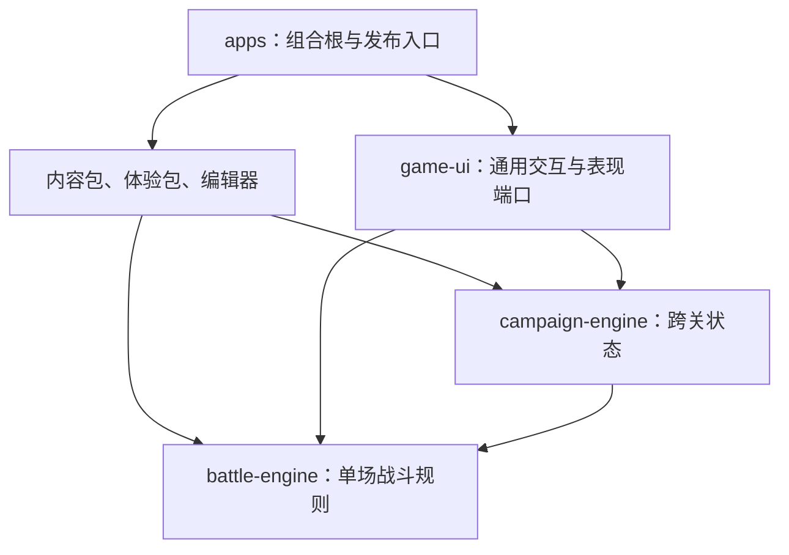

# Empire SRPG 技术文档

本目录说明当前代码已经实现的技术能力、稳定边界和扩展方法。这里不包含剧本、人物、章节、小说文本或题材素材制作说明；相关内容继续保留在 `docs/story-candidates/`，但不属于本技术文档体系。

> 文档类型：Landing · 适用读者：引擎开发者、关卡设计者、内容开发者、界面开发者 · 当前真值：代码与测试优先，本文档描述 `main` 分支现状

## 按任务选择文档

每份文档只承担一个主要职责。先从你的任务进入，不需要顺序阅读全部页面。

| 你要完成的任务 | 阅读入口 | 文档职责 |
| --- | --- | --- |
| 判断引擎能否表达某种玩法 | [引擎能力目录](./engine-capabilities.md) | Reference：逐项列出运行时、编辑器和缺口 |
| 设计一场战斗或调整数值 | [战斗系统设计](./combat-system-design.md) | Conceptual：解释体验目标、机制组合和数值护栏 |
| 扩展战斗规则或替换策略 | [战斗引擎架构](./combat-engine-architecture.md) | Conceptual：解释依赖方向、微内核和扩展契约 |
| 编写或生成关卡数据 | [关卡数据格式](./level-format.md) | Reference：说明 `LevelData` schema 2 与校验规则 |
| 使用或扩展地图编辑器 | [关卡编辑器](./editor-guide.md) | How-to：说明现有工具、工作流和编辑边界 |
| 接入素材、场景和动画 | [战场表现系统](./presentation-system.md) | Conceptual：说明表现端口、图层和帧动画 |
| 组织跨关流程与存档 | [战役引擎架构](./campaign-engine-architecture.md) | Conceptual：说明节点状态机与战斗防腐层 |
| 调整包边界或新增应用 | [Monorepo 架构](./monorepo-architecture.md) | Reference：说明工作区职责和依赖方向 |
| 验证改动是否可靠 | [质量与测试](./quality-and-testing.md) | How-to：说明测试层次、命令和验收门槛 |

## 文档状态词

能力目录和设计文档使用以下统一状态，避免把规划误写成实现：

- **已实现**：正式运行链路可调用，并有测试或生产入口
- **部分实现**：核心数据或规则存在，但工具、界面或产品闭环不完整
- **仅数据可配**：运行时支持，编辑器尚无可视化表单，需要 TypeScript 或 JSON 配置
- **未实现**：当前代码没有稳定契约，不应在关卡设计中依赖
- **明确不做**：当前产品方向主动排除，除非重新审视设计预算

## 技术边界总览

仓库采用四层单向依赖。上层组合能力，下层不认识题材和剧本：

战斗内核采用隐藏离散格。玩家可以看到自然场景、弯曲道路和不规则边界，但移动、射程、占位、回放条件与人工智能（AI）仍以确定的格坐标结算。表现层通过场景留白、落点圆环和分层素材弱化棋盘感，不改变规则坐标。

## 当前核心入口

下列文件是理解代码的稳定起点：

- `packages/battle-engine/src/engine.ts`：应用层战斗门面和事务边界
- `packages/battle-engine/src/session.ts`：带撤销、缓存和订阅的会话外壳
- `packages/battle-engine/src/kernel.ts`：微内核、插件依赖与能力装配
- `packages/battle-engine/src/types.ts`：关卡、状态、Action、Event 和场景代数
- `packages/battle-engine/src/content-pack.ts`：内容目录与原子安装
- `packages/editor/src/document.ts`：编辑器文档聚合
- `packages/game-ui/src/art/ports.ts`：题材美术端口
- `packages/campaign-engine/src/runtime.ts`：跨关状态机门面

## 维护规则

技术文档必须描述现行契约，不再追加“第 N 阶段”开发日志。架构演进原因应写入 Git 历史或单独的架构决策记录，不能堆叠在参考文档末尾。

每次机制改动至少同步以下一处：

1. 改变合法性或结算：更新战斗设计、能力目录和对应测试
2. 改变公开扩展点：更新战斗架构和包导出
3. 改变 `LevelData`：更新关卡格式、正规化和校验测试
4. 改变编辑界面：更新编辑器能力矩阵
5. 改变图层或素材契约：更新表现系统和视觉回归测试
