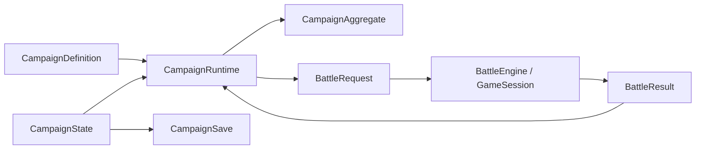

# 组织剧情战役状态

战役引擎在单场战斗之上组织节点、选择、持久名单和版本化存档。本页只说明通用技术契约，不描述任何具体剧本、人物或章节内容。

> 文档类型：Conceptual · 状态：基础框架已实现 · 代码真值：`packages/campaign-engine/src/`

## 战役层的职责

战役层回答跨关问题：

- 当前位于哪个流程节点
- 哪些选择可用，选择修改哪些持久事实
- 下一场战斗使用哪张 `LevelData`
- 哪些名单单位进入战斗，战后如何回收状态
- 存档依赖哪一版战役定义和内容包

战役层不解释伤害、移动、射程、人工智能（AI）、地形和战斗动画。它也不排版对话；节点中的 `presentation` 只是上层界面解释的不透明定位符。

## 运行模型

战役定义不可变，战役状态可序列化，`CampaignRuntime` 负责原子迁移。

| 对象 | 稳定职责 |
| --- | --- |
| `CampaignDefinition` | schema、定义版本、内容包版本、起点、节点图和初始名单 |
| `CampaignState` | 当前节点、旗标、变量、资源、关系、功能、名单和历史 |
| `CampaignAggregate` | 定义与状态不变量、节点查询、效果应用和战果投影 |
| `CampaignRuntime` | `advance`、`choose`、`beginBattle`、`completeBattle` 和事务回滚 |
| `CampaignBattleBridge` | 战役 DTO 与战斗 DTO 之间的防腐层 |
| `CampaignSaveMigrator` | 显式、逐版本向前的存档迁移 |

## 节点代数

`CampaignNodeKindMap` 是**开放**的，和条件、效果两套代数一样。节点种类曾是唯一一个封闭词表，而它的行为散在定义校验器和四个运行时方法里——于是剧本包能加一个条件、一个效果，却加不了一间商店、一座兵营、一段带检定的对话。

| 节点 | 用途 | 离开方式 |
| --- | --- | --- |
| `story` | 线性演出定位 | `advance()` |
| `choice` | 条件化分支 | `choose(id)` |
| `battle` | 关卡请求与战果出口 | `beginBattle()`、`completeBattle()` |
| `ending` | 完成或失败终点 | `advance()` |

内置四种，不是六种。`hub`（营地）和 `travel`（旅途）曾经也在这张表里，行为与 `story` 完全一致——注册它们的辅助函数自己的注释就写着「三种只有名字不同」。没有规则区分它们，界面也无法区分（三者都是带文案的过场），已发布战役一处都没用。对任何一层都不产生含义的公共概念应当删掉；词表是开放的，需要一间有自己行为的营地时，剧本包注册自己的种类。

有没有演出文案，是**某一种节点**的性质，不是所有节点共有的性质。`presentation` 曾经在每种节点上都可选，于是要渲染它的外壳只能用 `!` 断言绕过类型，而战斗节点——它从关卡简报里取演出，自己没有文案——照样带着这个字段。现在 `story`、`choice`、`ending` 都是**场景**（`presentation: string` 必填），`battle` 不是。

同样地，外壳只在一处读节点的 kind：`StoryCampaignController.screen()` 回答「此刻在哪个画面」，翻页、开打、收尾、渲染都读它。此前四个方法各问一次节点是什么种类，等于把引擎刻意留开放的词表在界面层抄了四份。

一个 `CampaignNodeHandler` 回答引擎对某种节点仅有的两个问题：**离开它会发生什么**（落效果、走向下一节点、或者结算战役），以及**它的声明必须满足什么**。`advance()` 不再知道「choice 需要 choose()、battle 需要 beginBattle()」——需要输入的种类自己拒绝，并说出该调哪个 API。

校验也按同一条缝切开，与战斗侧一致：文档自身的事实（schema、节点 id、起点、名册）留在 `validateCampaignDefinition`，某一*种*节点必须声明什么则归它的 handler，由 `CampaignAggregate` 对着一份文档名字的 inspection 逐个执行。`story`、`hub`、`travel` 原本共用一条分支，现在共用一个 handler 工厂——这正是让它们可以被逐个替换的原因。

节点效果和选项效果都通过 `CampaignEffectRegistry` 解释。条件由 `CampaignConditionRegistry` 解释。两个代数都支持 TypeScript declaration merging 和策略注册，但默认运行时会克隆注册表，避免实例间污染。

内置条件覆盖：

- 旗标存在性
- 变量数值比较
- 战役资源比较
- 势力关系比较
- 名单单位状态
- `all`、`any`、`not` 组合

内置效果覆盖：

- 设置或累加变量
- 设置或清除旗标
- 增加战役资源
- 修改势力关系
- 开关功能
- 修改名单单位状态

## 战斗防腐层

`CampaignBattleBridge` 是唯一同时理解 `CampaignState` 与 `GameState` 的通用模块。战斗内核始终只接收普通 `LevelData`。

它的翻译表也是数据。「一种离场标记对名册意味着什么」曾是一串四臂三元表达式，兜底答案是 `fallen`——永久阵亡——而标记种类在战斗引擎里是开放字符串：`transport-loss` 和任何剧本包自造的标记都会拿到这个最具破坏性的答案。现在是 `DEFAULT_MARKER_DISPOSITIONS`，可注入，未知离场方式读作 `missing`：这个单位出了事，而战役不知道是什么事。

### 进入战斗

`prepare()` 执行以下步骤：

1. 解析战斗节点和关卡快照
2. 按稳定的 `levelUnitKey` 查找关卡单位
3. 移除不可出战的名单单位
4. 写入兵种、生命比例、士气比例、军衔、资源、职业、熟练度和能力
5. 生成唯一 `requestId` 和只读语义上下文
6. 返回 `BattleRequest`

桥接器不会直接改变战役状态。`CampaignRuntime.beginBattle()` 在同一事务中记录 pending request，失败时恢复整个状态。

### 离开战斗

`result()` 根据活跃单位、载具乘员和战场 marker 还原持久单位状态：

| 战场结果 | 名单状态 |
| --- | --- |
| 仍在场或仍在载具中 | `available` |
| 溃退 marker | `routed` |
| 投降 marker | `surrendered` |
| 主动撤离 marker | `missing` |
| 死亡 marker | `fallen` |

`BattleResult` 还包含胜负、回合数、场景信号和语义事件计数。`completeBattle()` 只接受与 pending request 完全匹配的结果，因此重复提交和串关结果都会失败并回滚。

## 存档与迁移

`CampaignSave` 当前为 schema 1，包含：

- 战役定义 ID 和版本
- 内容包 ID 与版本映射
- 保存时间
- 完整 `CampaignState`

`CampaignSaveMigrator` 只执行已注册的逐版本迁移。以下情况会拒绝载入：

- schema 非法或高于当前版本
- 缺失某一步迁移
- 迁移没有提高 schema
- 定义 ID 或版本不匹配
- 内容包版本不匹配
- 状态不满足定义约束

前三条不属于战役：推进版本、拒绝断档、拒绝没有推进版本的迁移，这套阶梯和文档里装的是什么无关，所以它是战斗引擎里的 `SchemaMigrator`，战役存档与战斗存档共用同一份。后三条留在这里，因为只有战役知道它们——「装进来之后还得满足什么」和「它是不是当前形状」是两个问题。

该格式**不是**战斗存档。战斗存档现在存在（`BattleSave`，见战斗引擎文档），但两者还没有接上：`CampaignSave` 仍然只在关与关之间写入，`pendingBattle` 状态被视为不可恢复而丢弃。把一份 `BattleSave` 挂到 `pendingBattle` 上，就是「战役中途放下一场战斗」这条缺口收口的地方。战斗回放仍缺少正式的初始状态哈希、Action 序列、规则版本锁定和回放验证器。

## 事务和失败语义

`advance`、`choose`、`beginBattle` 和 `completeBattle` 都在 `CampaignRuntime.transaction()` 内执行。任何校验、效果或桥接错误都会恢复调用前快照。

应用层可以依赖以下不变量：

- 一个战役最多有一个 pending battle
- 战斗结果只能提交一次
- 当前节点始终存在于定义中
- 结束状态不能继续迁移
- 名单状态与定义版本始终匹配
- 失败的迁移不会留下半次旗标或资源修改

## 当前能力边界

以下能力已经实现：

- 通用节点状态机
- 条件、效果和组合逻辑
- 持久名单及战斗状态投影
- 关系、资源、旗标、变量和功能开关
- 战斗请求与战果防腐层
- 版本化存档和显式迁移
- 失败原子性和定义校验

以下能力尚未形成通用产品闭环：

- 战役定义可视化编辑器
- 装备、物品背包和商店领域
- 战前编队与持久装备界面
- 多存档槽、自动存档和云同步
- 战役中途放下一场战斗（`BattleSave` 已就位，尚未挂到 `pendingBattle`）与 Action 回放
- 本地化资源管理和配音时间线

这些缺口应继续留在战役或应用层，不能塞入战斗核心。

## 扩展检查表

新增战役能力前确认：

1. 它是否跨越多个战斗？如果否，应优先留在战斗或表现层
2. 它能否写成故事中立的状态、条件和效果？
3. 新条件是否同时提供类型、处理器和测试？
4. 新效果失败时是否保持事务原子性？
5. 它是否改变存档 schema？如果是，是否提供显式迁移？
6. 它是否需要战斗数据？如果是，是否通过 `CampaignBattleBridge`？

## 相关文档

- [战斗与战役能力边界](./engine-capabilities.md)
- [战斗引擎架构](./combat-engine-architecture.md)
- [关卡数据格式](./level-format.md)
- [Monorepo 架构](./monorepo-architecture.md)
