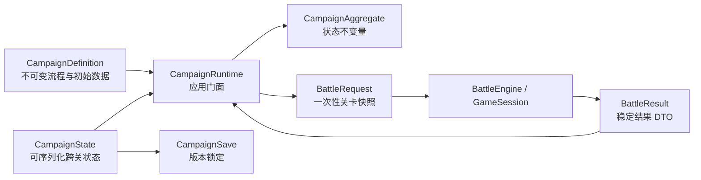

# Empire Tactics 通用剧情战役框架

> 状态：首个可执行框架已落地（2026-08-12）  
> 适用范围：候选剧本 1、2、3 与未来章节型 SRPG  
> 边界：本框架组织章节、选择、名单和战斗结果，不解释伤害、移动、AI 或地形

## 1. 定位

战役框架是战斗引擎之上的应用领域层。它回答：

- 玩家现在位于哪个章节节点；
- 哪些选择可用，选择改变哪些跨关事实；
- 下一场战斗使用哪张关卡、哪些持久角色；
- 战斗结束后的伤亡、溃退、投降、成长和信号如何回收到战役；
- 存档依赖哪一版剧本定义和内容包。

它不回答：

- 一次攻击是否合法或造成多少伤害；
- 单位如何寻路、反击、援护或获得地形修正；
- 某段对白如何排版、某张立绘何时淡入；
- 某题材中的“魔力”“能源”“军粮”在战斗内如何结算。

## 2. 核心对象

### `CampaignDefinition`

定义 schema、剧本 ID/版本、内容包版本、起始节点、节点图和初始名单。节点只有五类职责：

- `story`：线性剧情演出定位；
- `choice`：带条件与效果的路线选择；
- `battle`：关卡定位、持久名单绑定、胜败/撤退出口；
- `hub` / `travel`：营地与旅途等非战斗流程；
- `ending`：明确完成或失败。

`presentation` 是不透明资源定位符。框架不会读取小说文本，也不会把资源路径变成规则条件。

### `CampaignState`

保存当前节点、状态、旗标、变量、资源、势力关系、已解锁能力、持久名单、完成节点、战斗历史和待处理战斗。它是纯数据，可使用 `structuredClone`，没有 DOM、计时器或函数引用。

### `CampaignAggregate`

聚合负责定义/状态版本一致、节点存在、名单状态和战斗结果投影。`CampaignRuntime` 的每个状态迁移都有失败回滚；无效选择、关卡装配失败或不匹配的战斗结果不能留下半次提交。

## 3. 开放条件与效果

战役条件和效果分别由 `CampaignConditionRegistry` 与 `CampaignEffectRegistry` 解释。内置原语覆盖旗标、数值变量、战役资源、势力关系、名单状态和组合逻辑。

与战斗微内核一致，新题材可以通过 TypeScript declaration merging 扩展类型映射，并注册对应策略；默认运行时克隆注册表，多个战役实例不会互相污染。

## 4. 战斗防腐层

`CampaignBattleBridge` 是唯一允许同时理解战役 DTO 和战斗 DTO 的模块。

### 进入战斗

1. 解析 `battle.level` 得到新的 `LevelData` 快照；
2. 按稳定 `levelUnitKey` 绑定持久名单；
3. 不可出战角色从快照移除；
4. 把兵种、生命比例、士气比例、军衔、职业、熟练度、能力和资源播种到关卡单位；
5. 返回带唯一 request ID 的 `BattleRequest`。

战斗引擎只看到普通 `LevelData`，不知道角色来自哪个剧本章节。

### 离开战斗

桥接器按稳定 key 查询：

- 活跃单位或载具乘员：`available`；
- `routed` 标记：`routed`；
- `surrendered` 标记：`surrendered`；
- 尸体或运输损失：`fallen`。

随后生成 `BattleResult`，携带成长数据、胜负、回合数、场景信号和语义事件计数。`CampaignRuntime` 只接受与当前 pending request 完全匹配的结果，防止重复提交或串关。

## 5. 存档与迁移

`CampaignSave` schema 1 同时锁定：

- 剧本 ID 与版本；
- 每个内容包 ID 与版本；
- 完整 `CampaignState`；
- 保存时间。

`CampaignSaveMigrator` 只执行显式、逐版本前进的迁移。缺失迁移、版本倒退、剧本不匹配或内容包不匹配都会拒绝载入，不做静默猜测。

这份存档不是战斗 Action 回放。战斗回放还需要初始状态哈希、Action 序列和战斗规则版本，应保持独立格式。

## 6. 三套剧本如何共用

三个剧本包分别提供自己的七章结构契约：

- `packages/story-candidate-01/src/`；
- `packages/story-candidate-02/src/index.ts`；
- `packages/story-candidate-03/src/index.ts`。

- 候选 1：西幻灰旗成长史；
- 候选 2：宏大星际旅程；
- 候选 3：东方历史创业史。

三者只替换剧本 ID、演出定位、关卡定位、内容包和角色种子，使用同一个节点代数、运行时、战斗桥接与存档格式。专项测试会对三份定义运行同一组结构验证，并确认每份都含七场战斗契约。

## 7. 下一层应放在哪里

下面内容可以在战役框架上继续建设，但不应进入战斗核心：

- 对话播放器、镜头、立绘、选项文案和本地化；
- 战前编队 UI、角色装备 UI 和营地界面；
- 关卡解锁表、章节地图和奖励展示；
- 自动存档槽、云同步与存档选择界面；
- 三套剧本的实际节点数据、关卡文件与数值内容。

当前框架已经提供稳定的领域接口，制作剧情战役不需要再次重构战斗底座。
