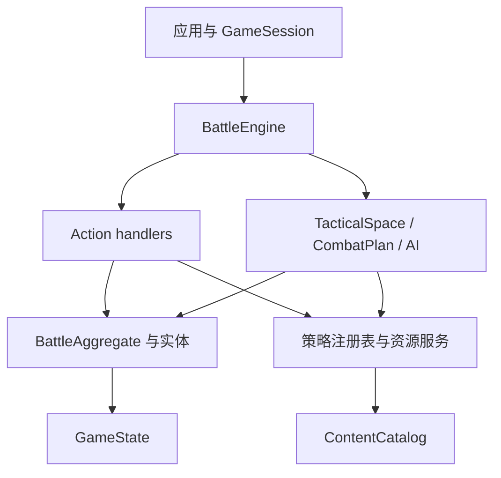

# 扩展通用 SRPG 战斗引擎

本页定义战斗引擎的现行架构、依赖方向、事务边界和扩展契约。它用于开发和审查规则代码，不记录历次重构过程。

> 文档类型：Conceptual · 状态：已实现并受架构测试保护 · 代码真值：`packages/battle-engine/src/`

## 引擎边界

战斗引擎是无文档对象模型（DOM）的单场战斗领域内核。给定内容目录、规则能力、关卡快照和 Action，它验证合法性、修改 `GameState` 并产生语义 `GameEvent`。

引擎负责：

- 关卡正规化后的状态创建与校验
- 移动、空间、视线、攻击和资源合法性
- 战斗、状态、指挥、士气、成长和结构结算
- 目标、场景触发器、阶段和胜负
- AI 行动枚举与估值
- 事务回滚、克隆、预测和确定性事件

引擎不负责：

- DOM、输入状态、动画、声音和素材路径
- 人物名、台词、章节和剧情分支
- 跨关名单、持久关系和存档槽
- 编辑器界面和本地存储
- 某个题材的兵种与数值定义

## 分层模型

代码按定义、领域状态、规则策略、应用门面和表现适配分层。



| 层 | 主要类型 | 约束 |
| --- | --- | --- |
| 内容定义 | `ContentPack`、`ContentCatalog`、各类 `*Def` | 不保存对局状态，不含流程副作用 |
| 对局数据 | `GameState`、`GameMap`、`LevelData` | 可结构化克隆，可序列化，不含 DOM 和函数 |
| 领域模型 | `BattleAggregate`、`UnitEntity`、`PlayerEntity`、`StructureEntity`、`Battlefield` | 维护实体和聚合不变量 |
| 规则策略 | Action、目标、场景、伤害、状态、资源和 AI 注册表 | 开放扩展，实例隔离 |
| 应用门面 | `BattleEngine`、`GameSession` | 统一查询、提交、回滚、撤销和订阅 |
| 上层适配 | `game-ui`、`editor`、`campaign-engine` | 只消费引擎，不反向注入题材判断 |

## 微内核组合

`SrpgMicrokernel` 只完成三件事：注册插件、解析依赖、装配能力。它不解释战斗玩法。

默认引擎由四个自洽插件组成：

| 插件 | 提供的能力 |
| --- | --- |
| `engine.tactical-rules` | 内容快照、能力、空间、伤害修正、命中效果、状态、成长、行动序策略、随机源 |
| `engine.mission-rules` | Action、场景条件、场景效果和目标 |
| `engine.resource-economy` | 通用资源账户策略 |
| `engine.ai-planning` | 目标顾问和能力估值 |

能力表当前有 18 项：`content` `abilities` `space` `actionHandlers` `combatModifiers` `hitEffects` `statusBehaviors` `scenarioConditions` `scenarioEffects` `objectives` `progression` `resources` `turnOrders` `reactions` `unitDepartures` `random` `aiObjectiveAdvisors` `abilityAiEvaluators`。

插件按业务能力成块，不能为每个类建立一个插件。每个插件声明：

- `id` 和正整数 `version`
- `provides` 能力清单
- `requiresCapabilities` 能力依赖
- 必要时使用 `requires` 声明非能力顺序
- `install(context)` 中的实际提供行为

内核拒绝重复插件版本、竞争能力提供者、缺失依赖、依赖环和声明后未提供的能力。装配结果只暴露只读 `KernelCapabilities`。

## 行动序策略

回合顺序是一条可替换的策略，不是写死的循环。`rules.turnOrder` 按 id 选择：

| 策略 | 语义 | 对应作品 |
| --- | --- | --- |
| `side` | 一方全体各行动一次，再交给下一位存活玩家 | 远古帝国 / AW / 火纹 |
| `initiative` | 每个单位按速度累积充能，单独获得行动权 | 皇家骑士团2 / FFT |

两套词汇必须分开，否则任何一族都做不对：

- **回合（round）**：战斗时钟一圈。收入、地形覆盖层衰减、场景 `everyRounds` 触发器以此为准，`state.turn` 计的是它。
- **行动轮（actor turn）**：一次行动权。状态跳动、建筑治疗、武器冷却、反应预算以此为准。

在阵营回合下两者按玩家重合，这正是它们长期被混为一谈的原因。

行动权由策略回答，命令处理器、AI 规划器和界面都问同一个策略，因此 AI 不可能规划出执行层必须拒绝的行动。策略自己维护可序列化的状态切片并自行清理离场单位——把它挂到单位生命周期上会让 `state` 依赖 `turn-order`，闭合一个依赖环，无环适应度测试会拒绝。

### 行动权只有一个问句

`mayAct(rules, state, unit)` 是「此刻这个单位能不能行动」的唯一答案：阶段由战斗回答，资格由策略回答。引擎门面、Action 管线和 AI 都调它。

**指令权限**（`ActionExecutionContext.commandableUnit(id, order)`）在此之上再加归属与「本轮已行动」，三者是**一条规则**：

```ts
const actor = context.commandableUnit(action.unit, '调整朝向');   // 归属 + 已行动 + 行动资格
const ally  = context.ownUnit(action.carrier);                    // 只要求归属（运输载具不消耗行动）
```

这条规则原先在每个处理器里手抄一遍，其中六个漏掉了策略资格。在阵营回合下「我的且未行动」恰好等价于「有行动权」，所以看不出问题；换成个体行动序，玩家就能在一个单位的行动轮里重排整支军队。适应度测试禁止再手写单位归属比较。

## 战斗生命周期

`BattleLifecycle`（`turn-cycle.ts`）是唯一可以改写 `state.phase` 和 `state.turn` 的地方：

| 方法 | 语义 |
| --- | --- |
| `start()` | 播种行动序策略，领取战斗第一个行动轮 |
| `beginPlaying()` | 部署结束，战斗正式开始 |
| `advanceTurn()` | 当前行动轮结束，按策略交接；跨轮时推进战斗时钟 |
| `concludeIfDecided()` | 胜负规则已判定时结束战斗 |

### 行动轮时钟

`state.actorTurns` 是「已经发出过多少次行动权」的单调计数，由 `claim()` 递增。所有延迟都以它为单位。

这是设计上的关键取舍：个体行动序自带充能时钟，阵营回合没有，如果延迟按 tick 计，同一份内容包在两族下含义完全不同，还会逼 `TurnOrderPolicy` 长出一套排程 API。而「一次行动权」是两族都恰好一次产出一个的东西——所以内容包写 `castTurns: 2`，在两族下都读作「再过两次行动权」。

它替换了五个互相传递 `(state, emit, rules)` 的自由函数。原先 `state.phase` 由三个互不相关的位置赋值，「一个回合什么时候结束」没有归属；策略报告「无人可行动」时只设了阶段就返回，战斗于是停在 `over` 却没有胜方、没有结束原因、也没有 `gameOver` 事件——等这个事件的外壳直接挂住。架构适应度测试现在守着这份归属。

## 反应姿态是内容

一种姿态曾经是四个硬编码字符串，含义写在 `combat.ts` 里的 `=== 'guard'` 比较和字面量 `0.7` 上。加第五种就得改伤害预测——那是内容包最不该碰的地方。

现在每种姿态是注册表里的一个值对象，`ReactionStance` 也和 `TerrainId` 一样是开放 id：

| 字段 | 含义 |
| --- | --- |
| `intercepts` | 替相邻友军挡下攻击 |
| `incomingMultiplier` | 受到攻击的伤害系数 |
| `retaliates` | 是否还击 |
| `conservesResources` | 只用无消耗武器还击 |

字段全部必填是刻意的：可选钩子会让某种姿态对某个问题回答「没有特别意见」，那默认值就又回到引擎里了。内容包加一个 `dodge`（0.4 减伤、放弃还击）不需要改任何一行引擎代码，HUD 也会自动列出它连同提示文本。

## 单位回场也是一次通告

复活尸体和召回撤退单位，曾经是**两段手写的代码**，而且已经漂开了：

| | 复活尸体 | 召回撤退 |
| --- | --- | --- |
| 士气 | 原样带回 | `max(1, 原值)` |
| 状态 | 清空 | 原样带回 |

第一格是个真 bug。溃逃标记里的 `fallenUnit.morale.current` 是 0——它就是因为归零才溃逃的。复活它，它带着 0 士气回来，**下一次任何士气波动都会让它再溃一次**。剧情里「复活阵亡的老兵」这种桥段，交给玩家的是一个当场蒸发的礼物。另一条路径写了 `max(1, ...)`，说明有人意识到过这个问题，但只修了自己那一半。

第二格没人做过决定，只是两次各写各的。

现在 `returnUnitToField()` 一处结算：位置、归属、`done`、占领进度、状态清空、士气回满、反应恢复、id 与指挥官重挂、标记消费与事件。**士气回满而不是保底 1**——理由和清空状态是同一条：离场结束了身上的毒，也结束了那阵慌乱；保底 1 在算术上非零，在实战里照样是下一击就崩。

适应度测试守着 `units.push`：往战场上添一个单位，必须经过一个有名字的生命周期步骤。**运输舱卸载被明确排除在外**——乘客从未离开过这个世界，它该保留自己的状态和士气；「搭个车就解毒」不是任何人想统一进来的规则。

## 单位离场是一次通告

死亡的后果属于别的子系统：光环崩塌、咏唱哑火、运输载具倾覆。它们过去逐个手工接线，于是 `handleCommanderDefeat` 被从**十一处**调用，每加一种后果就要重新找齐这十一处。

现在离场是一次通告加一份开放的监听者名单。指挥官模块和咏唱模块各自注册自己的后果，插件也用同样的方式加自己的。

**注册表本身不 import 任何子系统**，这正是它能成立的原因：战斗要通告死亡，而对死亡的反应可能又需要战斗——上一轮把这件事推迟，就是卡在这个环上。

同一个调用还吸收了「报告一次死亡」的固定动作：`death` 事件、尸体标记、`transportLost`，然后才是后果。那是六行代码在六个致命伤害点各抄一遍，每一份都离漏掉一步只有一次编辑之遥。`BattleAggregate` 现在返回 `fall`（恰好在致死时非空），调用方不必再从单位已经离开的战场上把伤亡信息拼回来。`StatusLifecycleContext` 的 `onDeath` 回调也随之退休——它存在的唯一理由是状态模块不能 import 指挥官模块。

## 问和做是两件事

一个查询不该靠抛异常回答「不行」。

`availableWeapon` 曾经同时回答两个问题——「这件武器现在能用吗」和「把它给我」——而第一个问题的「不能」是用抛异常表达的。于是每个只想*问*的地方（菜单枚举、AI 候选、合法性检查）都得包一层 `try { ... } catch { return false }`。

代价不是难看，是**它把两种完全不同的事变成了同一个安静的「否」**：武器在冷却，和单位的武器列表里写了一个内容包根本没定义的 id。后者是内容拼写错误，本该在注册表当场炸出来，结果被吞成「这个单位永远不能攻击」——只能靠二分内容才找得到。

现在是两个函数：

| 函数 | 谁在问 | 答不上来时 |
| --- | --- | --- |
| `readyWeapon` | 菜单、AI、合法性检查 | 返回 `null` |
| `requireReadyWeapon` | 执行路径（合法性已在受理时判过） | 抛 `DomainInvariantError` |

`isWeaponReady` 随之收窄成只接受 `WeaponDef`——它的 `WeaponId` 分支只剩咏唱一个调用方，而那里要的本来就是查询形态。

`forecastCombatPlan` 的三条前置条件也归入了错误分类：所有调用方都经由 `abilityTargets` 抵达，前置条件本就是调用方的责任，违反它是缺陷而不是拒绝。

通用 UI 里那个 `catch {}` 被删掉了：它防的竞态是「`hoverTarget` 是个存下来的字段、活得比填它的那次选择还久」造成的，而上一轮把它改成从当前选择的目标列表派生之后，那个竞态已经不存在了。渲染路径上的裸 catch 会把其他所有失败原因一起藏起来。

**一条适应度测试守着这一类**：不绑定错误对象的 `catch` 不许产生返回值。它上线后立刻抓到一处我没在找的——HUD 用 `try/catch` 取资源显示名，而注册表一直就有 `tryGet`。资源适配器注册表当时缺这个查询形态，补上了。

## 一次伤害就是一次结算

一次伤害不只是扣血。它还要报告这一击、结算阵亡、倾覆载具、震动幸存者、通知所有关心「有单位离场」的子系统。这套后续动作曾经在**五个**伤害点各写一遍，而且是**三种不同的顺序**；其中两处还得自己提防「目标已经被同一轮的前一击吓跑了」。

现在只有 `resolveDamage(rules, state, request, emit)`：

| 归属 | 内容 |
| --- | --- |
| 调用方 | 只有它自己那句话——`attack` / `counter` / `collisionDamage` / `statusTick` |
| 规则 | 阵亡、尸体、乘员、离场后果、受击者与围观者的士气 |

调用方通过 `report` 回调交出自己那句话，因此它必然被排在因果之间：先因后果，日志和回放都不会颠倒。

`DamageOutcome.leftField` 是这个抽象存在的第二个理由。调用方真正要问的是「这个单位还在不在场上」，而过去所有地方都把它写成 `!killed`——**被同一击的士气冲击吓跑的单位一样不在了**。名字一改，「对已经离场的单位继续施加命中效果」这一类 bug 就没有了写法。

顺带死掉的是一个布尔陷阱：`resolveMoraleAfterDamage(..., killed, ...)` 靠一个位置布尔做两件无关的事，还返回一个「他跑了」让调用方翻译成离场通告。现在它是 `sufferDamageShock` 和 `mournFallen` 两个函数，而**溃逃自己通告自己的离场**。这补上了一个真实的洞：场景效果 `changeMorale` 可以把一名指挥官吓出战场，而没有任何后果被触发。

## 控制区

单位占住身边的地。走进敌人的控制区，这一步就是终点——你没法从长枪兵旁边溜过去打他身后的弓手；从控制区里脱离，则要挨一记借机攻击。两条加起来，战线才是需要打破的东西，而不是绕开的东西。

| 决定 | 归属 |
| --- | --- |
| 有没有控制区这回事 | `rules.zoneOfControl`（默认关） |
| 每种兵伸多远 | `UnitDef.zoneOfControl`（默认 1，`0` 表示这种兵不占地） |

规则管有无、内容管远近，和 `moraleEnabled` 与单位士气档案是同一种分工：**内容包不能靠描述自己的单位把一条规则打开**。

移动侧只是寻路里的一句话：控制格可以进、不能从它继续展开。AI、威胁范围、UI 高亮因此自动跟上，没有第二处需要同步的实现。

借机攻击复用已有的概念而不是新造：一回合一次反应（`UnitEntity.canReact`），放弃还击的姿态同样放弃借机攻击，还击与借机攻击共用同一个「此刻它最强的一记免费打击」查询（`bestReactiveStrike`）。**被推出控制区不算脱离**——那不是它选的。借机攻击可能当场打死移动者，所以命令在移动之后会先确认单位还在，再继续执行。

## 咏唱与延迟结算

武器 `castTurns > 0` 时，这一击**当场提交、稍后结算**：目标格与出手格在提交时冻结，所以炮弹保留开火时的几何，而战场在它头顶继续变化。目标可以走出这一格，友军也可能走进来。

| 概念 | 归属 |
| --- | --- |
| 已提交未结算的一击 | `state.pendingCasts`（每个施法者至多一条） |
| 派生读数（剩余、进度、是否到期） | `SpellCastEntity` |
| 提交、结算、清扫 | `casting.ts` |
| 何时结算 | `BattleLifecycle.beginActorTurn()`，在下一位行动者动之前 |

**咏唱是代价，不是白送的延迟。** 生命周期不刷新正在咏唱的单位，它保持「已行动」直到落地。这不需要给 `canAct` 或行动序策略加任何新判断——`done` 是 `canAct`、`actors()` 和 AI 都已经理解的东西。

**结算是全函数的。** 咏唱打开了一个世界会变化的窗口，所以结算不假设提交时成立的前提仍然成立，而是逐条询问：施法者是否还在、武器是否仍可用、目标是否被交战规则保护、单目标武器指向的格子是否已空。任一不满足就让这一击**哑火**并给出原因，绝不让它掀翻恰好触发清扫的那个回合。

因此 `forecastCombatPlan` 里挪了一条守卫：原先「没有主目标就报错」，但它下面每一步本来就能处理空主目标。**范围**武器可以落在人已经走掉的格子上——那正是咏唱的意义；**单目标**武器指向空格才是真的无事可做。

代价在落地时支付，所以没打出去的咏唱不消耗弹药。施法者阵亡后的孤儿条目在行动轮边界统一清扫，而不是从单位可能死亡的十一个位置分别推送——理由与行动序自行清理离场单位相同；在此期间 `activeCasts()` 已经对所有读者隐藏了它们。

## AI 考虑做什么，是一份开放的清单

插件早就能**加**一种 Action 并让引擎执行它，但没有任何办法让 AI **选**它——扩展做到一半就停在人类玩家这里。原因是决策驱动是一条写死的链：先战术、再征募、再姿态、最后最优的一步棋。

现在这四项是注册表里的四个 intent（优先级 10/20/30/40，中间留了空档），插件可以插进去、也可以整个替换掉某一项。

**优先级没有改成打分**：「战术优先于行军」是关于*动作种类*的决定，不是对它们价值的比较；给它硬造一个共同货币，那是把重新平衡伪装成重构。

`AiTurnContext` 是一次决策共享的分析：立场读数（`AiAgenda`）、威胁图、战场投影。三者都是**惰性**的——被便宜的 intent 解决掉的一回合，不会为昂贵的那几个付费，这正是原来那条手写链的行为。

它同时是规划器内部函数的**整个参数表**。这些函数过去收的是拆开的零件：state、阵营、立场、威胁、激进度、战场投影、依赖包。`positionScore` 因此有八个参数，`evaluateUnit` 有七个——每个调用点都要把上下文拆开、再一个一个传回去，每加一项共享读数就要拓宽七处签名。现在传上下文。

## 一块地值多少，是十三个有名字的判断

格子估值曾是一段八十行的累加器，每一项都没有名字：一个格子算出 214 分，没有任何东西说明这来自地形、来自任务，还是来自东边两格的弓手。于是每个平衡问题都得靠二分查找回答。

`TileAppraisal` 把每项考虑写成一个有名字的问题——`defensibleGround`、`captureProspect`、`escortPull`、`exposure`、`commandLink`——并按累加器原本的顺序求和，因此算术分毫未动。全部三章的 AI 决策轨迹（3283 个动作）在重构前后逐条相同。

`ai.ts` 的 791 行按「这一部分回答什么问题」拆开：`measures`（一个单位或一块地值多少）、`threat`（敌人能对它做什么）、`agenda`（这一方在争什么）、`tile-appraisal`、`ability-evaluators`、`turn-context`、`default-intents`。顺带修掉几个真正误导人的名字：`AiObjectives` → `AiAgenda`（目标系统已经占用了「目标」）、`unitValue` → `unitWorth`（区别于 `UnitDef.value`，那是*兵种*的价值）、`nearest` → `nearestDistance`（它从来不返回最近的东西）、`pathFrom` → `pathTo`（它构造的是通往某格的路径）。

## 注册表是一个概念，不是十二份拷贝

十二个开放扩展点各自手写了同一张表，然后**在要紧的地方发生了漂移**：有的能被*问*「你有这个条目吗」，有的只能被*命令*、答不上来就抛异常——所以需要提问的调用方就在答案外面包一层 `try/catch`（上一轮 HUD 取资源显示名就是这么写的）。有的列得出自己的键，有的列不出。两个按优先级排序的注册表用了同样的并列打破规则，但只有一个记得缓存。

存储、重复拒绝、**问/命令这一对**、以及复制，现在只在 `KeyedRegistry` 里写一次；`PriorityRegistry` 加上「全部按序征询」这一变体；内容目录成为 `ContentRegistry`，名字终于说明它装的是什么。子类保留的是真正属于它自己的部分：条目登记时用的词汇，以及这张表*拿这些条目做什么*。

并列打破规则才是关键的那一条：按 id 打破并列，让安装顺序无法影响结果——两个插件注册在同一优先级上，也不会让一场战斗取决于模块加载顺序。

**一条适应度测试拒绝任何自带 `Map` 的新注册表**，漂移回不来了。两个例外不是按单一 id 索引的表：地形编码是字符与地形之间的双射，伤害克制是按「一对」索引的矩阵。

## 关卡校验器曾经是它自己的符号表

`validateLevel` 有 437 行，而且**语句顺序是承重的**：每一段各自建一个局部 `Set` 存声明过的 id——玩家、单位 key、区域、结构、复合目标、目标——后面的段落读前面留下的局部变量。触发器检查能工作，只是因为区域循环碰巧跑在前面、把 `zoneIds` 留在了作用域里。没有任何一段可以被命名、移动，或者单独阅读；同一套「缺少 id / id 重复」被抄了七遍，七种看起来很像的措辞。

现在名字由 `LevelDeclarations` 收集一次——**重名也在那里发现**，因为那是关于声明本身的事实，与任何一次引用无关。`LevelInspection` 携带文档、内容目录、地图和声明表，每一条检查是写在它上面的一个有名字的问题。

`mapio.ts` 随之消失。那个名字没有描述它五个主题中的任何一个——它既不只关于地图，也和 IO 无关——关卡文档现在一个主题一个模块：`defaults`、`schema`、`map`、`declarations`、`validation`、`issues`，统一在 `@empire/battle-engine/level` 之下。

重构后逐条比对：每个内置关卡加上各自的「全面破坏」变体，共 501 条发现，消息完全一致。

## 一次攻击只解释自己一遍

`DamageBreakdown` 把同一份解释写了两遍。修正链是有序、带标签、对任何插件注册的 provider 开放的那一份；除此之外还有九个字段——`effectiveness`、`strength`、`terrainDefense`、`unitDefense`、`statusAttackMultiplier`、`commanderAttackMultiplier`、`commanderDefenseDelta`、`targetBonus*`、`reactionMultiplier`——每一个都是**在每次攻击时用 id 字符串从那条链里再找回来的**。

第二份拷贝天然只能描述核心恰好知道名字的那些贡献：插件自己的修正在链里，却不在任何字段里。而生产代码里没有任何一处读它们——HUD 渲染的是链本身。

现在它是一个类，预先算好的是**问题而不是答案**：`factorOf`、`detailOf`、`familyFactor`、`familyLabels`，以及把一项新贡献折进来的 `and`——反击和援护攻击原本是靠展开对象再补两个字段做这件事的。

`attackerStrength` 只写一处。攻城伤害不跑修正链（跑了就会把地形、海拔和夹击算到一堵墙上，那是平衡改动而不是重构），但它原先确实手抄了这一个公式。

## 一发爆炸的形状是内容

`weapon.area` 曾是四个名字的封闭联合，加一个读它的 `switch`。于是一条龙息锥形、一发五乘五攻城爆炸，都是**改核心**——尽管爆炸的形状和武器的威力一样，本来就是内容。

`WeaponAreaShapes` 是开放注册表，也是第二十个内核能力。两处 `area === 'single'` 的判断改成问形状：**只覆盖瞄准格的一击需要那格上站着人**，这是形状的性质，不是它名字的性质。

随之删掉的还有 `ENGINE_CAPABILITIES`——一份手工维护的「引擎需要哪些能力」清单，紧挨着一个逐字段 `context.require(...)` 的构造调用。它立刻就漂移了：最新的能力从来没被加进去过。这正是「一份清单不要有第二份拷贝」的论据本身。

## 内容目录

内容目录是**按组合创建**的，没有环境单例。应用（或测试）声明自己使用哪些内容包，插件把它们装进只属于这个引擎的目录：

```ts
const content = createContentCatalog();
new ContentPackInstaller(content).install(COMMON_PACK, THEME_PACK);
const engine = createBattleEngine({ content });
// 或者交给微内核
const engine2 = createDefaultMicrokernel(content).buildBattleEngine();
// 直接从内容包组装
kernel.use(createContentPlugin([COMMON_PACK, THEME_PACK]));
```

两条随之成立的性质：

1. **地形字符命名空间是按目录的**。两个题材可以同时使用 `.` 和 `C`——同一份关卡行在不同目录下会被读成不同地形。这曾是全局单赋值的硬上限。
2. **定义在安装时深拷贝**。内容包是*声明*，目录才*拥有*定义；一个引擎里的平衡覆写不会串到另一个引擎，也不会污染内容包常量本身。

`data/` 目录只剩两个专用注册表类（`DamageMatchupRegistry`、`TerrainEncodingRegistry`）和职业查询；它过去存在的理由——放全局注册表——已经不存在了。

`ContentPack` 是纯数据包，当前可以提供：

- 移动配置
- 伤害类型、护甲和克制矩阵
- 地形与字符编码
- 武器与单位
- 状态、结构和地形覆盖
- 战术、职业和阵形

`ContentPackInstaller` 在写入目录前完成依赖排序、ID 冲突、交叉引用、资源形状、伤害矩阵和地形字符校验。整个安装过程通过预校验保持原子性。

`createBattleEngine({ content })` 会克隆规则注册表，因此对某个引擎的规则扩展不会泄漏到另一个引擎。

## 领域模型

系统采用面向对象和充血模型维护关键不变量，同时保留可序列化状态对象。

### BattleAggregate

`BattleAggregate` 管理影响多个实体的状态转换，例如伤害、死亡、载具损失和战场清理。调用者不能在多个数组中手动拼接一次死亡流程。

### UnitEntity

`UnitEntity` 管理单元级不变量，例如生命、反应、武器冷却、资源状态、军衔和职业。单位数据仍完整保存在一个 `Unit` 中，策略不会把身份拆成组件袋。

### PlayerEntity 和 ObjectiveRuntimeEntity

玩家拥有自己的资源和目标运行时状态。目标的激活、完成、失败、取消和公开由领域对象约束，场景效果不能写入非法状态。

### StructureEntity 和 Battlefield

`StructureEntity` 维护耐久、修复和失效规则。`Battlefield` 把基础地形、海拔、覆盖层、方向掩体和结构投影为统一战术格，但不会把这些源数据合并成单一字段。

这种设计保持两层真值：源数据各自独立，规则查询通过聚合投影获得有效结果。

## Action 与事务

`ActionKindMap` 是开放 Action 代数。内置 Action 覆盖部署、单位命令、战术、反应、朝向、转职、阵形、运输、招募和结束回合。

每种 Action 由一个 `ActionHandler` 执行。`ActionHandlerRegistry` 负责类型到策略的映射，核心分发器不包含不断增长的 `switch`。

`BattleEngine.dispatchWithReceipt()` 是权威事务边界：

1. 克隆提交前 `GameState`
2. 执行 Action handler
3. 推进场景、目标和胜负
4. 成功时返回事件和提交前快照
5. 任意异常时恢复完整状态并重新抛出

这项保证覆盖普通命令和 `endTurn`。扩展处理器可以使用就地领域修改，但调用者仍获得全有或全无语义。

### 拒绝是有类型的

两种失败必须分得开，区别在于**谁错了**：

| 异常 | 含义 | 谁看 |
| --- | --- | --- |
| `IllegalActionError` | 规则拒绝这条指令 | 玩家可见、可恢复 |
| `DomainInvariantError` | 调用方问了不可能的事 | 缺陷，必须修 |

两者都定义在 `domain/errors.ts`：拒绝指令是领域判断，**发现问题的协作者自己说**，不是由处理器代言。协作者（运输、转职、阵形、战术）直接抛 `IllegalActionError`。

处理器原先把它们包在 `try/catch` 里、把 `error.message` 转成非法行动。代价是真实缺陷被伪装成「这步不允许」，而 `GameSession.tryDispatch()` 恰好只吞 `IllegalActionError`——于是协作者里的任何 bug 都被**静默吞掉**。适应度测试禁止这种改标签写法。

## 查询与提交共用规则

UI 和 AI 不拥有规则副本。应用只调用以下引擎查询：

- `commandsAt()`：单位在落点可用的命令
- `moveField()` 与 `pathTo()`：移动范围和最低成本路径
- `threatOf()`：本回合可攻击范围
- `visibleTiles()` 与 `visibleUnits()`：战争迷雾投影
- `forecast()`：单目标交战预览
- `attackPlan()`：范围、结构和援护的完整计划
- `careerOptions()`：合法转职选项
- `chooseAiAction()`：下一项正式 AI Action

`TacticalSpace` 把移动、攻击目标和可见性放在同一个端口。替换潜行、区域控制或寻路策略时，必须整体保持菜单、AI 和提交一致。

## GameSession 外壳

`GameSession` 为有状态应用提供窄接口：

- 保存当前 `GameState` 和语义事件日志
- 缓存当前状态版本的移动场
- 支持订阅
- 保存 Action 前快照用于撤销
- 提供 `tryDispatch()` 给交互界面处理非法操作
- 支持重开

撤销不能跨过 `endTurn` 或完成部署。它是本地交互能力，不是通用回放格式。

## 开放扩展契约

扩展必须贯穿类型、执行、预测、AI 和事件，不能只在某个层面注册一个名称。

### 新增 Action

新增 Action 需要：

1. declaration merge `ActionKindMap`
2. 实现并注册 `ActionHandler`
3. 从合法命令或应用入口产生该 Action
4. 发出结构化 `GameEvent`
5. 提供成功、非法和回滚测试
6. 如果 AI 可使用，加入枚举和估值

### 新增能力

代码能力由 `AbilityDef` 和能力注册表执行。内容包只在单位或职业中引用能力 ID，不携带函数。

AI 可使用的新能力必须注册 `AbilityAiEvaluator`。能力合法性、执行和估值需要成组交付。

### 新增伤害修正

实现 `CombatModifierProvider`，给出稳定 ID、优先级和可解释 `CombatModifier`。不要直接改写最终伤害，也不要在 UI 中补算。

修正必须明确属于以下阶段之一：

- `power`：加法或乘法改变伤害功率
- `mitigation`：进入统一减伤与封顶
- `final`：反应等最终乘区或偏移

### 新增状态和命中效果

数据定义进入内容包。生命周期行为进入 `StatusBehaviorRegistry`，武器命中行为进入 `WeaponHitEffectHandlerRegistry`。

开放的命中效果需要 declaration merge `WeaponHitEffectKindMap`，并提供处理器。可预测效果还应进入 `CombatPlan` 或对应预览结构。

### 新增目标

目标需要 declaration merge `ObjectiveKindMap` 并注册 `ObjectiveHandler`。处理器必须定义结果、描述、进度、子目标和刷新方式。

AI 需要理解的新目标还要提供 `AiObjectiveAdvisor`，不能让 AI 根据 `label` 猜测任务。

### 新增场景原语

场景条件和效果分别扩展 `ScenarioConditionKindMap` 与 `ScenarioEffectKindMap`，再注册相应 handler。

效果只能修改战斗聚合内的事实。跨关关系、长期奖励和章节选择应通过 `scenarioSignal` 交给战役桥处理。

### 新增资源主体

资源状态保存在实体上，规则通过 `ResourceAdapter` 访问。扩展主体需要 declaration merge `ResourceSubjectKindMap`，并提供账户适配器、容量规则和 AI 权重。

### 新增爆炸形状

注册一个 `WeaponAreaShape`：一个 id、一段纯几何的 `cells(map, from, aimedAt)`，以及 `needsOccupant`——它自述「只覆盖瞄准格」这一性质，而不是让别人去比对它的名字。武器数据引用这个 id 即可，核心不需要认识它。

### 新增事件表现

一种新事件要让人看见，就注册一个 `BattleEventPresenter`：`animate` 和 `describe` 各自可选，登记在同一条目下。引擎能发出而没人登记的事件，会安静地过去——这是刻意的默认。

## 场景 DSL 与目标

场景领域特定语言（DSL）使用结构化条件和效果，不执行任意脚本字符串。处理器注册表让代数开放，关卡数据仍可序列化和校验。

场景执行顺序保持稳定：

1. Action handler 修改状态并发出事件
2. 更新事件计数
3. 处理对应 timing 的触发器
4. 应用场景效果并发出新事件
5. 刷新目标运行时
6. 检查玩家存活与胜负

重复触发器使用 `triggerRuntime` 记录次数和发生点。一次 timing occurrence 最多执行一次，防止效果递归造成同点重复。

## 确定性与序列化

默认战斗没有随机伤害、命中和暴击。相同内容版本、关卡快照和 Action 序列应产生相同事件和状态。

当前具备回放的基础条件：

- 可序列化 `GameState`
- 开放但结构化的 Action 和 Event
- 确定性寻路、预测和 AI 排序
- 内容包版本
- 原子 Action 边界

当前尚未提供正式回放产品：

- 初始状态哈希
- Action 日志格式
- 引擎规则版本锁定
- 重放校验器
- 旧 Action 迁移

在这些能力落地前，不能把 `GameSession.log` 宣称为产品级回放。

## 性能设计

引擎对小型和中型离散地图优化，但只在基准显示瓶颈后修改算法。`npm run bench:core` 测量创建状态、移动、威胁、预测和 AI 等热路径。

当前有意采用的优化包括：

- 按整数移动预算使用桶队列
- `GameSession` 按状态 stamp 缓存移动场
- `Battlefield` 作为一次规则查询中的短生命周期投影
- 修正提供者排序缓存
- `CombatPlan` 避免执行时重复展开目标
- 稳定排序保证 AI 与内容依赖可复现

任何缓存都不能成为第二真值。状态变化后必须失效，实例之间不能共享可变缓存。

## 依赖与隔离护栏

架构测试保护以下不变量：

- 核心模块无循环依赖
- `battle-engine` 不依赖 UI、编辑器、战役和内容包
- 引擎与内容不依赖 DOM
- 默认数据注册表不偷偷安装题材内容
- 编辑器文档聚合不依赖渲染
- 游戏控制器只能通过 `TacticalSpace` 获取空间合法性
- 多个默认引擎拥有隔离的策略和内容目录
- 每个扩展点都建在共享注册表基类上，不自带 `Map`
- 界面渲染出来的每一个 `data-act` / `data-field`，都有人接（HUD 与编辑器各一条）

违反这些边界时，应修复依赖设计，不应在测试中增加例外名单。

## 一种事件长什么样、战报怎么写，是同一个问题

控制器里有两个对同一判别式的 `switch`，相隔一百行：一个决定事件怎么放动画，一个决定它在战报里怎么写。加一种事件要记两次，而内容包新加的事件对两边都不可见——引擎能发出它，界面永远不会显示它。

`BattleEventPresenterRegistry` 把两半按事件类型登记在一起，建在共享注册表基类上。任何一半都可以省略，这是诚实的：升衔是一行战报没有画面，阵亡是一段画面没有战报。三段近乎相同的「先起手，再把伤害数字落在防守方身上、或落在它刚刚倒下的那一格」也收敛成一个 `playStrike`。

`SessionBattleStage` 刻意比控制器窄：一段能够到控制器的动画，就能在播放中途派发一条指令。

## 设计模式使用边界

系统使用设计模式解决具体变化轴：

| 模式 | 使用位置 | 解决的问题 |
| --- | --- | --- |
| 门面 | `BattleEngine`、`GameSession` | 给应用稳定的窄入口 |
| 策略与注册表 | Action、目标、场景、AI、状态、资源 | 开放行为扩展，移除名称分支 |
| 模板方法 | `KeyedRegistry` / `PriorityRegistry` | 表的机制只写一次，子类只带自己的词汇和用法 |
| 管线 | `CombatModifierPipeline` | 保持修正顺序和解释能力 |
| 聚合与实体 | battle、unit、player、structure | 集中不变量和生命周期 |
| 视图模型 | `HudView`、`EditorPanelView` | 说清渲染读什么，渲染才能离开控制器 |
| 命令表 | HUD 与编辑器的 `data-act` / `data-field` | 声明与处理写在一起，才能检查它们一致 |
| 防腐层 | `CampaignBattleBridge` | 隔离跨关 DTO 与战斗 DTO |
| 微内核 | `SrpgMicrokernel` | 替换成组能力并验证依赖 |
| 适配器 | 资源、素材、战役表现 | 让存储或题材实现服从稳定端口 |
| 组合 | 目标、条件、效果 | 用数据表达复合规则 |

以下做法属于过度设计：

- 为每个数据类增加接口和工厂
- 把一个业务插件拆成多个组件级插件
- 用事件总线替代可追踪的直接调用
- 把 `GameState` 拆成无归属组件
- 为尚无第二实现的内部函数建立端口

## 扩展验收清单

合并引擎扩展前确认：

1. 能力是否故事中立且至少有第二题材用例？
2. 状态是否归属于明确实体或聚合？
3. UI、AI 和提交是否读取同一合法性与预测？
4. 失败是否恢复完整状态和事件语义？
5. 自定义类型是否有对应注册处理器？
6. 内容目录是否在写入前完成交叉引用校验？
7. 新策略是否按引擎实例隔离？
8. 是否提供单元测试、契约测试和至少一个集成测试？
9. 是否更新[引擎能力目录](./engine-capabilities.md)？
10. 如果改变 `LevelData`，是否更新 schema、正规化、校验与[关卡数据格式](./level-format.md)？

## 相关文档

- [战斗系统设计](./combat-system-design.md)
- [引擎能力目录](./engine-capabilities.md)
- [关卡数据格式](./level-format.md)
- [战场表现系统](./presentation-system.md)
- [质量与测试](./quality-and-testing.md)
