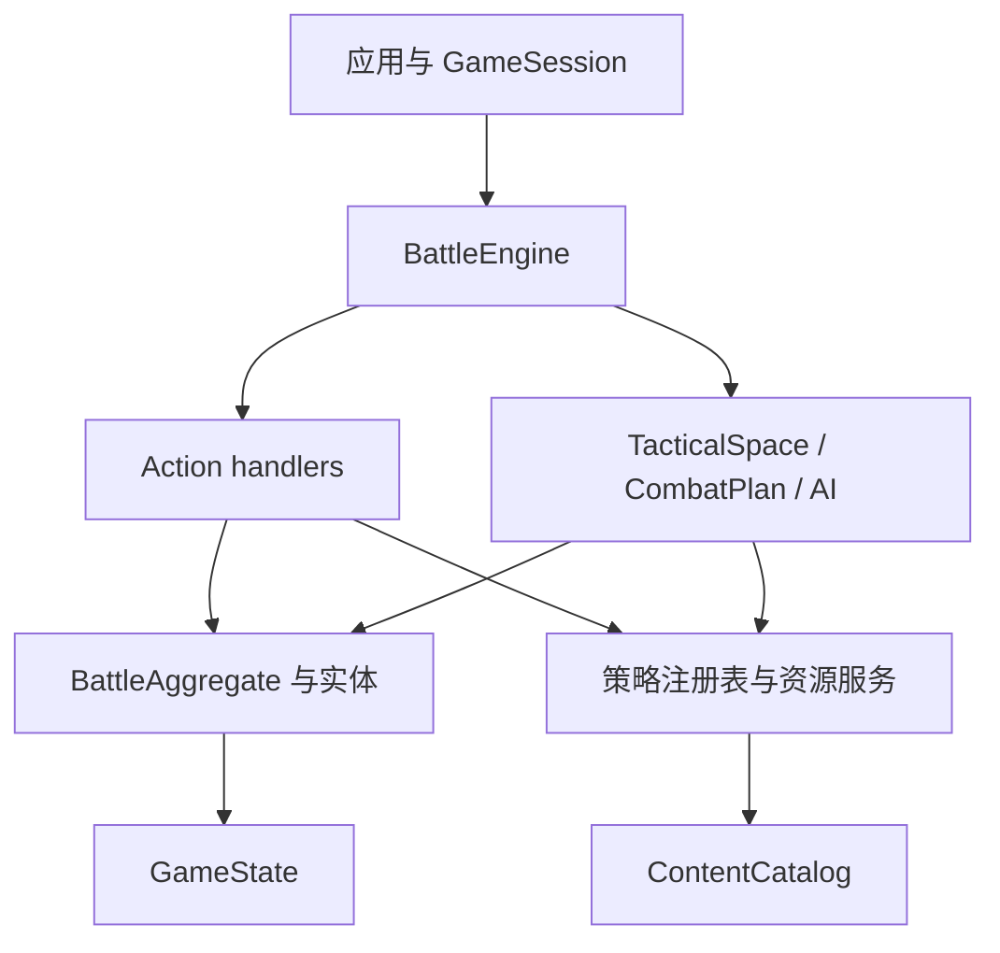

# 扩展通用 SRPG 战斗引擎

本页定义战斗引擎的现行架构、依赖方向、事务边界和扩展契约。它用于开发和审查规则代码，不记录历次重构过程。

> 文档类型：Conceptual · 状态：已实现并受架构测试保护 · 代码真值：`packages/battle-engine/src/`

## 引擎边界

战斗引擎是无文档对象模型（DOM）的单场战斗领域内核。给定内容目录、规则能力、关卡快照和 Action，它验证合法性、修改 `GameState` 并产生语义 `GameEvent`。

引擎负责：

- 关卡正规化后的状态创建与校验
- 移动、空间、视线、攻击和资源合法性
- 战斗、状态、指挥、士气、成长和结构结算
- 目标、场景触发器、阶段和胜负
- AI 行动枚举与估值
- 事务回滚、克隆、预测和确定性事件

引擎不负责：

- DOM、输入状态、动画、声音和素材路径
- 人物名、台词、章节和剧情分支
- 跨关名单、持久关系和存档槽
- 编辑器界面和本地存储
- 某个题材的兵种与数值定义

## 分层模型

代码按定义、领域状态、规则策略、应用门面和表现适配分层。



| 层 | 主要类型 | 约束 |
| --- | --- | --- |
| 内容定义 | `ContentPack`、`ContentCatalog`、各类 `*Def` | 不保存对局状态，不含流程副作用 |
| 对局数据 | `GameState`、`GameMap`、`LevelData` | 可结构化克隆，可序列化，不含 DOM 和函数 |
| 领域模型 | `BattleAggregate`、`UnitEntity`、`PlayerEntity`、`StructureEntity`、`Battlefield` | 维护实体和聚合不变量 |
| 规则策略 | Action、目标、场景、伤害、状态、资源和 AI 注册表 | 开放扩展，实例隔离 |
| 应用门面 | `BattleEngine`、`GameSession` | 统一查询、提交、回滚、撤销和订阅 |
| 上层适配 | `game-ui`、`editor`、`campaign-engine` | 只消费引擎，不反向注入题材判断 |

## 微内核组合

`SrpgMicrokernel` 只完成三件事：注册插件、解析依赖、装配能力。它不解释战斗玩法。

默认引擎由四个自洽插件组成：

| 插件 | 提供的能力 |
| --- | --- |
| `engine.tactical-rules` | 内容快照、能力、空间、伤害修正、命中效果、状态、成长、行动序策略、随机源 |
| `engine.mission-rules` | Action、场景条件、场景效果和目标 |
| `engine.resource-economy` | 通用资源账户策略 |
| `engine.ai-planning` | 目标顾问和能力估值 |

能力表当前有 16 项：`content` `abilities` `space` `actionHandlers` `combatModifiers` `hitEffects` `statusBehaviors` `scenarioConditions` `scenarioEffects` `objectives` `progression` `resources` `turnOrders` `random` `aiObjectiveAdvisors` `abilityAiEvaluators`。

插件按业务能力成块，不能为每个类建立一个插件。每个插件声明：

- `id` 和正整数 `version`
- `provides` 能力清单
- `requiresCapabilities` 能力依赖
- 必要时使用 `requires` 声明非能力顺序
- `install(context)` 中的实际提供行为

内核拒绝重复插件版本、竞争能力提供者、缺失依赖、依赖环和声明后未提供的能力。装配结果只暴露只读 `KernelCapabilities`。

## 行动序策略

回合顺序是一条可替换的策略，不是写死的循环。`rules.turnOrder` 按 id 选择：

| 策略 | 语义 | 对应作品 |
| --- | --- | --- |
| `side` | 一方全体各行动一次，再交给下一位存活玩家 | 远古帝国 / AW / 火纹 |
| `initiative` | 每个单位按速度累积充能，单独获得行动权 | 皇家骑士团2 / FFT |

两套词汇必须分开，否则任何一族都做不对：

- **回合（round）**：战斗时钟一圈。收入、地形覆盖层衰减、场景 `everyRounds` 触发器以此为准，`state.turn` 计的是它。
- **行动轮（actor turn）**：一次行动权。状态跳动、建筑治疗、武器冷却、反应预算以此为准。

在阵营回合下两者按玩家重合，这正是它们长期被混为一谈的原因。

行动权由策略回答，命令处理器、AI 规划器和界面都问同一个策略，因此 AI 不可能规划出执行层必须拒绝的行动。策略自己维护可序列化的状态切片并自行清理离场单位——把它挂到单位生命周期上会让 `state` 依赖 `turn-order`，闭合一个依赖环，无环适应度测试会拒绝。

## 内容目录

内容目录是**按组合创建**的，没有环境单例。应用（或测试）声明自己使用哪些内容包，插件把它们装进只属于这个引擎的目录：

```ts
const content = createContentCatalog();
new ContentPackInstaller(content).install(COMMON_PACK, THEME_PACK);
const engine = createBattleEngine({ content });
// 或者交给微内核
const engine2 = createDefaultMicrokernel(content).buildBattleEngine();
// 直接从内容包组装
kernel.use(createContentPlugin([COMMON_PACK, THEME_PACK]));
```

两条随之成立的性质：

1. **地形字符命名空间是按目录的**。两个题材可以同时使用 `.` 和 `C`——同一份关卡行在不同目录下会被读成不同地形。这曾是全局单赋值的硬上限。
2. **定义在安装时深拷贝**。内容包是*声明*，目录才*拥有*定义；一个引擎里的平衡覆写不会串到另一个引擎，也不会污染内容包常量本身。

`data/` 目录只剩两个专用注册表类（`DamageMatchupRegistry`、`TerrainEncodingRegistry`）和职业查询；它过去存在的理由——放全局注册表——已经不存在了。

`ContentPack` 是纯数据包，当前可以提供：

- 移动配置
- 伤害类型、护甲和克制矩阵
- 地形与字符编码
- 武器与单位
- 状态、结构和地形覆盖
- 战术、职业和阵形

`ContentPackInstaller` 在写入目录前完成依赖排序、ID 冲突、交叉引用、资源形状、伤害矩阵和地形字符校验。整个安装过程通过预校验保持原子性。

应用可以使用全局目录完成启动期注册。`createDefaultBattleEngine()` 会克隆目录和规则注册表，后续全局修改不会泄漏到已创建引擎。

多题材并行沙箱应显式创建 `ContentCatalog` 和 `ContentPackInstaller`，不要依赖全局便捷目录。

## 领域模型

系统采用面向对象和充血模型维护关键不变量，同时保留可序列化状态对象。

### BattleAggregate

`BattleAggregate` 管理影响多个实体的状态转换，例如伤害、死亡、载具损失和战场清理。调用者不能在多个数组中手动拼接一次死亡流程。

### UnitEntity

`UnitEntity` 管理单元级不变量，例如生命、反应、武器冷却、资源状态、军衔和职业。单位数据仍完整保存在一个 `Unit` 中，策略不会把身份拆成组件袋。

### PlayerEntity 和 ObjectiveRuntimeEntity

玩家拥有自己的资源和目标运行时状态。目标的激活、完成、失败、取消和公开由领域对象约束，场景效果不能写入非法状态。

### StructureEntity 和 Battlefield

`StructureEntity` 维护耐久、修复和失效规则。`Battlefield` 把基础地形、海拔、覆盖层、方向掩体和结构投影为统一战术格，但不会把这些源数据合并成单一字段。

这种设计保持两层真值：源数据各自独立，规则查询通过聚合投影获得有效结果。

## Action 与事务

`ActionKindMap` 是开放 Action 代数。内置 Action 覆盖部署、单位命令、战术、反应、朝向、转职、阵形、运输、招募和结束回合。

每种 Action 由一个 `ActionHandler` 执行。`ActionHandlerRegistry` 负责类型到策略的映射，核心分发器不包含不断增长的 `switch`。

`BattleEngine.dispatchWithReceipt()` 是权威事务边界：

1. 克隆提交前 `GameState`
2. 执行 Action handler
3. 推进场景、目标和胜负
4. 成功时返回事件和提交前快照
5. 任意异常时恢复完整状态并重新抛出

这项保证覆盖普通命令和 `endTurn`。扩展处理器可以使用就地领域修改，但调用者仍获得全有或全无语义。

## 查询与提交共用规则

UI 和 AI 不拥有规则副本。应用只调用以下引擎查询：

- `commandsAt()`：单位在落点可用的命令
- `moveField()` 与 `pathTo()`：移动范围和最低成本路径
- `threatOf()`：本回合可攻击范围
- `visibleTiles()` 与 `visibleUnits()`：战争迷雾投影
- `forecast()`：单目标交战预览
- `attackPlan()`：范围、结构和援护的完整计划
- `careerOptions()`：合法转职选项
- `chooseAiAction()`：下一项正式 AI Action

`TacticalSpace` 把移动、攻击目标和可见性放在同一个端口。替换潜行、区域控制或寻路策略时，必须整体保持菜单、AI 和提交一致。

## GameSession 外壳

`GameSession` 为有状态应用提供窄接口：

- 保存当前 `GameState` 和语义事件日志
- 缓存当前状态版本的移动场
- 支持订阅
- 保存 Action 前快照用于撤销
- 提供 `tryDispatch()` 给交互界面处理非法操作
- 支持重开

撤销不能跨过 `endTurn` 或完成部署。它是本地交互能力，不是通用回放格式。

## 开放扩展契约

扩展必须贯穿类型、执行、预测、AI 和事件，不能只在某个层面注册一个名称。

### 新增 Action

新增 Action 需要：

1. declaration merge `ActionKindMap`
2. 实现并注册 `ActionHandler`
3. 从合法命令或应用入口产生该 Action
4. 发出结构化 `GameEvent`
5. 提供成功、非法和回滚测试
6. 如果 AI 可使用，加入枚举和估值

### 新增能力

代码能力由 `AbilityDef` 和能力注册表执行。内容包只在单位或职业中引用能力 ID，不携带函数。

AI 可使用的新能力必须注册 `AbilityAiEvaluator`。能力合法性、执行和估值需要成组交付。

### 新增伤害修正

实现 `CombatModifierProvider`，给出稳定 ID、优先级和可解释 `CombatModifier`。不要直接改写最终伤害，也不要在 UI 中补算。

修正必须明确属于以下阶段之一：

- `power`：加法或乘法改变伤害功率
- `mitigation`：进入统一减伤与封顶
- `final`：反应等最终乘区或偏移

### 新增状态和命中效果

数据定义进入内容包。生命周期行为进入 `StatusBehaviorRegistry`，武器命中行为进入 `WeaponHitEffectHandlerRegistry`。

开放的命中效果需要 declaration merge `WeaponHitEffectKindMap`，并提供处理器。可预测效果还应进入 `CombatPlan` 或对应预览结构。

### 新增目标

目标需要 declaration merge `ObjectiveKindMap` 并注册 `ObjectiveHandler`。处理器必须定义结果、描述、进度、子目标和刷新方式。

AI 需要理解的新目标还要提供 `AiObjectiveAdvisor`，不能让 AI 根据 `label` 猜测任务。

### 新增场景原语

场景条件和效果分别扩展 `ScenarioConditionKindMap` 与 `ScenarioEffectKindMap`，再注册相应 handler。

效果只能修改战斗聚合内的事实。跨关关系、长期奖励和章节选择应通过 `scenarioSignal` 交给战役桥处理。

### 新增资源主体

资源状态保存在实体上，规则通过 `ResourceAdapter` 访问。扩展主体需要 declaration merge `ResourceSubjectKindMap`，并提供账户适配器、容量规则和 AI 权重。

## 场景 DSL 与目标

场景领域特定语言（DSL）使用结构化条件和效果，不执行任意脚本字符串。处理器注册表让代数开放，关卡数据仍可序列化和校验。

场景执行顺序保持稳定：

1. Action handler 修改状态并发出事件
2. 更新事件计数
3. 处理对应 timing 的触发器
4. 应用场景效果并发出新事件
5. 刷新目标运行时
6. 检查玩家存活与胜负

重复触发器使用 `triggerRuntime` 记录次数和发生点。一次 timing occurrence 最多执行一次，防止效果递归造成同点重复。

## 确定性与序列化

默认战斗没有随机伤害、命中和暴击。相同内容版本、关卡快照和 Action 序列应产生相同事件和状态。

当前具备回放的基础条件：

- 可序列化 `GameState`
- 开放但结构化的 Action 和 Event
- 确定性寻路、预测和 AI 排序
- 内容包版本
- 原子 Action 边界

当前尚未提供正式回放产品：

- 初始状态哈希
- Action 日志格式
- 引擎规则版本锁定
- 重放校验器
- 旧 Action 迁移

在这些能力落地前，不能把 `GameSession.log` 宣称为产品级回放。

## 性能设计

引擎对小型和中型离散地图优化，但只在基准显示瓶颈后修改算法。`npm run bench:core` 测量创建状态、移动、威胁、预测和 AI 等热路径。

当前有意采用的优化包括：

- 按整数移动预算使用桶队列
- `GameSession` 按状态 stamp 缓存移动场
- `Battlefield` 作为一次规则查询中的短生命周期投影
- 修正提供者排序缓存
- `CombatPlan` 避免执行时重复展开目标
- 稳定排序保证 AI 与内容依赖可复现

任何缓存都不能成为第二真值。状态变化后必须失效，实例之间不能共享可变缓存。

## 依赖与隔离护栏

架构测试保护以下不变量：

- 核心模块无循环依赖
- `battle-engine` 不依赖 UI、编辑器、战役和内容包
- 引擎与内容不依赖 DOM
- 默认数据注册表不偷偷安装题材内容
- 编辑器文档聚合不依赖渲染
- 游戏控制器只能通过 `TacticalSpace` 获取空间合法性
- 多个默认引擎拥有隔离的策略和内容目录

违反这些边界时，应修复依赖设计，不应在测试中增加例外名单。

## 设计模式使用边界

系统使用设计模式解决具体变化轴：

| 模式 | 使用位置 | 解决的问题 |
| --- | --- | --- |
| 门面 | `BattleEngine`、`GameSession` | 给应用稳定的窄入口 |
| 策略与注册表 | Action、目标、场景、AI、状态、资源 | 开放行为扩展，移除名称分支 |
| 管线 | `CombatModifierPipeline` | 保持修正顺序和解释能力 |
| 聚合与实体 | battle、unit、player、structure | 集中不变量和生命周期 |
| 防腐层 | `CampaignBattleBridge` | 隔离跨关 DTO 与战斗 DTO |
| 微内核 | `SrpgMicrokernel` | 替换成组能力并验证依赖 |
| 适配器 | 资源、素材、战役表现 | 让存储或题材实现服从稳定端口 |
| 组合 | 目标、条件、效果 | 用数据表达复合规则 |

以下做法属于过度设计：

- 为每个数据类增加接口和工厂
- 把一个业务插件拆成多个组件级插件
- 用事件总线替代可追踪的直接调用
- 把 `GameState` 拆成无归属组件
- 为尚无第二实现的内部函数建立端口

## 扩展验收清单

合并引擎扩展前确认：

1. 能力是否故事中立且至少有第二题材用例？
2. 状态是否归属于明确实体或聚合？
3. UI、AI 和提交是否读取同一合法性与预测？
4. 失败是否恢复完整状态和事件语义？
5. 自定义类型是否有对应注册处理器？
6. 内容目录是否在写入前完成交叉引用校验？
7. 新策略是否按引擎实例隔离？
8. 是否提供单元测试、契约测试和至少一个集成测试？
9. 是否更新[引擎能力目录](./engine-capabilities.md)？
10. 如果改变 `LevelData`，是否更新 schema、正规化、校验与[关卡数据格式](./level-format.md)？

## 相关文档

- [战斗系统设计](./combat-system-design.md)
- [引擎能力目录](./engine-capabilities.md)
- [关卡数据格式](./level-format.md)
- [战场表现系统](./presentation-system.md)
- [质量与测试](./quality-and-testing.md)
