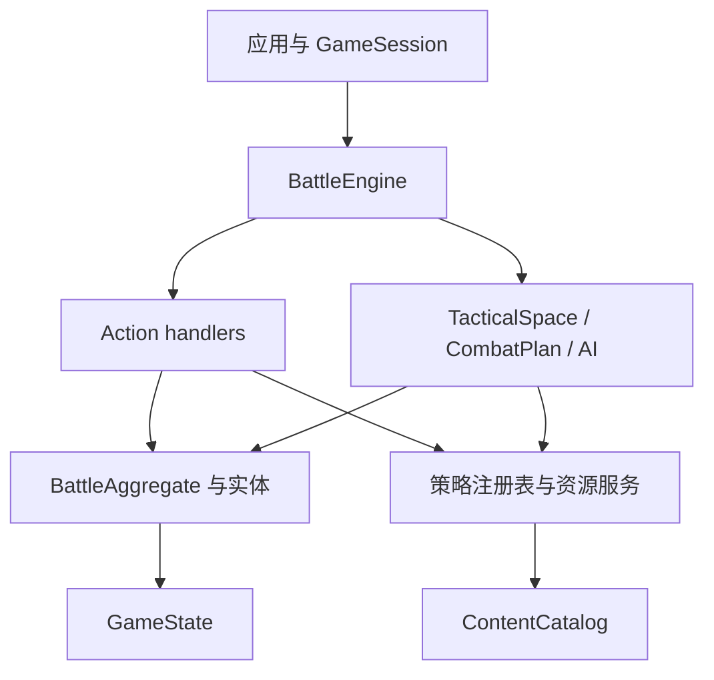

# 扩展通用 SRPG 战斗引擎

本页定义战斗引擎的现行架构、依赖方向、事务边界和扩展契约。它用于开发和审查规则代码。

每条契约后面通常跟一段“为什么不是另一种做法”。那不是重构日志，而是契约的一部分：不写下被否决的方案，下一次改动会把它重新引入。历次改动的过程本身在 git 历史和代码注释里，不在这里。

> 文档类型：Conceptual · 状态：已实现并受架构测试保护 · 代码真值：`packages/battle-engine/src/`

## 引擎边界

战斗引擎是无文档对象模型（DOM）的单场战斗领域内核。给定内容目录、规则能力、关卡快照和 Action，它验证合法性、修改 `GameState` 并产生语义 `GameEvent`。

引擎负责：

- 关卡正规化后的状态创建与校验
- 移动、空间、视线、攻击和资源合法性
- 战斗、状态、指挥、士气、成长和结构结算
- 目标、场景触发器、阶段和胜负
- AI 行动枚举与估值
- 事务回滚、克隆、预测和确定性事件

引擎不负责：

- DOM、输入状态、动画、声音和素材路径
- 人物名、台词、章节和剧情分支
- 跨关名单、持久关系和存档槽
- 编辑器界面和本地存储
- 某个题材的兵种与数值定义

## 分层模型

代码按定义、领域状态、规则策略、应用门面和表现适配分层。



| 层 | 主要类型 | 约束 |
| --- | --- | --- |
| 内容定义 | `ContentPack`、`ContentCatalog`、各类 `*Def` | 不保存对局状态，不含流程副作用 |
| 对局数据 | `GameState`、`GameMap`、`LevelData` | 可结构化克隆，可序列化，不含 DOM 和函数 |
| 领域模型 | `BattleAggregate`、`UnitEntity`、`PlayerEntity`、`StructureEntity`、`CommanderEntity`、`Battlefield` | 维护实体和聚合不变量 |
| 规则策略 | Action、目标、场景、伤害、状态、资源和 AI 注册表 | 开放扩展，实例隔离 |
| 应用门面 | `BattleEngine`、`GameSession` | 统一查询、提交、回滚、撤销和订阅 |
| 上层适配 | `game-ui`、`editor`、`campaign-engine` | 只消费引擎，不反向注入题材判断 |

## 微内核组合

`SrpgMicrokernel` 只完成三件事：注册插件、解析依赖、装配能力。它不解释战斗玩法。

默认引擎由四个自洽插件组成：

| 插件 | 提供的能力 |
| --- | --- |
| `engine.tactical-rules` | 能力、空间、棋盘铺法、伤害修正、命中效果、状态、成长、行动序策略、反应姿态、离场后果、爆炸形状、常驻命令、引用校验、存档阶梯、随机源 |
| `engine.mission-rules` | Action、场景条件、场景效果和目标 |
| `engine.resource-economy` | 通用资源账户策略 |
| `engine.ai-planning` | 目标顾问和能力估值 |

能力表当前有 24 项，且**只声明一次**：`KernelCapabilityMap extends BattleEngineDependencies`。它曾把这些名字以 `BattleRuleServices['x']` 的形式重抄一遍——一份第二清单，唯一的职责是和第一份保持一致。仍然对声明合并开放：插件可以加只有它自己的插件消费的能力。

插件按业务能力成块，不能为每个类建立一个插件。每个插件声明：

- `id` 和正整数 `version`
- `provides` —— 它**引入**的能力（同一个能力不能被两个插件引入）
- `overrides` —— 它**替换**的能力
- `requiresCapabilities` 能力依赖
- 必要时使用 `requires` 声明非能力顺序
- `install(context)` 中的实际提供行为

内核拒绝重复插件版本、竞争能力提供者、缺失依赖、依赖环，以及清单与实际安装行为在**任一方向**上的不一致。装配结果只暴露只读 `KernelCapabilities`。

## 只有一个组装根，替换是真的能用

有两件事，插件架构宣称做到了，实际没有。

**它不是组装根。** `createBattleEngine` 手工拼出同样的二十一项默认值，而除了 demo 之外的每个应用、除了一个之外的每个测试，用的都是它——于是微内核成了产品从不执行的真代码，而那份默认值还必须和遮蔽它的插件保持同步。上一轮 `areaShapes` 的清单漂移就是从这里来的。现在只有一个公开根：`createBattleEngine` 组合默认插件，再由同模块内的私有 `assembleBattleEngine` 把已经验证的能力装成引擎。

**替换被写在文档里，却是不可能的。** `provides` 的注释说清单「让替换不必依赖提供者 id」，但两个插件声明同一个能力是错误，store 也拒绝第二次 `provide`。现在插件可以声明 `overrides` 并调用 `context.replace`。让它安全的是顺序：一次替换落在**引入者之后、每一个消费者之前**——因为在 `install` 时就读取某个能力的消费者，否则会一直握着被替换掉的那个值。任务规则插件正是在安装时用 `random` 播种条件注册表，缺了这条边，替换 `random` 就会静默失效。

所以工厂给**每个被替换的能力各建一个插件**，而不是一个插件替换全部：一个同时替换 `random` 和 `scenarioConditions` 的插件，必须同时排在任务规则之前和之后。

具体引擎装配也从 `SrpgMicrokernel` 上移走了，并且没有成为第二个公开工厂。一个知道如何构造某个具体应用的通用插件宿主，就是一个组装不了别的东西的宿主。

## 内容和规则之间的引用完整性有主人

「这套规则是不是实现了内容和关卡写下的每一个名字」这个问题，过去有三个答案，而对大多数扩展点没有答案：

- 引擎构造函数里三个手写循环（兵种能力、职业能力、武器命中效果）；
- 紧挨着它的一段手写遍历里另外三个（目标、条件、效果种类），其中条件遍历把 `all | any | not` 写死；
- 以及此后新增的每一个扩展点——爆炸形状、常驻命令、反应姿态、行动序策略——**没有任何人检查**。一个引用了未注册爆炸形状的关卡不会作为「坏关卡」失败，它会在战斗中途、以一次注册表查找的形式、从恰好跑到那条规则的地方失败。

`RuleReferenceCheckRegistry` 是一张开放注册表，每条检查说明「我这个扩展点认识哪些名字」以及「名字会出现在哪些位置」。位置有三种，因为文档有三种：目录（组合引擎时查一次）、关卡（载入那张图时查）、以及**运行中的战斗**（读存档时查）。第三种不是前两种的子集：开打之后才出现的名字——场景效果发下的一条常驻命令、单位改过的姿态、职业授予的能力——只存在于状态里，而状态会被写到磁盘上，几个月后回到一台插件已经变过的引擎里。九条默认检查覆盖了六个原本无人检查的扩展点；规则包新增扩展点时，顺手注册守它的那条检查——这正是它是一项能力而不是一个函数的原因。

`ScenarioConditionHandler.children` 与 `ObjectiveHandler.children` 并列：两处遍历都写死了三种复合条件，规则包自己的复合条件的子节点在两边都被静默跳过。

而「一个组合目标由哪些目标构成」被写了四遍——id 分配器、运行时状态遍历器、关卡 linter 的声明收集、linter 自己的递归——每一份都是自己那套复合种类名单，四份都要扩展，而规则包的复合种类一份都不在里面。改成**按文档形状读**：组合目标就是**持有**其它目标的那个，文档自己说了；不需要任何人把新种类的名字加到任何地方。

## 行动序策略

回合顺序是一条可替换的策略，不是写死的循环。`rules.turnOrder` 按 id 选择：

| 策略 | 语义 | 对应作品 |
| --- | --- | --- |
| `side` | 一方全体各行动一次，再交给下一位存活玩家 | 远古帝国 / AW / 火纹 |
| `initiative` | 每个单位按速度累积充能，单独获得行动权 | 皇家骑士团2 / FFT |

两套词汇必须分开，否则任何一族都做不对：

- **回合（round）**：战斗时钟一圈。收入、地形覆盖层衰减、场景 `everyRounds` 触发器以此为准，`state.turn` 计的是它。
- **行动轮（actor turn）**：一次行动权。状态跳动、建筑治疗、武器冷却、反应预算以此为准。

在阵营回合下两者按玩家重合，这正是它们长期被混为一谈的原因。

行动权由策略回答，命令处理器、AI 规划器和界面都问同一个策略，因此 AI 不可能规划出执行层必须拒绝的行动。策略自己维护可序列化的状态切片并自行清理离场单位——把它挂到单位生命周期上会让 `state` 依赖 `turn-order`，闭合一个依赖环，无环适应度测试会拒绝。

### 行动权只有一个问句

`mayAct(rules, state, unit)` 是「此刻这个单位能不能行动」的唯一答案：阶段由战斗回答，资格由策略回答。引擎门面、Action 管线和 AI 都调它。

**指令权限**（`ActionExecutionContext.commandableUnit(id, order)`）在此之上再加归属与「本轮已行动」，三者是**一条规则**：

```ts
const actor = context.commandableUnit(action.unit, '调整朝向');   // 归属 + 已行动 + 行动资格
const ally  = context.ownUnit(action.carrier);                    // 只要求归属（运输载具不消耗行动）
```

这条规则原先在每个处理器里手抄一遍，其中六个漏掉了策略资格。在阵营回合下「我的且未行动」恰好等价于「有行动权」，所以看不出问题；换成个体行动序，玩家就能在一个单位的行动轮里重排整支军队。适应度测试禁止再手写单位归属比较。

## 战斗生命周期

`BattleLifecycle`（`turn-cycle.ts`）是唯一可以改写 `state.phase` 和 `state.turn` 的地方：

| 方法 | 语义 |
| --- | --- |
| `start()` | 播种行动序策略，领取战斗第一个行动轮 |
| `beginPlaying()` | 部署结束，战斗正式开始 |
| `advanceTurn()` | 当前行动轮结束，按策略交接；跨轮时推进战斗时钟 |
| `concludeIfDecided()` | 胜负规则已判定时结束战斗 |

### 行动轮时钟

`state.actorTurns` 是「已经发出过多少次行动权」的单调计数，由 `claim()` 递增。所有延迟都以它为单位。

这是设计上的关键取舍：个体行动序自带充能时钟，阵营回合没有，如果延迟按 tick 计，同一份内容包在两族下含义完全不同，还会逼 `TurnOrderPolicy` 长出一套排程 API。而「一次行动权」是两族都恰好一次产出一个的东西——所以内容包写 `castTurns: 2`，在两族下都读作「再过两次行动权」。

它替换了五个互相传递 `(state, emit, rules)` 的自由函数。原先 `state.phase` 由三个互不相关的位置赋值，「一个回合什么时候结束」没有归属；策略报告「无人可行动」时只设了阶段就返回，战斗于是停在 `over` 却没有胜方、没有结束原因、也没有 `gameOver` 事件——等这个事件的外壳直接挂住。架构适应度测试现在守着这份归属。

## 反应姿态是内容

一种姿态曾经是四个硬编码字符串，含义写在 `combat.ts` 里的 `=== 'guard'` 比较和字面量 `0.7` 上。加第五种就得改伤害预测——那是内容包最不该碰的地方。

现在每种姿态是注册表里的一个值对象，`ReactionStance` 也和 `TerrainId` 一样是开放 id：

| 字段 | 含义 |
| --- | --- |
| `intercepts` | 替相邻友军挡下攻击 |
| `incomingMultiplier` | 受到攻击的伤害系数 |
| `retaliates` | 是否还击 |
| `conservesResources` | 只用无消耗武器还击 |

字段全部必填是刻意的：可选钩子会让某种姿态对某个问题回答「没有特别意见」，那默认值就又回到引擎里了。内容包加一个 `dodge`（0.4 减伤、放弃还击）不需要改任何一行引擎代码，HUD 也会自动列出它连同提示文本。

## 单位回场也是一次通告

复活尸体和召回撤退单位，曾经是**两段手写的代码**，而且已经漂开了：

| | 复活尸体 | 召回撤退 |
| --- | --- | --- |
| 士气 | 原样带回 | `max(1, 原值)` |
| 状态 | 清空 | 原样带回 |

第一格是个真 bug。溃逃标记里的 `fallenUnit.morale.current` 是 0——它就是因为归零才溃逃的。复活它，它带着 0 士气回来，**下一次任何士气波动都会让它再溃一次**。剧情里「复活阵亡的老兵」这种桥段，交给玩家的是一个当场蒸发的礼物。另一条路径写了 `max(1, ...)`，说明有人意识到过这个问题，但只修了自己那一半。

第二格没人做过决定，只是两次各写各的。

现在 `returnUnitToField()` 一处结算：位置、归属、`done`、占领进度、状态清空、士气回满、反应恢复、id 与指挥官重挂、标记消费与事件。**士气回满而不是保底 1**——理由和清空状态是同一条：离场结束了身上的毒，也结束了那阵慌乱；保底 1 在算术上非零，在实战里照样是下一击就崩。

适应度测试守着 `units.push`：往战场上添一个单位，必须经过一个有名字的生命周期步骤。**运输舱卸载被明确排除在外**——乘客从未离开过这个世界，它该保留自己的状态和士气；「搭个车就解毒」不是任何人想统一进来的规则。

## 单位离场是一次通告

死亡的后果属于别的子系统：光环崩塌、咏唱哑火、运输载具倾覆。它们过去逐个手工接线，于是 `handleCommanderDefeat` 被从**十一处**调用，每加一种后果就要重新找齐这十一处。

现在离场是一次通告加一份开放的监听者名单。指挥官模块和咏唱模块各自注册自己的后果，插件也用同样的方式加自己的。

**注册表本身不 import 任何子系统**，这正是它能成立的原因：战斗要通告死亡，而对死亡的反应可能又需要战斗——上一轮把这件事推迟，就是卡在这个环上。

同一个调用还吸收了「报告一次死亡」的固定动作：`death` 事件、尸体标记、`transportLost`，然后才是后果。那是六行代码在六个致命伤害点各抄一遍，每一份都离漏掉一步只有一次编辑之遥。`BattleAggregate` 现在返回 `fall`（恰好在致死时非空），调用方不必再从单位已经离开的战场上把伤亡信息拼回来。`StatusLifecycleContext` 的 `onDeath` 回调也随之退休——它存在的唯一理由是状态模块不能 import 指挥官模块。

## 问和做是两件事

一个查询不该靠抛异常回答「不行」。

`availableWeapon` 曾经同时回答两个问题——「这件武器现在能用吗」和「把它给我」——而第一个问题的「不能」是用抛异常表达的。于是每个只想*问*的地方（菜单枚举、AI 候选、合法性检查）都得包一层 `try { ... } catch { return false }`。

代价不是难看，是**它把两种完全不同的事变成了同一个安静的「否」**：武器在冷却，和单位的武器列表里写了一个内容包根本没定义的 id。后者是内容拼写错误，本该在注册表当场炸出来，结果被吞成「这个单位永远不能攻击」——只能靠二分内容才找得到。

现在是两个函数：

| 函数 | 谁在问 | 答不上来时 |
| --- | --- | --- |
| `readyWeapon` | 菜单、AI、合法性检查 | 返回 `null` |
| `requireReadyWeapon` | 执行路径（合法性已在受理时判过） | 抛 `DomainInvariantError` |

`isWeaponReady` 随之收窄成只接受 `WeaponDef`——它的 `WeaponId` 分支只剩咏唱一个调用方，而那里要的本来就是查询形态。

`forecastCombatPlan` 的三条前置条件也归入了错误分类：所有调用方都经由 `abilityTargets` 抵达，前置条件本就是调用方的责任，违反它是缺陷而不是拒绝。

通用 UI 里那个 `catch {}` 被删掉了：它防的竞态是「`hoverTarget` 是个存下来的字段、活得比填它的那次选择还久」造成的，而上一轮把它改成从当前选择的目标列表派生之后，那个竞态已经不存在了。渲染路径上的裸 catch 会把其他所有失败原因一起藏起来。

### 拒绝的理由只写一遍，问和做各取一半

问与做分开之后还剩一个陷阱：**同一条规则被写两遍，一遍拒绝、一遍列举**。战前部署就是这么废掉的——Action 处理器里逐条写着区域归属、占位交换、地形能否承载，而任何想*提供*这些落点的界面都得把它们再推一遍。没人推，于是这个阶段带着完整的规则、校验、编辑器表单和存档覆盖上线，却没有一个界面进得去。

现在只有一个函数说「不行」：

```ts
deploymentRefusal(rules, state, unit, at): string | null
```

菜单留下它答 `null` 的格（`deploymentSpots`），指令抛出它答的那句话（`deployUnit`）。棋盘画出来的落点和引擎收下的落点因此不可能对不上，而每条拒绝仍然带着自己的理由，不会塌成一句「非法」。

顺手补上的是它揭出来的一个洞：交换位置只检查了**移动方**能不能站过去，没检查**被挤走的那个**能落在哪。骑兵和步兵同区，步兵站在山地上和骑兵换位，骑兵就被放到了一个它永远走不出来的格子里。

登载与卸载是同一个病例的第二例，而且更彻底：`transports.ts` 里每一条规则都只有抛异常那一种形态，于是任何界面都无从枚举「这辆车收不收你」。它带着完整的事件、乘员随车阵亡、撤退处理和存档覆盖上线，而**没有一个已发布兵种声明过 `transport`**——单元测试之外，仓库里没有东西跑过它。现在 `embarkRefusal` / `disembarkRefusal` 同样是那一句话：菜单拿它当禁用理由，指令拿它当拒绝消息。

顺带一提，这些拒绝语从英文改成了中文。它们以前是英文，因为**没有任何人会看到**；现在同一句话就印在禁用按钮的 title 上。

**一条适应度测试守着这一类**：不绑定错误对象的 `catch` 不许产生返回值。它上线后立刻抓到一处我没在找的——HUD 用 `try/catch` 取资源显示名，而注册表一直就有 `tryGet`。资源适配器注册表当时缺这个查询形态，补上了。

## 一次伤害就是一次结算

一次伤害不只是扣血。它还要报告这一击、结算阵亡、倾覆载具、震动幸存者、通知所有关心「有单位离场」的子系统。这套后续动作曾经在**五个**伤害点各写一遍，而且是**三种不同的顺序**；其中两处还得自己提防「目标已经被同一轮的前一击吓跑了」。

现在只有 `resolveDamage(rules, state, request, emit)`：

| 归属 | 内容 |
| --- | --- |
| 调用方 | 只有它自己那句话——`attack` / `counter` / `collisionDamage` / `statusTick` |
| 规则 | 阵亡、尸体、乘员、离场后果、受击者与围观者的士气 |

调用方通过 `report` 回调交出自己那句话，因此它必然被排在因果之间：先因后果，日志和回放都不会颠倒。

`DamageOutcome.leftField` 是这个抽象存在的第二个理由。调用方真正要问的是「这个单位还在不在场上」，而过去所有地方都把它写成 `!killed`——**被同一击的士气冲击吓跑的单位一样不在了**。名字一改，「对已经离场的单位继续施加命中效果」这一类 bug 就没有了写法。

顺带死掉的是一个布尔陷阱：`resolveMoraleAfterDamage(..., killed, ...)` 靠一个位置布尔做两件无关的事，还返回一个「他跑了」让调用方翻译成离场通告。现在它是 `sufferDamageShock` 和 `mournFallen` 两个函数，而**溃逃自己通告自己的离场**。这补上了一个真实的洞：场景效果 `changeMorale` 可以把一名指挥官吓出战场，而没有任何后果被触发。

## 控制区

单位占住身边的地。走进敌人的控制区，这一步就是终点——你没法从长枪兵旁边溜过去打他身后的弓手；从控制区里脱离，则要挨一记借机攻击。两条加起来，战线才是需要打破的东西，而不是绕开的东西。

| 决定 | 归属 |
| --- | --- |
| 有没有控制区这回事 | `rules.zoneOfControl`（默认关） |
| 每种兵伸多远 | `UnitDef.zoneOfControl`（默认 1，`0` 表示这种兵不占地） |

规则管有无、内容管远近，和 `moraleEnabled` 与单位士气档案是同一种分工：**内容包不能靠描述自己的单位把一条规则打开**。

移动侧只是寻路里的一句话：控制格可以进、不能从它继续展开。AI、威胁范围、UI 高亮因此自动跟上，没有第二处需要同步的实现。

借机攻击复用已有的概念而不是新造：一回合一次反应（`UnitEntity.canReact`），放弃还击的姿态同样放弃借机攻击，还击与借机攻击共用同一个「此刻它最强的一记免费打击」查询（`bestReactiveStrike`）。**被推出控制区不算脱离**——那不是它选的。借机攻击可能当场打死移动者，所以命令在移动之后会先确认单位还在，再继续执行。

## 咏唱与延迟结算

武器 `castTurns > 0` 时，这一击**当场提交、稍后结算**：目标格与出手格在提交时冻结，所以炮弹保留开火时的几何，而战场在它头顶继续变化。目标可以走出这一格，友军也可能走进来。

| 概念 | 归属 |
| --- | --- |
| 已提交未结算的一击 | `state.pendingCasts`（每个施法者至多一条） |
| 派生读数（剩余、进度、是否到期） | `SpellCastEntity` |
| 提交、结算、清扫 | `casting.ts` |
| 何时结算 | `BattleLifecycle.beginActorTurn()`，在下一位行动者动之前 |

**咏唱是代价，不是白送的延迟。** 生命周期不刷新正在咏唱的单位，它保持「已行动」直到落地。这不需要给 `canAct` 或行动序策略加任何新判断——`done` 是 `canAct`、`actors()` 和 AI 都已经理解的东西。

**结算是全函数的。** 咏唱打开了一个世界会变化的窗口，所以结算不假设提交时成立的前提仍然成立，而是逐条询问：施法者是否还在、武器是否仍可用、目标是否被交战规则保护、单目标武器指向的格子是否已空。任一不满足就让这一击**哑火**并给出原因，绝不让它掀翻恰好触发清扫的那个回合。

因此 `forecastCombatPlan` 里挪了一条守卫：原先「没有主目标就报错」，但它下面每一步本来就能处理空主目标。**范围**武器可以落在人已经走掉的格子上——那正是咏唱的意义；**单目标**武器指向空格才是真的无事可做。

代价在落地时支付，所以没打出去的咏唱不消耗弹药。施法者阵亡后的孤儿条目在行动轮边界统一清扫，而不是从单位可能死亡的十一个位置分别推送——理由与行动序自行清理离场单位相同；在此期间 `activeCasts()` 已经对所有读者隐藏了它们。

## AI 考虑做什么，是一份开放的清单

插件早就能**加**一种 Action 并让引擎执行它，但没有任何办法让 AI **选**它——扩展做到一半就停在人类玩家这里。原因是决策驱动是一条写死的链：先战术、再征募、再姿态、最后最优的一步棋。

现在这四项是注册表里的四个 intent（优先级 10/20/30/40，中间留了空档），插件可以插进去、也可以整个替换掉某一项。

**优先级没有改成打分**：「战术优先于行军」是关于*动作种类*的决定，不是对它们价值的比较；给它硬造一个共同货币，那是把重新平衡伪装成重构。

`AiTurnContext` 是一次决策共享的分析：立场读数（`AiAgenda`）、威胁图、战场投影。三者都是**惰性**的——被便宜的 intent 解决掉的一回合，不会为昂贵的那几个付费，这正是原来那条手写链的行为。

它同时是规划器内部函数的**整个参数表**。这些函数过去收的是拆开的零件：state、阵营、立场、威胁、激进度、战场投影、依赖包。`positionScore` 因此有八个参数，`evaluateUnit` 有七个——每个调用点都要把上下文拆开、再一个一个传回去，每加一项共享读数就要拓宽七处签名。现在传上下文。

## 一块地值多少，是十三个有名字的判断

格子估值曾是一段八十行的累加器，每一项都没有名字：一个格子算出 214 分，没有任何东西说明这来自地形、来自任务，还是来自东边两格的弓手。于是每个平衡问题都得靠二分查找回答。

`TileAppraisal` 把每项考虑写成一个有名字的问题——`defensibleGround`、`captureProspect`、`escortPull`、`exposure`、`commandLink`——并按累加器原本的顺序求和，因此算术分毫未动。全部三章的 AI 决策轨迹（3283 个动作）在重构前后逐条相同。

`ai.ts` 的 791 行按「这一部分回答什么问题」拆开：`measures`（一个单位或一块地值多少）、`threat`（敌人能对它做什么）、`agenda`（这一方在争什么）、`tile-appraisal`、`ability-evaluators`、`turn-context`、`default-intents`。顺带修掉几个真正误导人的名字：`AiObjectives` → `AiAgenda`（目标系统已经占用了「目标」）、`unitValue` → `unitWorth`（区别于 `UnitDef.value`，那是*兵种*的价值）、`nearest` → `nearestDistance`（它从来不返回最近的东西）、`pathFrom` → `pathTo`（它构造的是通往某格的路径）。

## 注册表是一个概念，不是十二份拷贝

十二个开放扩展点各自手写了同一张表，然后**在要紧的地方发生了漂移**：有的能被*问*「你有这个条目吗」，有的只能被*命令*、答不上来就抛异常——所以需要提问的调用方就在答案外面包一层 `try/catch`（上一轮 HUD 取资源显示名就是这么写的）。有的列得出自己的键，有的列不出。两个按优先级排序的注册表用了同样的并列打破规则，但只有一个记得缓存。

存储、重复拒绝、**问/命令这一对**、以及复制，现在只在 `KeyedRegistry` 里写一次；`PriorityRegistry` 加上「全部按序征询」这一变体；内容目录成为 `ContentRegistry`，名字终于说明它装的是什么。子类保留的是真正属于它自己的部分：条目登记时用的词汇，以及这张表*拿这些条目做什么*。

并列打破规则才是关键的那一条：按 id 打破并列，让安装顺序无法影响结果——两个插件注册在同一优先级上，也不会让一场战斗取决于模块加载顺序。

**一条适应度测试拒绝任何自带 `Map` 的新注册表**，漂移回不来了。两个例外不是按单一 id 索引的表：地形编码是字符与地形之间的双射，伤害克制是按「一对」索引的矩阵。

## 关卡校验器曾经是它自己的符号表

`validateLevel` 有 437 行，而且**语句顺序是承重的**：每一段各自建一个局部 `Set` 存声明过的 id——玩家、单位 key、区域、结构、复合目标、目标——后面的段落读前面留下的局部变量。触发器检查能工作，只是因为区域循环碰巧跑在前面、把 `zoneIds` 留在了作用域里。没有任何一段可以被命名、移动，或者单独阅读；同一套「缺少 id / id 重复」被抄了七遍，七种看起来很像的措辞。

现在名字由 `LevelDeclarations` 收集一次——**重名也在那里发现**，因为那是关于声明本身的事实，与任何一次引用无关。`LevelInspection` 携带文档、内容目录、地图和声明表，每一条检查是写在它上面的一个有名字的问题。

`mapio.ts` 随之消失。那个名字没有描述它五个主题中的任何一个——它既不只关于地图，也和 IO 无关——关卡文档现在一个主题一个模块：`defaults`、`schema`、`map`、`declarations`、`validation`、`issues`，统一在 `src/level/` 之下，随包根一起导出。

重构后逐条比对：每个内置关卡加上各自的「全面破坏」变体，共 501 条发现，消息完全一致。

## 一次攻击只解释自己一遍

`DamageBreakdown` 把同一份解释写了两遍。修正链是有序、带标签、对任何插件注册的 provider 开放的那一份；除此之外还有九个字段——`effectiveness`、`strength`、`terrainDefense`、`unitDefense`、`statusAttackMultiplier`、`commanderAttackMultiplier`、`commanderDefenseDelta`、`targetBonus*`、`reactionMultiplier`——每一个都是**在每次攻击时用 id 字符串从那条链里再找回来的**。

同一种病还在同一个文件里活着，这一轮才清掉：`StructureCombatForecast` 把自己的算式又抄了六个字段——`strength`、`statusAttackMultiplier`、`targetBonusReasons`、`structureDefense` 四个**在生产代码和测试里都没有任何读者**，删掉；剩下 `commanderAttackMultiplier` 与 `targetBonusMultiplier` 各有一个测试读它，当作「光环/克制确实作用到了建筑上」的观察点。

这是一处真实的不对称，记在这里而不是假装它不存在：单位那条路径用的是**有序、带标签、对插件开放的修正链**，建筑这条路径还是一串裸乘法。让它也走 `CombatModifierPipeline` 是对的方向，但那会改数值、改事件流、改战役结局——是一次行为变更，不是一次清理，所以没有顺手做。

第二份拷贝天然只能描述核心恰好知道名字的那些贡献：插件自己的修正在链里，却不在任何字段里。而生产代码里没有任何一处读它们——HUD 渲染的是链本身。

现在它是一个类，预先算好的是**问题而不是答案**：`factorOf`、`familyFactor`、`familyLabels`，以及把一项新贡献折进来的 `and`——反击和援护攻击原本是靠展开对象再补两个字段做这件事的。

`attackerStrength` 只写一处。攻城伤害不跑修正链（跑了就会把地形、海拔和夹击算到一堵墙上，那是平衡改动而不是重构），但它原先确实手抄了这一个公式。

## 一发爆炸的形状是内容

`weapon.area` 曾是四个名字的封闭联合，加一个读它的 `switch`。于是一条龙息锥形、一发五乘五攻城爆炸，都是**改核心**——尽管爆炸的形状和武器的威力一样，本来就是内容。

`WeaponAreaShapes` 是开放注册表，也是当时的第二十个内核能力。两处 `area === 'single'` 的判断改成问形状：**只覆盖瞄准格的一击需要那格上站着人**，这是形状的性质，不是它名字的性质。

随之删掉的还有 `ENGINE_CAPABILITIES`——一份手工维护的「引擎需要哪些能力」清单，紧挨着一个逐字段 `context.require(...)` 的构造调用。它立刻就漂移了：最新的能力从来没被加进去过。这正是「一份清单不要有第二份拷贝」的论据本身。

## 一次攻击、一次反击、一次援护，是同一件事

齐射、反击、友军的援护射击，是三个人做的**同一件事**，却被写了三遍：报告这一击、让出手者成长、施加武器附带的效果、给还站着的承受者一点气势。三份拷贝已经分叉：

- 只有齐射那份在附带效果结算之后**再看一眼**目标还在不在。被击退撞上悬崖而死的单位，会被反击那份补上「幸存者受击气势」，并为一个已经离场的单位发出一条 `resourceChanged`。
- 只有齐射那份在意「这一击有没有落到人」。反击若指向一个已经不在场的攻击者，仍会给它的主人记一笔成长。

`land()` 现在独占这件事。事件流只在反击和援护两条路径上重排：出手者的成长现在发生在武器附带效果**之前**，与齐射一直以来的顺序一致。十六章 × 三档 AI 侵略性、五万两千条事件，集合完全相同，胜者、回合数与终局状态哈希逐一相等。

**一次撤离射击（parting shot）刻意不是这件事**，并且现在明说了：它不携带武器附带效果，也不教会任何人——从毒刃身边走过不应该等于给全军上毒，一个隘口也不应该变成刷军衔的地方。这是一条规则，不是一处遗漏。

## 这一格能不能站人，是一个问题

「过不去的地形」和「被建筑填满的格子」是两层，两层都得点头。部署、下船、击退、传送、场景生成、从尸体标记救回——每一处都手抄了这两层，一共七份，每一份都可能只记住一半。`BattlefieldCell.admits()` 拥有它，`canReceive()` 再加上「没人站着」。

`traversalCost` 原先只回答地面那一层，这正是移动力展开必须在下一行另外检查建筑的原因：**被建筑填满的格子不是一步很贵，而是根本没有这一步**。

## 一条常驻命令是内容

`UnitDirectiveMode` 曾是四个名字的封闭联合，被四处分散的分支读：想要哪块地、离敌人站多近、要不要停下来打、巡逻什么时候推进路点。一条突袭令、一条征粮令、一次护送，都是改核心。而那条 if 阶梯已经长出了一个没人有意写下的意外——**有区域但没有路点的巡逻会掉进撤退分支**，继承撤离的强拉力。

现在每条命令自己回答，`directives` 是第二十一个内核能力。那个意外被原样保留并写清楚了：它是「巡逻这片区域，路线不限」唯一说得通的读法。

顺带查出：`areaShapes` 一直由战术规则插件提供，却**不在它的清单里**。排序读的是清单，所以任何声明 `requiresCapabilities: ['areaShapes']` 的插件都会被告知能力缺失，而组装好的引擎其实一直握着它。`compose()` 现在双向核对清单。

## 谁可以持有资源，只说一次

资源持有者这个家族被写了六遍，而只有第一遍是开放的：可声明合并的 `ResourceSubjectKindMap`；交易上的封闭联合；构建它的三路 `switch`；事件上的另一个封闭联合；武器消耗路径上填这个联合的三分支三元；以及战报里给持有者取名的第三个三分支三元。

于是插件可以声明一个「小队公库」并为它写适配器，却发现没有任何消耗能扣它、没有任何战报能提到它。类型移到 `types.ts`，与其它扩展映射并列；`ResourceSubjectResolver` 拥有引擎对持有者提出的两个问题：从调用者手里的东西构建一个，以及投影成只含 id 的引用。

`BattleResourceSystem.announce()` 取代了六份「读新余额、判断值不值得说、手工拼事件」。

## 装包校验也拆成有名字的检查

`ContentPackInstaller` 里有五个私有校验器，其中两个是上百行的过程式代码，各自覆盖十来条互不相干的规则、全靠局部闭包串起来——这正是关卡 linter 重构前的形状。现在是同一个形状：一个 `ContentInstallation`（待装的包、要装进的目录、装完之后会存在哪些 id）加十三条具名检查。理由也一样：**没有名字的规则就是找不到的规则**。

给它们起名之后掉出来两件事：

- **内容包用不了规则插件定义的武器附带效果。** 引用校验把每一个它不认识的命中效果种类都当成击退，然后校验 `distance`——于是 `{type: 'test.ignite'}` 会被拒绝，理由是「无效的强制移动效果」。目录只判断它自己看得懂的载荷；handler 存不存在是**规则**的问题，引用校验早就在问了。
- 按 id 索引武器的表建在一个它并不依赖的 per-pack 循环里。

## 棋盘怎么铺，是一条规则

四方向几何并没有错，它只是**没被说出来**，散在十几个模块里：`dist` 是十五个文件里的曼哈顿距离，`NEIGHBOURS` 是寻路器里的四个向量，`ring` 是五个调用者眼里的菱形，`Direction` 是四个名字加旁边一张四向量表，棋盘把一切画在 `x * TILE`。于是「对角算一步」这种**让地图设计变自由**的改动，不是关卡里的一行字，而是一次引擎重写。

`TacticalGrid` 是铺法，第 24 项能力 `grids`，由 `RuleSet.grid` 点名。内置三种：

| 铺法 | 距离 | 邻接 | 朝向 | 美术 |
| --- | --- | --- | --- | --- |
| `square4`（默认） | 曼哈顿 | 4 | 北东南西 | 与此前逐字节一致 |
| `square8` | Chebyshev（射程 3 是 7×7 方块，不是菱形） | 8 | 八向 | **完全不用改**——铺法相同，只有邻接不同 |
| `hex` | 立方坐标距离 | 6 | 六向 | 方形贴图按格裁切，按格描边 |

一套铺法**同时**回答两半问题，这是故意的：规则问「这两格差几步」，表现问「这一格在哪、什么形状」。两者都是同一套铺法的推论，把第二半交给别人回答，就是六边格棋盘上画出方格线的来源。

**偏移存储是六边格能负担得起的原因。** 采用 odd-r 偏移后行列仍是矩形，于是关卡格式、地形行、扁平层数组、每一处 `idx()`、编辑器笔刷全都不动；动的只有邻接、距离与画面。

`Board`（地图 + 铺法）取代了那些自由函数，而**本来就为了共享投影而存在的上下文顺手共享它**：伤害上下文、AI 回合上下文、格位估值、常驻命令勘察。爆炸形状是**画在**某块棋盘上的，所以十字在六边格上是六格；九宫格仍然到处都是九格——那是作者画在存储上的形状，故意不随铺法变。`Direction` 开放，HUD 的朝向按钮直接读铺法：六边格六个，八方格八个。

新守卫上线时抓到一处：「两个格子是否共边」被写了四遍（层写入口、地图构建、关卡 linter 两处）。那不是铺法的距离，而是**存储**的相邻——悬崖边就是这么定义的——所以它归 `sharesEdge`。

**但铺法本身当时并没有从包根导出。** 于是「几何归铺法」这句话在包外只是一句口号：别的包想量一段距离，根本没有类型可以点名。战役的关卡评审指标就是这么手写了一遍曼哈顿距离——而那个数字喂给的是节奏断言，是最不该悄悄算错的地方。`tactical-grid` 现在在包根的导出清单里，`auditBattlefield` 收下一个 `GridRules` 端口。

守卫本身也修了：它只扫三个包（违规在战役包），而且第一条 tell 要求写全整个两项曼哈顿式子，于是 Chebyshev 和半个式子都溜得过去。现在扫全部工作区包与应用入口，tell 放宽到半个式子，美术层除外——像素是渲染器自己的单位。

## 一张地图的空间层有一个写入口

`Battlefield` 是读模型：它给稀疏的空间层建索引并缓存，所以它**不能**同时改这些层。而写这件事本来谁都不负责：四个场景效果、占领能力、两个单位生命周期步骤、编辑器文档，以及**绕过文档的**编辑器控制器，各自伸手进 `tiles`、`elevation`、`owners`、`captureProgress`、`cliffs`、`directionalCover` 做自己的下标运算。

这些拷贝已经分叉了：

- 一处用 `edgeKey` 匹配悬崖边，另一处手工比较两种朝向；
- 一处把清空后的方向掩体条目删掉，另一处留在原地（读的时候两者等价，只有序列化出来才看得见那份死数据）；
- 占领能力把「这一格归他了」写了两遍，一遍给瞬间占领，一遍给渐进占领达标——两份四行代码必须一直互相同步。

`MapLayers` 拥有这些写入，并且**返回实际变了什么**：运行时据此播报事件，编辑器据此什么都不做。要不要播报是一个判断，不该由两个调用者各判断一次。

顺带解掉一个环：`edgeKey` 是纯坐标几何，却住在同时回答夹击和朝向（需要单位和队伍）的模块里，于是空间层写入口一引用它就把战斗状态拖了进来——无环守卫当场报了出来。它现在和 `idx`、`dist` 一起住在 `grid.ts`。

## 一个触发器什么时候该响，是触发器自己的问题

`runScenarioTriggers` 曾经把这件事全握在手里：循环块的六个内联条件、同一份带默认值的 `{ count, lastOccurrence }` 读两遍（一遍判断、一遍更新）、以及一份一次性触发器台账的私有 `Set` 拷贝。

现在 `ScenarioTriggerEntity` 回答 `dueAt(occurrence)` 并记录触发；`TriggerOccurrence` 给「这一轮、这一方、这个时机」这个时刻一个名字，它此前是两处各写一遍的插值字符串。

关卡 linter 曾把循环块的四条规则又说了一遍——而且对后果的判断不一致：linter 拒收关卡，运行时静默地永不触发。现在 `TriggerSchedule` 报出自己的毛病，linter 只负责补上触发器的名字，文案一个字都没变。

## 一场战斗也能被放下

`BattleSave` 是带 schema 的文档：头部（关卡、回合、阶段）、规则集身份、时间戳、状态。它是唯一由**运行中的战斗**写出、而不是由人手写的文档，所以校验也最重：七条具名检查（根形状、规则集、摘要元数据、地图、单位、战场、规则引用），最后一条就是上面说的 `inState`。规则插件和内容包的集合必须双向完全一致，摘要也必须与状态一致。任何一条不过就整份拒绝——通用 UI 把拒绝理由写进战报，屏幕上那场战斗一个字节都没被替换。

读存档是一条规则，所以 `BattleSaveReader` 是第 23 项能力 `saves`：自带状态形状的规则包可以整体替换读取与校验策略。当前开发阶段只接受当前 schema，不维护没有真实旧格式消费者的迁移阶梯；格式专属的七条拒绝规则仍留在知道状态和规则身份的读取器里。

浏览器槽位是文档边界，不是一个可以把坏输入答成「没有存档」的便利缓存。非法 JSON 会被适配器归类为 `StoredDocumentError`，合法 JSON 仍交给 `BattleSaveReader` 判断；UI 在同一个拒绝边界里捕获两者并报告。自定义关卡槽位还要求根为数组：根形状错误或 JSON 损坏时，写入和删除都会拒绝并保留原字节，不会用当前可读子集重写整槽。

## 状态摘要写「不算什么」，不写「算什么」

`hashState` 曾是一份手写的二十来个字段的投影，而状态早就长过了它：载具乘员、指挥官用掉的战术、动态交战禁区、悬崖边、方向掩体、循环触发器的台账、区域内容、事件计数、单位的巡逻路线——全都不在里面。两场在其中任何一项上不同的战斗哈希相同，一次在其中任何一项上分叉的回放被报告为「完全复现」。

清单反过来写就**默认收紧**：新字段先算进去，除非有人给出理由；而一个不该算的字段——时间戳、缓存——会在第一次被加进状态时以确定性失败的形式自我暴露。目前只有两项例外，各自对着拥有它的类型做类型检查：关卡显示名，以及**谁在操作某一方**（后者是被收紧后的摘要自己找出来的：一场交给 AI 接手的战斗被报成与自己的回放不一致）。

摘要现在**顺序敏感**，这翻掉了文档里的一句旧话。旧话本身自相矛盾——它排序单位列表，却按位置对待 `map.tiles`——而且不成立：阵营回合的行动者列表**就是**单位列表，AI 在两个同分候选之间保留先出现的那个，所以同一个局面把两个单位换个位置，从下一步起就可能被指挥得不一样。缺失字段和值为 `undefined` 的字段仍然读作同一件事，否则每一份从 JSON 读回来的战斗都会被报成分叉。

## 一次接口瘦身

按 `AGENTS.md` 的三条——「每个公开概念都要挣得它的位置」「同一语义只有一条正典路径」「未被证明需要的东西不要先实现」——机械扫了一遍无人消费的导出：119 个值导出，逐个按**职责**而不是按仓库内用量判断（这是引擎，下游可用性才是重点）。

删掉的分三类：

- **无人读取**：`availableAbilities`、`idleUnits`、`terrainDefenseAt`、`defineFormation`、`ownerAt`、`terrainForCharacter`、`currentPlayerState`、`loseTransportPassengers`、`NEUTRAL`、`hpBarMarkup` 等等——它们是没有任何代码支撑的能力声明。`data/careers.ts` 整个模块只剩一个没人用的助手，也一起走了。
- **第二条语义路径**，比死代码更糟，因为两个答案看起来都对：`overlays.ts` 有五个访问器在回答 `BattlefieldCell` 已经拥有的问题；`canReach` 重述 `canReachWithWeapon`；`planTurn` 是一个自带第二套 AI 循环的「便利函数」；`createDefaultBattleEngine` 是唯一组装根的别名；`DefaultCombatModifierPipeline` 是一条**共享全局注册表**的第二构造路径——正是插件里 `clone()` 存在的理由，而它就躺在禁止此事的守卫同一个文件里。
- **一个问题三个名字**：「站在这一格的是谁」曾是 `unitAt(state, x, y)`、`unitAtCoord(state, at)` 和棋盘读模型的 `occupantAt`。现在只有按坐标问的 `unitAt`，读模型转交给它。

关卡文档不走存档迁移阶梯。项目仍在开发阶段，`normaliseLevel` 只接受当前 schema，并先深拷贝再补齐可选字段；格式变化时一次性升级所有内置关卡和开发存档，不维护第二条旧格式语义路径。

铺法被问一个它没有的朝向的「反向」时，现在抛错而不是把原朝向答回去：夹击与方向掩体这两个调用者都会把「没有反向」读成「正面来袭」。

第三轮又把审计从函数扩到**包入口和真实消费者**：逐个解析导出符号在其他生产包中的引用，并逐项核对状态字段、事件种类和注册表。`content-common`、`content-ancient-empires`、候选剧本与体验关卡的根入口现在只公开装配完成的内容包、关卡集合或应用组合值，原始定义数组留在所属包内；题材表现子入口同样只公开美术、菜单美术和战役适配器。`cloneContentCatalog` 仍是内容目录模块内部的装配工具，但不再占据引擎根入口。

这次删除的确凿残留只有四处：没有调用者的 `coordOf`、`terrainAt`、`clearCaptureAt` 与 DOM `html` 助手；测试内容包的环境目录和体验关卡重复常量导出也被收回。反过来，`BattleRecorder` / `replayBattle`、`DeterministicOnlyRandom`、`moveCostOf` 与 `objectiveOutcome` 虽然生产仓库调用少，分别是回放协议、确定性随机边界和正式查询契约，有独立行为测试和文档消费者，因此刻意保留。公共概念的判断依据是职责与下游效用，不是简单的引用计数。

## 表现层的美术也要被组合

`Battlefield` 是读模型、内容目录按组合创建、规则集由插件装配——而表现层直到这一轮还留着引擎早就治好的病：两个模块级可变数组，题材包在导入时把自己 push 进去，外面用一个 `registered` 布尔量兜着。于是**哪套美术画这个单位，取决于谁先被 import**，而 `registerCandidate01Presentation()` 是四个应用和三个测试文件都得记着执行的副作用。它能工作只因为现在恰好只有一个题材包：两个包都为同一个单位 id 作答时，胜者由注册顺序决定，而代码里没有任何一句说明这件事。

`ArtDirection` 把这份组合变成一个值：provider 按被询问的顺序排列、presentation 供关卡挑选、重复 id 直接拒绝而不是静默忽略。单关外壳与战役外壳都从 options 接收同一份 art 和 renderer；`StoryCampaignController` 创建内部 `GameController` 时原样转交，不另走通用美术或 SVG 默认路径。`BoardView` 与 `Hud` 再从构造参数取得它，美术函数把它作为第一个依赖。应用组合根在内容目录和引擎旁边装配它；编辑器和 demo 显式选择题材美术或 `GENERIC_ART`。

顺带掉出两件事：题材包的 `iconMarkup` 是 `try { … } catch { return null }`，把「这个包没有这张图标」和「素材解析坏了」答成同一个 null——问改成问（`candidate01TryIconMarkup`），做仍然抛错；以及**题材包此前不在任何架构守卫的扫描范围内**，那个 catch 就是把它们纳入扫描后当场被点出来的。

## 内容目录

内容目录是**按组合创建**的，没有环境单例。应用（或测试）声明自己使用哪些内容包，插件把它们装进只属于这个引擎的目录：

```ts
const content = createContentCatalog();
new ContentPackInstaller(content).install(COMMON_PACK, THEME_PACK);
const engine = createBattleEngine({ content });
// 换掉一条规则，仍然经过插件
const engine2 = createBattleEngine({ content, reactions: myStances });
```

两条随之成立的性质：

1. **地形字符命名空间是按目录的**。两个题材可以同时使用 `.` 和 `C`——同一份关卡行在不同目录下会被读成不同地形。这曾是全局单赋值的硬上限。
2. **定义在安装时深拷贝**。内容包是*声明*，目录才*拥有*定义；一个引擎里的平衡覆写不会串到另一个引擎，也不会污染内容包常量本身。
3. **组合完成即封存**。内容定义与规则注册表在 `createBattleEngine` 返回前深度冻结并封存；运行时不能偷偷增改能力。扩展必须先 clone、显式组装，再创建另一个引擎。
4. **身份进入持久化契约**。规则插件 id/版本与内容包 id/版本组成 `BattleRulesetManifest`；存档和回放要求两边集合完全一致，多一个、少一个或版本不同都拒绝。
5. **表现也读同一份目录**。`BattlePresentation.sceneFrame` 与 `sceneLayers` 接收一份 `BattleSceneContext`，其中的 `content` 就是当前会话目录。题材场景根据地形标签判断道路等语义，不再 import 某套静态地形数组；同一表现交给另一份目录时，结果随显式输入改变。

`data/` 目录只剩两个专用注册表类（`DamageMatchupRegistry`、`TerrainEncodingRegistry`）和职业查询；它过去存在的理由——放全局注册表——已经不存在了。

`ContentPack` 是纯数据包，当前可以提供：

- 移动配置
- 伤害类型、护甲和克制矩阵
- 地形与字符编码
- 武器与单位
- 状态、结构和地形覆盖
- 战术、职业和阵形

`ContentPackInstaller` 在写入目录前完成依赖排序、ID 冲突、交叉引用、资源形状、伤害矩阵和地形字符校验。整个安装过程通过预校验保持原子性。

`createBattleEngine({ content })` 会克隆规则注册表，因此对某个引擎的规则扩展不会泄漏到另一个引擎。

## 领域模型

系统采用面向对象和充血模型维护关键不变量，同时保留可序列化状态对象。

### BattleAggregate

`BattleAggregate` 管理影响多个实体的状态转换，例如伤害、死亡、载具损失和战场清理。调用者不能在多个数组中手动拼接一次死亡流程。

### UnitEntity

`UnitEntity` 管理单元级不变量，例如生命、反应、武器冷却、资源状态、军衔和职业。单位数据仍完整保存在一个 `Unit` 中，策略不会把身份拆成组件袋。

**字段只由它自己的实体写。** 规则模块不许写 `unit.x`、`unit.hp`、`unit.done` 这类字段，架构守卫「lets only an entity write its own fields」会扫描全部工作区包（引擎内按 `Unit` 全部字段，引擎外按只有运行时单位才有的那几个，因为 `LevelUnit` 与编辑器文档共用了同样的名字）。缺哪个动词就给实体加哪个动词，而不是在规则里就地写字段——「一个单位站到某一格」曾经被四处各拼一遍，士气有两个写入者，而**校验换阵形的查询**会把请求的阵形写到活单位上问一句再写回去。

### CommanderEntity

`CommanderEntity` 管理指挥官记录的生命周期：每回合归还战术次数，以及跟随所属单位改边。这两条规则此前分别住在回合资源发放循环和「把阵亡单位放回场上」的模块里，都不属于它们所在的地方。

### PlayerEntity 和 ObjectiveRuntimeEntity

玩家拥有自己的资源和目标运行时状态。目标的激活、完成、失败、取消和公开由领域对象约束，场景效果不能写入非法状态。

### StructureEntity 和 Battlefield

`StructureEntity` 维护耐久、修复和失效规则。`Battlefield` 把基础地形、海拔、覆盖层、方向掩体和结构投影为统一战术格，但不会把这些源数据合并成单一字段。

这种设计保持两层真值：源数据各自独立，规则查询通过聚合投影获得有效结果。

## Action 与事务

`types.ts` 1200 行、110 个导出，直觉是按大小拆开。**那是错的轴**：其中七个是内容包要 `declare module '../types'` 合并进去的 kind map，一个模块正是让这条增补语句有唯一、明显的目标。这里的内聚是「一个包要扩展的词汇表」，不是行数。

它真正的问题只有一个：一份共享的可变默认规则曾待在一个**契约就是会被擦除**的模块里。现在 `defaultRules()` 与 `defaultVictory()` 每次产生独立值，并和「一张关卡默认是什么」的其它答案住在 `level/defaults.ts`；覆盖规则也会深拷贝嵌套对象。一条守卫扫全部工作区包里所有 `types.ts`，禁止任何 `const` / `function` / `class` / `enum` 导出。

`ActionKindMap` 是开放 Action 代数。内置 Action 覆盖部署、单位命令、战术、反应、朝向、转职、阵形、运输、招募和结束回合。

**一个指令带来的坐标，只有一条路变成格子。** `context.cell(at)` 越界即拒绝，理由和它下面那个 `context.unit(id)` 一模一样——「客户端点了一个已经死掉的单位，那是指令错了，不是引擎不变量塌了」。这条以前只写了单位那一半：招募处理器直接拿 Action 里的坐标去索引地图，越界读出 `undefined`，再从地形注册表里冒出来一句 `unknown terrain "undefined"`——那是 `DomainInvariantError`，外壳一律往上抛。**点错一格，游戏崩掉。**

拿整套 Action 代数灌畸形指令扫一遍才找出来的，那一遍现在是 `command-authority.test.ts` 里的测试：一百多条乱七八糟的指令，每一条的失败都必须是 `IllegalActionError`。

**开放代数的两个附加事实由处理器自己声明，不由派发器点名。** `handsOffTurn` 说「这条命令把回合交出去了，之前的不能撤销」——它被加出来，正是因为会话外壳曾经拿 Action kind 去比一对写死的名字。而三行之下，派发器自己在拿 `deployUnit` 和 `finishDeployment` 比一对写死的名字，用来判断哪些命令属于战前阶段。现在是 `duringDeployment`：一个规则包可以加自己的战前命令（把某人换下预备队、买一个位置），而不会被回一句「请先完成战前部署」——它做的正是部署。行为测试注册了一条 `rally` 命令来证明这一点。

**清单要在三个方向上都和实际发生的事相符，而消费那一向以前根本没查。** `provides` 和 `overrides` 双向核对过：声明了没装、装了没声明，都报错。但一个插件可以 `context.require('space')` 而不在 `requiresCapabilities` 里声明——于是排序不会把它排在任何替换 `space` 的插件之后，它就会终身持有那个**已经被替换掉的值**。这正是 `overrides` 存在要防的那件事：「只有在没人于安装期捕获旧值时才成立的替换，不叫替换。」`compose()` 现在记录每个插件真正 `require` 过什么，并要求它是声明的子集。只查这一向：声明了却在这次组合里没读到，是合法的排序声明（一个插件可能在某条内容分支上才消费它），为一条没走到的分支让构建失败，比它守的规则更糟。`has` / `providerOf` 不算消费——问一句存不存在并不捕获任何值。

每种 Action 由一个 `ActionHandler` 执行。`ActionHandlerRegistry` 负责类型到策略的映射，核心分发器不包含不断增长的 `switch`。

`BattleEngine.dispatchWithReceipt()` 是权威事务边界：

1. 克隆提交前 `GameState`
2. 执行 Action handler
3. 推进场景、目标和胜负
4. 成功时返回事件和提交前快照
5. 任意异常时恢复完整状态并重新抛出

这项保证覆盖普通命令和 `endTurn`。扩展处理器可以使用就地领域修改，但调用者仍获得全有或全无语义。

### 拒绝是有类型的

两种失败必须分得开，区别在于**谁错了**：

| 异常 | 含义 | 谁看 |
| --- | --- | --- |
| `IllegalActionError` | 规则拒绝这条指令 | 玩家可见、可恢复 |
| `DomainInvariantError` | 调用方问了不可能的事 | 缺陷，必须修 |
| `StoredDocumentError` | 这份存档／关卡文档这套规则读不了 | 玩家可见，但要怪的是文件 |

三者都定义在 `domain/errors.ts`：拒绝指令是领域判断，**发现问题的协作者自己说**，不是由处理器代言。协作者（运输、转职、阵形、部署、战术）直接抛 `IllegalActionError`。`LevelFormatError` 是 `StoredDocumentError` 的一种。

处理器原先把它们包在 `try/catch` 里、把 `error.message` 转成非法行动。代价是真实缺陷被伪装成「这步不允许」，而 `GameSession.tryDispatch()` 恰好只吞 `IllegalActionError`——于是协作者里的任何 bug 都被**静默吞掉**。适应度测试禁止这种改标签写法。

**引擎里不许抛 `new Error`。** 全仓只有三处按异常类型分支（`tryDispatch` 一处、外壳两处），所以一个没有分类的抛出不是「不整洁」，而是在唯一需要区分的地方跟其他所有失败长得一模一样。适应度测试「never throws the one error class that says nothing」扫 `packages/battle-engine/src`；`RangeError` 例外，它自己就是一类。

**还有第三种答案：什么都不抛。** 增援落点上站着人，不是缺陷也不是被拒的指令，是**普通对局**——这一条增援不到场，后面的照常到，边界写在注释里并有测试。它的两个兄弟本来就是这么答的：救援在集结区满时停下，复活遇到有人占的格子返回 null。

## 查询与提交共用规则

UI 和 AI 不拥有规则副本。应用只调用以下引擎查询：

- `commandsAt()`：单位在落点可用的命令
- `moveField()` 与 `pathTo()`：移动范围和最低成本路径
- `threatOf()`：本回合可攻击范围
- `visibleTiles()` 与 `visibleUnits()`：战争迷雾投影
- `forecast()`：单目标交战预览
- `attackPlan()`：范围、结构和援护的完整计划
- `careerOptions()`：合法转职选项
- `formationOptions()`：该兵种声明的阵形，以及每一条此刻站不站得住
- `deploymentRoster()` 与 `deploymentSpots()`：战前部署要摆的编成，以及某个单位此刻可以站的格（含落上去会跟谁换位）
- `carrierOptions()` 与 `passengerOptions()`：身边有哪几辆载具（含拒载理由）、车上有谁、每个乘员能在哪几格下车
- `chooseAiAction()`：下一项正式 AI Action

`TacticalSpace` 把移动、攻击目标和可见性放在同一个端口。替换潜行、区域控制或寻路策略时，必须整体保持菜单、AI 和提交一致。

### 端口只写自己读的那几项

`XxxRules` 由需要它的模块声明，`BattleRuleServices` 结构上满足它。写一个端口时：

- **只列本模块自己读的字段。** 架构守卫「declares no port field its own module never reads」会扫描所有工作区包，逐字段检查。
- **把服务交给协作者时，`extends` 协作者的端口，不要把它的字段抄过来。** `AbilityRules extends CombatPlanRules`，因为 `execute` 把整份规则集交给了战斗结算；抄字段等于给同一个端口起了第二个名字，`CombatPlanRules` 以后多一项服务，第一个编译不过的会是根本不关心伤害怎么算的 `abilities.ts`。
- **抄字段几乎总是伴随抄问题。** 五个端口各自写了一遍 `GridRules` 的 `grids`；`AiRules` 抄了 `turnOrders`，紧接着 `AiTurnContext` 把 `activeTurnOrder` 的函数体又写了一遍；`WeaponAreaRules` 声明了本模块一次也没用过的 `areaShapes`，于是「一次打击覆盖哪些格」在战斗结算和 AI 威胁图里各写了一份。
- 唯一被豁免的形态：**端口是发布给注册处理器的契约**（`UnitDeparture.rules`），它带的是处理器要读的东西，不是发布者要读的东西。豁免写在守卫里，并注明理由。

## GameSession 外壳

`GameSession` 为有状态应用提供窄接口：

- 保存当前 `GameState` 和语义事件日志
- 缓存当前状态版本的移动场
- 支持订阅
- 保存 Action 前快照用于撤销
- 提供 `tryDispatch()` 给交互界面处理非法操作
- 支持重开

撤销不能跨过 `endTurn` 或完成部署。它是本地交互能力，不是通用回放格式。

## 开放扩展契约

扩展必须贯穿类型、执行、预测、AI 和事件，不能只在某个层面注册一个名称。

### 新增 Action

新增 Action 需要：

1. declaration merge `ActionKindMap`
2. 实现并注册 `ActionHandler`
3. 从合法命令或应用入口产生该 Action
4. 发出结构化 `GameEvent`
5. 提供成功、非法和回滚测试
6. 如果 AI 可使用，加入枚举和估值

### 新增能力

代码能力由 `AbilityDef` 和能力注册表执行。内容包只在单位或职业中引用能力 ID，不携带函数。

会开火的能力另外要实现 `weaponChoices`：它列出这条能力愿意拆成几条独立命令的武器。
命令菜单按它展开（一件武器一条，key 为 `<能力>:<武器>`），派发时也按它校验——命令上带了
能力没给过的武器，会被当作非法命令拒掉，而不是悄悄换一把。不开火的能力返回空数组即可，
`defineAbility` 的默认值就是空。

AI 可使用的新能力必须注册 `AbilityAiEvaluator`。能力合法性、执行和估值需要成组交付。

### 新增伤害修正

实现 `CombatModifierProvider`，给出稳定 ID、优先级和可解释 `CombatModifier`。不要直接改写最终伤害，也不要在 UI 中补算。

修正必须明确属于以下阶段之一：

- `power`：加法或乘法改变伤害功率
- `mitigation`：进入统一减伤与封顶
- `final`：反应等最终乘区或偏移

### 新增状态和命中效果

数据定义进入内容包。生命周期行为进入 `StatusBehaviorRegistry`，武器命中行为进入 `WeaponHitEffectHandlerRegistry`。

开放的命中效果需要 declaration merge `WeaponHitEffectKindMap`，并提供处理器。可预测效果还应进入 `CombatPlan` 或对应预览结构。

### 新增目标

目标需要 declaration merge `ObjectiveKindMap` 并注册 `ObjectiveHandler`。处理器必须定义结果、描述、进度、子目标和刷新方式。

AI 需要理解的新目标还要提供 `AiObjectiveAdvisor`，不能让 AI 根据 `label` 猜测任务。

### 新增场景原语

场景条件和效果分别扩展 `ScenarioConditionKindMap` 与 `ScenarioEffectKindMap`，再注册相应 handler。

效果只能修改战斗聚合内的事实。跨关关系、长期奖励和章节选择应通过 `scenarioSignal` 交给战役桥处理。

新 handler 只要指向了关卡里的名字（区域、结构、复合目标、玩家、目标、内容 id、格子、边），就顺手声明 `references`——校验器据此检查它，不需要认识这个 kind。载荷自己才能判断的事（距离必须非负、海拔必须是整数）用 `references(...).fault('...')` 说出来，报错文案归载荷所有，上下文前缀由调用方拼。

### 新增资源主体

资源状态保存在实体上，规则通过 `ResourceAdapter` 访问。扩展主体需要 declaration merge `types.ts` 里的 `ResourceSubjectKindMap`，提供账户适配器（容量规则、AI 权重），再注册一个 `ResourceSubjectResolver`——它回答「从调用者手里的东西怎么构建这个持有者」和「它在事件里长什么样」。缺了后者，新持有者就没有任何消耗能扣它、没有任何战报能提到它。

### 新增常驻命令

注册一个 `UnitDirectiveBehavior`：`pull(survey)` 说明这条命令想要哪块地，`engagement` 说明它还想不想打，`fightPenalty` 说明为它停下来交手要付什么代价，可选的 `arriveAt` 处理「到达之后」。关卡数据引用这个 id 即可。

### 新增爆炸形状

注册一个 `WeaponAreaShape`：一个 id、一段纯几何的 `cells(map, from, aimedAt)`，以及 `needsOccupant`——它自述「只覆盖瞄准格」这一性质，而不是让别人去比对它的名字。武器数据引用这个 id 即可，核心不需要认识它。

### 新增事件表现

一种新事件要让人看见，就注册一个 `BattleEventPresenter`：`animate` 和 `describe` 各自可选，登记在同一条目下。引擎能发出而没人登记的事件，会安静地过去——这是刻意的默认。

## 载荷指向了什么，只有跑它的那个 handler 知道

一条场景效果、一个触发条件、一个目标，都是会点名的声明：一个区域、一个结构、一个内容目录里的状态、一个必须在地图上的格子。

谁知道它点了哪些名字？**想解析它们的人**知道——于是关卡校验器里长出了两百行 `effect.type === '…'`，一个不拥有这些载荷的模块，把二十来种效果、十来种条件、十来种目标的字段挨个写了一遍；`rule-references.ts` 为了找出「哪些效果会下常驻命令」，把同一份清单又推导了第三遍。题材包 declaration merge 出来的 kind 不在任何一份清单里，于是它的引用**没有人检查**——开放注册表里长回了一个闭合联合。

现在跑载荷的 handler 自己说：

```ts
effectHandler('replaceTerrain', apply, {
  references: (effect) => points().zone(effect.zone).terrain(effect.terrain),
})
```

`PayloadReferences` 既是建造器也是它建出来的记录：`zones` / `players` / `structures` / `composites` / `objectives` / `statuses` / `terrains` / `overlays` / `unitTypes` / `directives` / `cells` / `edges` / `conditions` / `faults`。「未知」是什么意思由调用方决定——关卡校验器拿一份关卡文档和它的内容目录去解析，`DefaultRuleReferenceChecks` 拿「这套规则集实现了什么」去解析。常驻命令是刻意留给后者的那一格。

顺着这条线掉下来的几件事：

- `validateLevel(rules, level)` 一次问完「文档自洽吗」和「这套规则实现了它点名的每条规则吗」。这两半此前由引擎和编辑器各自手工拼一次——两个地方可以忘掉第二半。
- 校验器搬出了 `level/`。关卡文档层是**创建状态**的下层，而校验一张关卡需要组装好的规则集，所以它属于规则层，和 `rule-references.ts` 并列。这也是无环守卫当场报出来的事。
- `failOn` 里嵌的那条失败条件终于有人走了：目标树在 children 处停下，条件树从触发器开始，它此前落在两者之间。
- 单位朝向问铺法要，而不是硬写四个名字——六边形和八向棋盘上的每一个方向都会被那四个名字拒绝；方向掩体的受保护边同理。

## 场景 DSL 与目标

场景领域特定语言（DSL）使用结构化条件和效果，不执行任意脚本字符串。处理器注册表让代数开放，关卡数据仍可序列化和校验。

场景执行顺序保持稳定：

1. Action handler 修改状态并发出事件
2. 更新事件计数
3. 处理对应 timing 的触发器
4. 应用场景效果并发出新事件
5. 刷新目标运行时
6. 检查玩家存活与胜负

重复触发器使用 `triggerRuntime` 记录次数和发生点。一次 timing occurrence 最多执行一次，防止效果递归造成同点重复。

## 确定性与序列化

默认战斗没有随机伤害、命中和暴击。相同内容版本、关卡快照和 Action 序列应产生相同事件和状态。

当前引擎级回放已经具备：

- `BattleReplay` 的关卡 id、种子与结构化 Action 序列
- 规则插件和内容包的精确版本清单
- 初始与最终状态摘要
- 首条非法 Action 的分歧位置
- 终局提前、初态漂移和终态漂移校验
- 只把 `IllegalActionError` 分类为规则分歧；领域不变量错误继续暴露为引擎缺陷

当前尚未提供的是产品层闭环：

- 回放文件的存储、导入和分享界面
- 战役存档对一场进行中战斗及其 Action 流的编排

当前开发数据不承担旧 Action 兼容义务。正式发布后若形成真实回放兼容需求，再针对已经存在的格式差异建立明确转换；在此之前不预留迁移注册表。

`GameSession.log` 仍只是语义事件日志；正式回放必须由 `BattleRecorder` 记录提交过的 Action，并携带完整规则身份与边界摘要。

## 性能设计

引擎对小型和中型离散地图优化，但只在基准显示瓶颈后修改算法。`npm run bench:core` 测量创建状态、移动、威胁、预测和 AI 等热路径。

当前有意采用的优化包括：

- 按整数移动预算使用桶队列
- `GameSession` 按状态 stamp 缓存移动场
- `Battlefield` 作为一次规则查询中的短生命周期投影
- 修正提供者排序缓存
- `CombatPlan` 避免执行时重复展开目标
- 稳定排序保证 AI 与内容依赖可复现

任何缓存都不能成为第二真值。状态变化后必须失效，实例之间不能共享可变缓存。

## 依赖与隔离护栏

架构测试保护以下不变量：

- 核心模块无循环依赖
- `battle-engine` 不依赖 UI、编辑器、战役和内容包
- 引擎与内容不依赖 DOM
- 默认数据注册表不偷偷安装题材内容
- 编辑器文档聚合不依赖渲染
- 游戏控制器只能通过 `TacticalSpace` 获取空间合法性
- 多个默认引擎拥有隔离的策略和内容目录
- 每个扩展点都建在共享注册表基类上，不自带 `Map`
- 界面渲染出来的每一个 `data-act` / `data-field`，都有人接（HUD 与编辑器各一条）

违反这些边界时，应修复依赖设计，不应在测试中增加例外名单。

## 一种事件长什么样、战报怎么写，是同一个问题

控制器里有两个对同一判别式的 `switch`，相隔一百行：一个决定事件怎么放动画，一个决定它在战报里怎么写。加一种事件要记两次，而内容包新加的事件对两边都不可见——引擎能发出它，界面永远不会显示它。

`BattleEventPresenterRegistry` 把两半按事件类型登记在一起，建在共享注册表基类上。任何一半都可以省略，这是诚实的：升衔是一行战报没有画面，阵亡是一段画面没有战报。三段近乎相同的「先起手，再把伤害数字落在防守方身上、或落在它刚刚倒下的那一格」也收敛成一个 `playStrike`。

`SessionBattleStage` 刻意比控制器窄：一段能够到控制器的动画，就能在播放中途派发一条指令。

## 设计模式使用边界

系统使用设计模式解决具体变化轴：

| 模式 | 使用位置 | 解决的问题 |
| --- | --- | --- |
| 门面 | `BattleEngine`、`GameSession` | 给应用稳定的窄入口 |
| 策略与注册表 | Action、目标、场景、AI、状态、资源 | 开放行为扩展，移除名称分支 |
| 模板方法 | `KeyedRegistry` / `PriorityRegistry` | 表的机制只写一次，子类只带自己的词汇和用法 |
| 管线 | `CombatModifierPipeline` | 保持修正顺序和解释能力 |
| 聚合与实体 | battle、unit、player、structure | 集中不变量和生命周期 |
| 视图模型 | `HudView`、`EditorPanelView` | 说清渲染读什么，渲染才能离开控制器 |
| 命令表 | HUD 与编辑器的 `data-act` / `data-field` | 声明与处理写在一起，才能检查它们一致 |
| 防腐层 | `CampaignBattleBridge` | 隔离跨关 DTO 与战斗 DTO |
| 微内核 | `SrpgMicrokernel` | 替换成组能力并验证依赖 |
| 适配器 | 资源、素材、战役表现 | 让存储或题材实现服从稳定端口 |
| 组合 | 目标、条件、效果 | 用数据表达复合规则 |

以下做法属于过度设计：

- 为每个数据类增加接口和工厂
- 把一个业务插件拆成多个组件级插件
- 用事件总线替代可追踪的直接调用
- 把 `GameState` 拆成无归属组件
- 为尚无第二实现的内部函数建立端口

## 扩展验收清单

合并引擎扩展前确认：

1. 能力是否故事中立且至少有第二题材用例？
2. 状态是否归属于明确实体或聚合？
3. UI、AI 和提交是否读取同一合法性与预测？
4. 失败是否恢复完整状态和事件语义？
5. 自定义类型是否有对应注册处理器？
6. 新扩展点是否注册了守它的 `RuleReferenceCheck`？没有这条，引用错误会推迟到战斗中途才炸。
7. 默认值是否由插件安装，而不是由某个工厂另抄一份？
8. 新策略是否按引擎实例隔离？
9. 是否提供单元测试、契约测试和至少一个集成测试？
10. 是否更新[引擎能力目录](./engine-capabilities.md)？
11. 如果改变 `LevelData`，是否更新 schema、正规化、校验与[关卡数据格式](./level-format.md)？

## 相关文档

- [战斗系统设计](./combat-system-design.md)
- [引擎能力目录](./engine-capabilities.md)
- [关卡数据格式](./level-format.md)
- [战场表现系统](./presentation-system.md)
- [质量与测试](./quality-and-testing.md)
