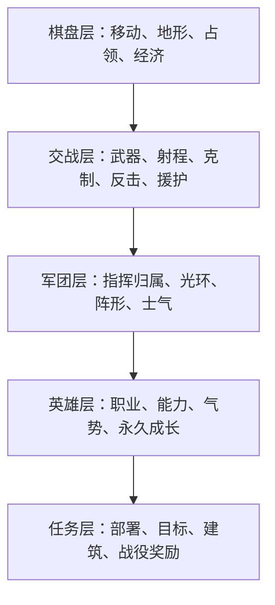
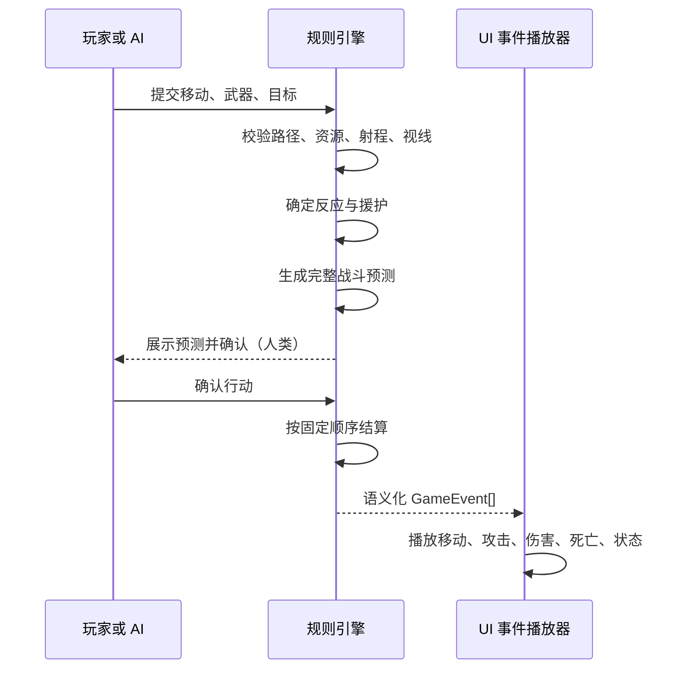

# 《远古帝国》战斗系统设计研究与演进方案

> 架构说明：本文负责战斗体验、机制取舍与数值方向；与剧情、界面解耦的正式领域边界、三剧本机制并集和引擎实施规范，见 [《通用 SRPG 战斗引擎架构》](./combat-engine-architecture.md)。

> 状态：设计基线；当前落地进度见第 14 节，实现边界以架构文档为准
>
> 适用项目：`empire`
>
> 最后更新：2026-08-11

## 1. 文档目的

本项目以 Java 平台《远古帝国 2》（Ancient Empires II）为复刻原点。目标不是把若干经典战棋的机制简单拼接起来，而是在保留《远古帝国》短小、清晰、易上手特征的前提下，吸收其他作品已经验证过的设计思想，形成一套适合本项目规模、交互方式和技术架构的战斗系统。

本文回答以下问题：

- 当前战斗机制的优势、缺口和技术风险是什么；
- 《高级战争》《火焰纹章》《最终幻想战略版》《皇家骑士团》《梦幻模拟战》《超级机器人大战》各自最值得吸收什么；
- 这些机制如何收束为一个统一系统，而不是七套互相竞争的规则；
- 哪些设计明确不进入核心玩法；
- 数据结构、战斗流程、UI、AI、平衡和测试应如何演进；
- 应按什么顺序实施，才能在每个阶段都得到一个可玩的版本。

本文不直接承诺所有提案都会实现。标记为“推荐”的内容是当前建议方向；标记为“候选”或“远期”的内容需要在原型和试玩后再决定。

---

## 2. 执行摘要

推荐的产品定位是：

> 一款以《远古帝国 2》为核心气质、具备现代信息表达和有限英雄养成的轻量奇幻战棋。

统一后的设计分工如下：

| 设计来源 | 在本项目中负责的层次 |
| --- | --- |
| 《远古帝国 2》 | 核心节奏、奇幻兵种、即时招募、占领与反击 |
| 《高级战争》 | 清晰的兵种棋盘、地形、经济、指挥能力 |
| 《梦幻模拟战》 | 指挥官、军团归属、局部光环和阵形 |
| 《火焰纹章》 | 命名角色、成长、战斗预览和人物关系 |
| 《最终幻想战略版》 | 小型职业分支、主动能力、范围效果和构筑 |
| 《皇家骑士团》 | 高低差、状态控制、部署和多样任务目标 |
| 《超级机器人大战》 | 多武器、反应姿态、援护攻防、气势与英雄爆发 |

实现时必须遵守四条总原则：

1. **确定性优先**：普通攻击不依赖基础命中、闪避和随机暴击；玩家确认前应知道准确结果。
2. **可解释性优先**：任何影响伤害的克制、地形、光环、状态和援护都必须出现在预览中。
3. **普通兵简单、英雄有深度**：普通兵承担棋盘职能；复杂成长和资源主要属于少量命名英雄。
4. **每套机制只有一个职责**：不同时存在多条含义相近的能量、怒气、SP、CO 槽和法力条。

推荐的首批增量不是完整职业树或独立行动顺序，而是：

1. 修复事件顺序和现有规则语义；
2. 建立可解释的伤害修正管线；
3. 增加单位专属克制和多武器模型；
4. 增加防御姿态、援护攻防和基础状态；
5. 再加入指挥官、气势和英雄成长。

---

## 3. 项目的战斗设计北极星

### 3.1 一局战斗应该提供什么体验

玩家在每个回合主要思考五件事：

1. 哪个目标值得争夺；
2. 哪个兵种应该处理哪个敌人；
3. 应该从什么地形和距离发动攻击；
4. 哪些单位需要互相保护或接受指挥；
5. 现在是否值得消耗稀缺的英雄能力。

玩家不应该把主要精力花在：

- 查询隐藏乘区；
- 重复计算命中率；
- 为十几个普通士兵逐一配置装备；
- 管理五六种战斗资源；
- 等待冗长且无法跳过的演出；
- 因一次不可预见的随机结果被迫重开。

### 3.2 推荐的复杂度预算

| 对象 | 推荐复杂度 |
| --- | --- |
| 普通单位 | 1 种基础武器、0～1 种特殊武器、0～1 个被动 |
| 精英单位 | 1～2 种武器、1 个能力、1 个兵种特性 |
| 命名英雄 | 2～3 种武器、2～3 个指挥/英雄能力、1 个职业被动 |
| 指挥官 | 1 个局部指挥效果、1 个高成本战术能力 |
| 地形 | 移动、减伤、视野/高度三类信息以内 |
| 状态 | 同一单位通常不超过 3 个可见状态 |
| 战斗资源 | 全局 1 种、英雄个人最多 1 种 |

---

## 4. 当前实现基线

### 4.1 已有架构

当前规则引擎位于 `src/core`，不依赖 DOM，核心数据流为：

```text
输入 → Action → applyAction(state) → GameEvent[] → UI 动画 → 重绘
```

已有的良好扩展点包括：

- `UnitTypes`、`Terrains`、`Abilities` 注册表；
- `RuleSet` 规则开关；
- `Objective` 联合类型；
- `Unit.meta` 和 `LevelData.extra` 原型预留；
- 确定性的 `forecast()`；
- 可在测试和 AI 中复用的无界面规则层；
- 一层效用评分 AI，可以逐个动作执行并交给 UI 播放。

这些结构允许先做数据驱动的纵向切片，而不必立即重写整个引擎。

### 4.2 当前伤害模型

当前公式位于 `src/core/combat.ts`：

```text
damage = attack
       × effectiveness
       × (0.5 + 0.5 × hpRatio)
       × (1 - mitigation)

mitigation = min(0.6, terrainDefense + unitDefense)
```

当前特点：

- 伤害完全确定；
- 攻击力随剩余生命降低；
- 地形防御与单位防御相加，减伤上限 60%；
- 反击取决于防守方是否能覆盖攻击者所在格；
- 防守方以受击后的生命值计算反击伤害；
- 弩车有最小射程，且移动后不能攻击；
- 基础克制由“伤害类型 × 护甲类型”矩阵决定，武器再用目标语义标签表达专属加成。

### 4.3 当前系统的优势

1. **预览可信**：预测与实际结果一致，这是应该长期保留的产品特征。
2. **距离本身产生战术**：弓箭手在两格外攻击近战不会被反击，被贴身时则会被反击。
3. **地形权重明确**：森林、丘陵、山地直接改变生存能力和移动效率。
4. **经济与占领让便宜步兵始终有价值**：高价单位无法完全取代占领单位。
5. **内容数据化**：新增兵种和能力不必为每个类型增加新的主流程分支。

### 4.4 原始审计问题与当前处理状态

#### 4.4.1 通用克制表无法表达兵种专长

该问题已经由 `WeaponDef.bonuses` 解决。基础矩阵只表达普遍物理关系，武器可按 `flying`、`support`、`caster`、`building`、`large` 等目标标签提供带原因的专属倍率，预测、HUD 和 AI 读取同一修正链。

原始问题包括：

- 刺客的说明是专杀无甲单位，但剑士和刺客对无甲目标可能造成相同的最终基础伤害；
- 弩车无法单独表达“破坏建筑”；
- 牧师的钝击类型理论上克制重甲，但其职业身份并非破甲兵；
- 兵种描述与实际伤害矩阵可能逐渐发生偏差。

结论仍成立，并已落地为“通用矩阵 + 武器专属标签加成”。

#### 4.4.2 重伤单位仍保留过强输出

当前生命缩放下限为 50%。一支只剩 1 HP 的部队仍保留接近一半输出，削弱了集火和保护残军的意义。

推荐把基础下限改为 30%，但不应降为 0：

```text
strength = 0.30 + 0.70 × hpRatio
```

具体数值需通过回合数、击杀时间和残血反杀率测试决定。

#### 4.4.3 高减伤与建筑治疗可能制造僵局

重甲单位驻守城堡时仍需持续做数值平衡，但原先缺少的破局机制均已落地：

- 建筑耐久和攻城破坏；
- 禁疗、破甲或驱离效果；
- 多单位协同攻击；
- 明确的回合压力和次要目标。

结构耐久、攻城目标、破甲/禁用状态、援护攻击、击退碰撞与回合目标已经能够组合成破局方案；剩余风险属于关卡与数值校准，不再是表达能力缺口。

#### 4.4.4 攻击事件顺序与动画语义不一致

该问题已经由 `CombatPlan` 固定提交阶段解决。攻击、范围攻击、反击和援护攻击先发出命中事件，再发出死亡与尸体标记事件；命中效果只对存活目标执行。

正确的语义顺序应至少是：

```text
攻击声明 → 攻击/命中特效 → 伤害数字 → 死亡 → 反击 → 反击死亡
```

援护、状态、范围攻击和强制位移均复用这一顺序。

#### 4.4.5 远程攻击没有攻击视线概念

视线已经成为武器显式规则：`none` 不检查遮挡，`direct` 使用带海拔与遮挡高度的直射线，`arc` 表达抛射。射程仍使用曼哈顿距离。

- 弓箭和直射武器是否需要视线；
- 投石、抛射和魔法是否忽略视线；
- 一至两格的轻量远程是否为了简洁统一忽略视线。

内容包按武器选择模式，避免所有攻击无差别引入复杂几何判断。

#### 4.4.6 预留规则与真实行为存在偏差

- 已移除未参与结算的 `damageVariance`，核心继续坚持确定性预测即真值；
- `surviveTurns` 已由目标处理器独立结算，不再借用全局 `turnLimit`；
- 经验、状态、指挥归属、职业、武器与资源均已有显式字段，`Unit.meta` 只保留为原型逃生口。

上述偏差已经完成一次性迁移，不保留双轨兼容字段。

---

## 5. 经典作品的可吸收设计

### 5.1 《远古帝国 2》：必须保留的核心 DNA

最重要的不是逐像素复刻数值，而是以下战斗感受：

- 小规模地图与快速回合；
- 兵种身份鲜明，克制容易理解；
- 地形显著影响移动与攻防；
- 射程决定能否反击；
- 城镇、城堡、生产和恢复形成争夺中心；
- 奇幻单位拥有强记忆点：毒、光环、亡灵、召唤、攻城、飞龙弱点；
- 指挥官不仅是高属性单位，还承载占领、复活或剧情功能；
- 单位受伤后战斗力下降，保护残军有意义。

优先恢复的原作辨识度机制：

1. 弓箭手对飞行的专属克制；
2. 狼或刺客的毒；
3. 光环型辅助单位；
4. 墓碑与短时复活；
5. 投石/弩车对建筑的破坏；
6. 水域单位的环境优势；
7. 紧凑的军衔成长。

### 5.2 《高级战争》：清晰的兵种棋盘

值得吸收：

- 明确、可学习、可预期的兵种硬克制；
- 地形、单位剩余战力与反击共同影响交换结果；
- 建筑占领同时影响经济、补给和生产；
- 指挥官被动改变阵营风格，充能能力制造阶段性高潮；
- 战斗目标不只歼灭，也包括占领总部等地图目标。

在本项目中的转译：

- 保留通用伤害类型，增加武器/单位专属目标修正；
- 指挥官能力并入统一“指挥点”资源，而不是单独增加 CO 槽；
- 指挥能力必须提前展示范围和效果；
- 建筑仍是地图战略核心，而不是单纯回血格。

不建议吸收：

- 全员弹药与燃料后勤；
- 过强、不可反制的全图超级能力；
- 为了克制表而制造大量只差数值的同质单位。

### 5.3 《火焰纹章》：角色、成长与风险表达

值得吸收：

- 战斗预览清楚展示伤害、反击和可能的连续攻击；
- 武器/兵种关系容易形成角色定位；
- 命名角色通过成长、个人特性和支援关系产生感情连接；
- 飞行、重甲等标签拥有显式弱点；
- 速度差、支援和站位能够改变一次交战的结果。

在本项目中的转译：

- 普通单位采用三级军衔，不采用无限刷级；
- 命名英雄才拥有永久成长、个人被动和有限职业分支；
- 支援关系优先转化为战场中的援护或相邻加成，而不是大量对话数值；
- 预览继续保持确定性，新增内容以准确结果呈现。

不建议吸收：

- 普通攻击的基础命中/闪避随机；
- 所有普通单位永久死亡；
- 无限成长导致低级单位数值失效；
- 过多随机成长率和重开诱因。

### 5.4 《最终幻想战略版》：能力构筑与行动规划

值得吸收：

- 职业改变单位在战场中的功能，而不只是提高属性；
- 已学能力可以形成跨职业组合；
- 范围法术、延迟生效、资源消耗和行动顺序让技能具有规划价值；
- 三维地形让射程和站位更重要。

在本项目中的转译：

- 每位英雄只保留两级、两分支的紧凑职业树；
- 设置有限技能槽，而不是任意携带全部已学能力；
- 引入十字、直线、环形等范围模板；
- 使用冷却、次数或统一指挥点，避免多个平行法力系统；
- 高低差先作为地形标签和小幅修正，而非完整三维寻路。

不建议吸收：

- 二十多个职业和数百技能的完整构筑规模；
- 大量叠加后产生的隐藏最优解；
- 为高度系统重做所有地图、美术和寻路；
- 普通士兵也参与复杂职业养成。

### 5.5 《皇家骑士团》：空间、状态与任务目标

本文按《Tactics Ogre / 皇家骑士团》系列理解。

值得吸收：

- 高低差和立体战场；
- 速度、装备影响单位行动顺序；
- 控场、增益、减益和队形的重要性；
- 部署阶段和不同战斗胜利条件；
- 击败关键目标即可结束，而非每关清空地图。

在本项目中的转译：

- 使用 `high` 或未来的 `elevation` 数据表达轻量高低差；
- 增加毒、沉默、护卫、破甲、动摇等短时状态；
- 增加护送、撤离、防守、破坏装置、击败首领等目标；
- 保留阵营阶段制，不切换到单位独立 RT 行动制。

不建议吸收完整 RT 系统。当前收入、占领、治疗、AI、`currentPlayer` 和回合目标都建立在阵营阶段制之上；切换为独立行动时间线将是核心架构和产品节奏的整体重写，而不是一次普通扩展。

### 5.6 《梦幻模拟战》：将领与军团

值得吸收：

- 命名指挥官与普通佣兵是不同层次的资产；
- 佣兵在所属指挥官附近获得指挥加成；
- 指挥官职业决定可率领兵种、法术和阵营功能；
- 普通佣兵可以是每场战斗的临时投入，英雄负责长期成长；
- 兵种相克和地形共同影响军团部署。

在本项目中的转译：

- 每名指挥官率领 3～5 个已有地图单位，而不是额外生成六七个跟随小兵；
- 指挥半径默认 2 格；
- 指挥加成只强化一个主要方向，基准约 10%，避免攻防同时大幅提升；
- 普通士兵在关内可晋升军衔，战役结束后不永久保留复杂成长；
- 指挥官阵亡使所属单位暂时“动摇”，但不让它们立即全部死亡。

不建议按原作规模把每位将领与多名佣兵都作为独立地图单位。当前地图尺寸、操作方式和逐步 AI 会因此显著变慢并产生严重拥挤。

### 5.7 《超级机器人大战》：武器、反应与英雄爆发

值得吸收：

- 同一单位拥有不同威力、射程、移动后使用限制和资源条件的武器；
- 被攻击时可以在反击、防御、回避等反应之间选择；
- 相邻单位可以进行援护攻击或援护防御；
- 精神指令提供有限但确定的战术强化；
- 气力/士气达到阈值后解锁招牌技能；
- 驾驶员与机体分别成长，形成“角色能力 × 载体能力”；
- 可跳过的强表现力战斗演出强化单位个性。

在本项目中的转译：

- 改为“英雄 × 职业/坐骑”双层，而不是驾驶员 × 机体；
- 将精神指令和《高级战争》的指挥官能力合并为统一“指挥能力”；
- 将敌方回合即时选择改为预设反应姿态，避免 AI 回合频繁弹窗；
- 气势主要用作技能门槛，不直接持续放大所有属性；
- 援护每单位每轮最多触发一次，禁止援护连锁。

不建议吸收：

- 同时管理 EN、弹药、SP、气力、冷却等多条资源；
- 后期多重乘算造成普遍一击秒杀；
- 所有单位都采用双层永久养成；
- 不可跳过或过长的普通攻击演出。

---

## 6. 统一后的目标战斗模型

### 6.1 五层结构



各层必须可以独立理解：一个不使用英雄和指挥官的遭遇战，仍应只靠棋盘层与交战层正常运行。

### 6.2 资源统一

推荐只保留以下资源：

| 资源 | 所属 | 用途 | 是否跨关保留 |
| --- | --- | --- | --- |
| 金币 | 阵营 | 招募和地图经济 | 否，按关卡定义 |
| 指挥点 | 阵营 | 指挥官能力、战术指令 | 否 |
| 气势 | 命名英雄 | 解锁招牌武器或被动 | 否 |
| 经验 | 命名英雄 | 永久成长与转职 | 是，战役模式 |
| 军衔进度 | 普通单位 | 当关强化 | 默认否 |

冷却和有限次数属于具体能力约束，不应再显示为一条通用资源。普通单位不同时拥有法力、怒气和耐力。

### 6.3 普通单位与命名英雄的职责区别

| 维度 | 普通单位 | 命名英雄/指挥官 |
| --- | --- | --- |
| 核心价值 | 兵种职能、数量、占位和经济交换 | 改变局部规则、提供能力和剧情身份 |
| 武器 | 1～2 种 | 2～3 种 |
| 成长 | 当关三级军衔 | 永久等级与紧凑转职 |
| 资源 | 通常无个人资源 | 气势或英雄能力 |
| 阵亡 | 当关经济损失 | 任务失败、受伤或剧情后果 |
| 配置 | 数据固定 | 可选择职业、有限能力槽 |

---

## 7. 详细机制设计

### 7.1 可解释的伤害修正管线

不再让 `computeDamage()` 直接读取所有零散字段后一次性相乘，而是先构造上下文和修正列表：

```ts
type ModifierKind =
  | 'matchup'
  | 'strength'
  | 'terrain'
  | 'position'
  | 'status'
  | 'command'
  | 'reaction';

interface CombatModifier {
  source: string;
  kind: ModifierKind;
  multiplier?: number;
  mitigation?: number;
}

interface DamageBreakdown {
  base: number;
  modifiers: CombatModifier[];
  mitigation: number;
  damage: number;
}
```

推荐公式：

```text
strength = 0.30 + 0.70 × hpRatio

damage = round(
  basePower
  × genericMatchup
  × specificBonus
  × strength
  × offensiveModifiers
  × (1 - mitigation)
)
```

叠加规则：

- 同来源只取最高值，不重复叠加；
- 同类光环默认不叠加；
- 地形防御与单位护甲仍可加算，但总减伤上限保持 60%；
- 指挥、状态和位置的总进攻乘区建议限制在 0.70～1.50；
- 除显式免疫外，最终伤害至少为 1；
- 舍入只在最终一步发生；
- 预览和实际结算必须调用同一套纯函数。

预览应显示：

```text
基础威力          34
穿刺对飞行      ×1.15
弓箭手：对空    ×1.35
高地优势        ×1.10
目标森林防御     -20%
预计伤害          39
```

### 7.2 通用克制与专属克制

推荐把克制分为两层：

1. **通用层**：伤害类型对护甲类型的温和修正，通常为 0.85～1.20；
2. **专属层**：武器或兵种对明确标签的强修正，通常为 1.30～1.60。

```ts
interface TargetBonus {
  targetTag: string;
  multiplier: number;
  reason: string;
}
```

示例：

```ts
const longbow = {
  damageType: 'pierce',
  bonuses: [
    { targetTag: 'flying', multiplier: 1.45, reason: '对空' },
  ],
};
```

这样可以明确表达：

- 弓箭手对飞行是强克制；
- 刺客对 `support`、`caster` 或 `ranged` 是强克制，而不是笼统克制所有无甲；
- 弩车对 `building` 和 `large` 有加成；
- 圣属性对 `undead` 有加成；
- 水元素在 `water` 地形获得环境修正。

### 7.3 多武器系统

攻击力、伤害类型、射程和移动后攻击能力已经完全下沉到 `WeaponDef`；`UnitDef` 只保存有序武器 ID，不再保存首武器派生副本：

```ts
interface WeaponDef {
  id: string;
  name: string;
  power: number;
  damageType: DamageType;
  minRange: number;
  maxRange: number;
  moveAndAttack: boolean;
  lineOfSight: 'none' | 'direct' | 'arc';
  area?: 'single' | 'cross1' | 'line' | 'ring1';
  cooldown?: number;
  uses?: number;
  moraleRequired?: number;
  bonuses: TargetBonus[];
  tags: string[];
}
```

约束：

- 普通单位通常只有一个无消耗武器；
- 特殊单位最多再加一个冷却或有限次数武器；
- 命名英雄最多三个武器；
- 每个武器必须有明确用途差异，不能只做“同射程但数值更高”；
- 是否能移动后攻击应由武器决定；
- AI 与 UI 都从同一武器列表枚举合法动作。

示例：

| 单位 | 武器 | 战术用途 |
| --- | --- | --- |
| 弓箭手 | 短弓 | 1～2 格，可移动后攻击 |
| 弓箭手 | 对空齐射 | 2 格，对飞行强化，冷却 2 回合 |
| 骑士 | 长剑 | 稳定近战 |
| 骑士 | 冲锋 | 移动后根据直线距离强化，冷却 2 回合 |
| 弩车 | 重弩 | 2～3 格，不能移动后攻击 |
| 弩车 | 破城矢 | 对建筑强化，有限次数 |
| 巨龙 | 爪击 | 单体近战 |
| 巨龙 | 龙息 | 直线或小范围，需要气势/冷却 |

### 7.4 反应姿态

为了让防守方在敌方阶段也拥有战术表达，同时避免 AI 每次攻击都暂停询问，单位在结束行动时可以预设反应姿态：

```ts
type ReactionMode = 'counter' | 'guard' | 'support' | 'conserve';
```

| 姿态 | 效果 |
| --- | --- |
| 反击 | 按射程正常反击；默认模式 |
| 防御 | 放弃反击，本次受伤降低约 30% |
| 援护 | 优先为符合条件的相邻友军提供援护防御 |
| 节制 | 只使用无消耗武器反击，不消耗次数或高价值能力 |

第一版可以只实现“反击/防御”，验证价值后再加入援护和节制。

### 7.5 援护攻击与援护防御

援护负责把相邻站位变成真实协同，而不是又一层被动属性。

推荐规则：

- 每单位每轮最多援护一次；
- 援护攻击造成正常伤害的 60%；
- 援护攻击不触发第二次反击；
- 援护防御由护卫承担伤害，护卫自身地形是否生效需统一规定；
- 第一版不允许援护技能继续触发其他援护；
- 攻击确认前必须显示援护者、伤害和可能死亡结果；
- AI 必须计算“拆除援护”和“保护核心”的价值。

推荐的交换顺序：

```text
攻击声明
→ 确定援护防御目标
→ 主攻击
→ 目标死亡判定
→ 防守方反应/反击
→ 攻击方援护攻击
→ 战后状态结算
```

具体顺序可以在原型后调整，但必须唯一且被测试固定。

### 7.6 状态系统

正式状态不应长期放在 `Unit.meta` 中。推荐增加：

```ts
interface StatusInstance {
  id: string;
  sourceUnitId?: number;
  remainingTurns: number;
  stacks: number;
  data?: Record<string, number>;
}

interface StatusDef {
  id: string;
  name: string;
  tags: string[];
  maxStacks: number;
  refresh: 'replace' | 'extend' | 'ignore';
  tick: 'turnStart' | 'turnEnd' | 'afterCombat';
}
```

第一批状态建议：

| 状态 | 用途 | 推荐规则 |
| --- | --- | --- |
| 中毒 | 压制高血量和建筑治疗 | 回合结束按最大 HP 扣少量生命，不致死或是否致死需明确 |
| 护卫 | 保护脆弱单位 | 允许一次援护防御 |
| 动摇 | 指挥官阵亡后的军团惩罚 | 移动力 -1，不能占领，持续 1 回合 |
| 破甲 | 打破高减伤僵局 | 单位防御降低固定值，持续 1～2 回合 |
| 沉默 | 克制高价值施法者 | 禁用带 `spell` 标签的能力 |
| 鼓舞 | 提供短期推进窗口 | 小幅攻击或移动加成，不与同类光环叠加 |

状态设计规则：

- 优先改变决策，不只改变数值；
- 持续时间短，通常 1～2 回合；
- 图标必须显示剩余时间；
- Boss 可以缩短持续时间或降低强度，但不应普遍免疫；
- 状态结算时间点必须写进规则并覆盖测试。

### 7.7 指挥官与军团归属

推荐数据模型：

```ts
interface CommanderState {
  unitId: number;
  commandRadius: number;
  capacity: number;
  commandAbilityIds: string[];
}

interface UnitCommandLink {
  commanderUnitId: number;
  slot: number;
}
```

推荐规则：

- 一名指挥官最多率领 3～5 支部队；
- 默认指挥半径 2 格；
- 只有归属于该指挥官的单位获得加成；
- 指挥加成约 10%，且原则上只强化攻击、防御、移动或特定兵种中的一项；
- 同一单位不能同时接受多个同类指挥光环；
- 指挥官阵亡时，所属单位获得一回合“动摇”；
- 指挥范围和归属连线可在选中指挥官时显示，常态界面只保留小图标。

《高级战争》式全局能力、《梦幻模拟战》式局部光环和《超级机器人大战》式精神指令统一为：

- **局部常驻能力**：指挥官光环，不消耗资源；
- **主动战术能力**：消耗阵营共享指挥点；
- **个人招牌技能**：由英雄气势解锁。

不再额外创建 CO 槽、SP 槽和怒气槽。

### 7.8 指挥点与战术能力

指挥点推荐按关卡或回合少量提供，具体刷新方式需要试玩：

候选 A：每关固定 5～8 点，不自然恢复；强调资源规划。

候选 B：每回合恢复 1 点，上限 5；强调持续使用。

候选 C：通过占领、承伤和击杀获得；更有戏剧性，但最容易滚雪球。

当前推荐先使用候选 B，因为规则稳定、AI 易评估、落后方不会因无法击杀而永远没有资源。

示例能力：

| 能力 | 消耗 | 效果 |
| --- | ---: | --- |
| 坚守 | 1 | 指定单位下一次受伤降低 40% |
| 突进 | 1 | 指定单位本回合移动力 +2 |
| 狙击 | 1 | 下一次符合条件的远程攻击射程 +1 |
| 鼓舞 | 2 | 指挥范围内友军获得一回合攻击增益 |
| 再动 | 3～4 | 恢复一个已行动单位，整场或每若干回合限用一次 |
| 亡者召回 | 3 | 从符合条件的墓碑短时复活单位 |

任何“额外行动”都必须是最高风险能力：禁止连续对同一单位使用，禁止通过额外行动再次生成等量指挥点。

### 7.9 气势与招牌技能

气势只属于命名英雄或极少数首领。

推荐区间：

```text
初始气势：100
普通攻击：+5
受到攻击：+3
击杀敌人：+10
友军阵亡：按英雄性格 -5 / +5
常见技能门槛：115～130
```

气势的主要用途是解锁，不是持续增伤：

- 115：职业被动进入强化状态；
- 120：可使用招牌武器；
- 130：可使用一次终极能力。

气势必须有上限。高气势能力使用后可以降低气势或进入长冷却，防止持续碾压。

### 7.10 军衔、英雄与职业

普通单位采用三级当关军衔：

```text
新兵 → 老兵 → 精英
```

推荐：

- 造成伤害、击杀、治疗、占领和援护均可获得军衔进度；
- 每级总战斗力提升控制在约 8% 以内；
- 精英只解锁一个兵种特性；
- 战役结束后普通单位默认不永久保留军衔；
- 普通单位产生的部分经验可以归所属指挥官。

命名英雄采用永久成长和紧凑职业树：

```text
Galamar
├─ 元帅：步兵容量 +1，防御指挥
└─ 龙骑统领：飞行兵指挥，机动能力

Valadorn
├─ 巫妖：法术、召唤和范围控制
└─ 死亡领主：亡灵近战、墓碑与复活
```

推荐把英雄和职业拆成两层：

```ts
interface HeroState {
  id: string;
  level: number;
  experience: number;
  classId: string;
  learnedAbilityIds: string[];
  equippedAbilityIds: string[];
}
```

- 英雄决定个人能力、成长和气势特性；
- 职业决定 HP、护甲、移动、武器和地形适应；
- 普通单位继续只使用 `UnitDef`，不承担双层配置成本。

### 7.11 离散高低差、方位、夹击与视线

当前实现已经从 `high` 标签迁移到独立海拔层：

- 海拔作为与地形分离的整数数组；
- 移动类型分别声明爬升、下落、上坡消耗和悬崖通行能力；
- 高地攻击达到阈值时默认获得 10% 伤害加成；
- 高地暂不增加射程；
- 飞行单位无视悬崖，但是否获得高地攻击加成仍由实际出手海拔决定；
- 山地继续通过地形成本、防御和基础掩体体现价值。

单位保存北、东、南、西四方向朝向。移动和攻击自动调整朝向，玩家也可以主动转向。近战从侧面和背面获得不同倍率；当目标另一侧存在攻击方友军时，形成可与背刺叠加的对向夹击。

攻击视线建议：

- `none` 武器不检查中间遮挡；
- `direct` 武器以攻击者/目标视点高度和中间格遮挡顶面计算射线；
- `arc` 抛射武器：忽略中间阻挡；
- 范围法术：由武器/能力数据明确决定。

半掩体和全掩体可以来自地形、结构或目标格四个方向的独立边。高地会把掩体降低一个等级；近战、曲射和带 `ignores-cover` 标签的武器绕过掩体。所有结果进入同一预测明细。

### 7.12 建筑耐久与攻城

为了避免城堡重甲驻军僵局，并恢复《远古帝国》的攻城辨识度，推荐把部分建筑从纯地形扩展为可交互目标：

```ts
interface StructureState {
  id: number;
  type: string;
  x: number;
  y: number;
  owner: PlayerId;
  hp: number;
  disabled: boolean;
}
```

第一版只需要：

- 城门、炮塔、任务装置等独立结构；
- 弩车/投石车拥有对建筑专属加成；
- 建筑受损后降低治疗或停止生产；
- 修复需要资金、回合或工程单位；
- 普通村庄是否可摧毁由关卡明确决定，避免破坏经济目标。

不建议立即把所有地形都转成实体。可以先用少量 `StructureState` 覆盖关卡需求。

### 7.13 胜利条件与额外挑战

核心胜利条件建议扩展为：

- 歼灭敌军；
- 击败指定首领；
- 占领指定建筑；
- 坚守指定回合；
- 护送单位到达区域；
- 全员撤离；
- 保护单位或建筑；
- 摧毁指定装置；
- 同时控制若干关键点。

另外增加不决定胜负的“战略评价/额外目标”：

- 在 6 回合内击败敌方指挥官；
- 不损失任何建筑；
- 同一回合占领两个据点；
- 不使用复活能力；
- 使用指定兵种击败首领。

额外目标奖励装备、转职材料、剧情分支或评价，不应提供大幅永久属性，避免强者更强。

---

## 8. 建议的兵种身份

| 兵种 | 核心职责 | 明确优势 | 明确弱点 | 推荐新增机制 |
| --- | --- | --- | --- | --- |
| 剑士 | 廉价战线与占领 | 价格、耐久、建筑争夺 | 机动和爆发有限 | 防守/占领强化 |
| 弓箭手 | 对空与安全消耗 | 两格射击、飞行专属克制 | 被贴身、无甲 | 对空齐射 |
| 刺客 | 切后排与夺点 | 高移动、克制辅助/施法/远程 | 脆弱、正面交换差 | 毒或脱离能力 |
| 牧师 | 治疗与净化 | 恢复、驱散亡灵/状态 | 伤害低、易被刺客处理 | 净化、短时护盾 |
| 法师 | 破重甲与范围控制 | 魔法、范围、状态 | 低耐久、资源/冷却 | 火球、破甲或沉默 |
| 骑士 | 突击与侧翼 | 高移动、冲锋、处理轻型单位 | 魔法、复杂地形 | 冲锋武器 |
| 巨魔 | 护卫与攻坚 | 高 HP、高防御、援护 | 慢、被魔法与控制克制 | 护卫、击退 |
| 弩车 | 远程压制与攻城 | 远射、建筑加成、不会被近战直接反击 | 最小射程、不能移动后攻击 | 破城矢、直射视线 |
| 巨龙 | 高价机动核心 | 飞行、高耐久、范围威胁 | 弓箭专属克制、成本极高 | 龙息、气势技能 |

任何兵种说明都应由测试验证。例如“唯一弱点是弓箭”必须对应弓箭武器专属加成，而不是所有穿刺攻击都同样有效。

---

## 9. 一次交战的标准流程

推荐把战斗从“直接扣血”升级为明确的阶段管线：



建议事件类型逐步演进为：

```ts
type CombatEvent =
  | { type: 'combatStarted'; snapshot: CombatSnapshot }
  | { type: 'strike'; source: number; target: number; weapon: string }
  | { type: 'damageApplied'; target: number; amount: number; hpAfter: number }
  | { type: 'statusApplied'; target: number; status: string }
  | { type: 'unitDefeated'; unit: number; at: Coord }
  | { type: 'combatEnded'; result: CombatResult };
```

关键要求：

- 先发出攻击表现事件，再发出死亡事件；
- 事件携带播放所需快照，不依赖已经从 `state.units` 移除的对象；
- 多段攻击、反击和援护共享同一 `combatId`；
- AI 模拟可以跳过事件构造或使用轻量事件收集器；
- 动画速度可调，普通攻击可以快速播放，英雄招牌技能可跳过。

---

## 10. UI 与信息表达

### 10.1 战斗预览

预览至少展示：

- 攻击者使用的武器；
- 主攻击伤害与目标剩余 HP；
- 是否发生反击以及反击武器；
- 防御姿态或援护防御；
- 援护攻击；
- 将施加或触发的状态；
- 伤害修正来源；
- 是否击杀；
- 能力、次数、指挥点和气势消耗。

复杂交战可以先显示摘要，展开后显示详细乘区。

### 10.2 棋盘信息

推荐使用按需覆盖层：

- 选中单位：移动范围、武器范围、危险范围；
- 选中指挥官：指挥半径、所属单位连线；
- 选择援护：可援护单位和触发条件；
- 选择范围能力：作用格、友军误伤与预计状态；
- 高地：通过地形图形表达，避免常驻大量数字；
- 反应姿态、状态和军衔：单位旁显示小图标。

### 10.3 表现原则

- 先修正 `GameEvent` 顺序，再增加复杂演出；
- 战斗动画服务于理解和冲击力，不隐藏规则；
- 普通单位动画短，英雄招牌技能允许更强表现；
- 所有演出都可加速或跳过；
- 移动端不能依赖悬停查看关键规则；
- 颜色之外还要用图标、形状表达克制和阵营信息。

---

## 11. AI 演进方案

当前 AI 枚举“落点 × 能力 × 目标”，对伤害、反击、目标价值、占领、地形和危险度进行一层效用评分。这一架构可以继续使用，但新系统会扩大动作空间。

### 11.1 保留的原则

- 仍然每次只选择一个动作，便于 UI 逐步播放；
- 不立即引入全局 Minimax；
- 所有 AI 动作必须来自与玩家相同的合法动作枚举；
- 先让 AI 理解规则，再增加搜索深度。

### 11.2 新增评分项

| 系统 | AI 需要考虑的价值 |
| --- | --- |
| 专属克制 | 对目标标签的真实最终伤害，而非只看通用类型表 |
| 多武器 | 伤害、消耗、冷却、射程和移动后限制 |
| 防御姿态 | 预期承伤、是否需要保留反击 |
| 援护 | 保护单位价值、援护者风险、拆除敌方援护 |
| 状态 | 持续回合内的预期收益，而非只看即时伤害 |
| 指挥范围 | 进入或保持指挥范围的局部收益 |
| 指挥点 | 当前收益与为高价值能力保留资源之间的权衡 |
| 气势 | 是否接近招牌技能阈值 |
| 目标 | 时间限制、护送、撤离、结构破坏和额外目标 |

### 11.3 控制动作空间

- 普通单位最多 1～2 种武器；
- 范围技能只保留评分最高的若干目标中心；
- 不枚举明显劣于另一武器的支配动作；
- 指挥能力先按规则生成少量候选；
- 援护关系在回合开始或行动后局部更新；
- 为每次 `chooseAction()` 设置候选数和耗时上限；
- AI 对打测试继续设置最大动作数，防止循环。

### 11.4 AI 性格

现有 `aggression` 可继续保留，但未来可增加少量明确性格，而不是任意权重集合：

- 进攻：更重视击杀、气势和推进；
- 防守：更重视地形、援护和建筑；
- 控制：更重视状态、射程和目标封锁；
- 经济：更重视占领与性价比招募。

指挥官职业可以选择 AI 性格模板，使阵营打法与角色身份一致。

---

## 12. 数据与架构演进

### 12.1 不要让 `Unit.meta` 成为正式系统仓库

`Unit.meta` 适合原型验证，例如先快速测试 `poisonTurns`。一旦机制进入正式版本，应迁移到类型化字段：

```ts
interface Unit {
  // existing fields...
  reaction: ReactionMode;
  statuses: StatusInstance[];
  weaponState: Record<string, { cooldown: number; usesLeft?: number }>;
  rank: 0 | 1 | 2;
  rankProgress: number;
  commandLink?: UnitCommandLink;
  heroId?: string;
  morale?: number;
}
```

原因：

- `meta` 无法穷举和验证；
- 克隆、序列化、AI 模拟和 UI 展示容易遗漏；
- 拼写错误只能在运行时发现；
- 状态生命周期无法由类型表达。

### 12.2 内容目录与注册表现状

武器、状态、移动、地形、地貌覆盖、结构、战术、伤害类型、护甲类型和克制矩阵均已拥有正式注册入口，并通过 `ContentPackInstaller` 统一装配。核心目录只保留注册表与规则；当前奇幻单位、武器、地形、伤害矩阵和关卡位于 `src/content/ancient-empires/`，跨题材状态、移动、结构与环境原语位于 `src/content/common/`。

新增内容应提交一个版本化 `ContentPack`，由安装器在写入前检查依赖、重复 ID、交叉引用、地图字符和克制矩阵完整性。不要再从任意业务模块直接调用全局注册表写入，也不要让导入 `src/core` 产生默认内容副作用。

每个 `BattleEngine` 现在持有自己的 `ContentCatalog` 快照。状态创建、移动、视线、伤害、状态、职业、场景、目标和 AI 都从同一实例目录读取；同一进程可同时运行 ID 相同但数值不同的题材沙箱，互不污染全局默认内容。

### 12.3 规则与关卡格式

适合放入 `RuleSet` 的内容：

- 是否启用指挥官；
- 是否启用反应姿态；
- 是否启用援护；
- 军衔是否跨关；
- 指挥点恢复方式；
- 视线规则；
- 友军伤害规则。

不适合放入 `RuleSet` 的内容：

- 某个英雄的具体能力；
- 某个武器对飞行的倍率；
- 某个状态的持续时间；
- 某张地图的剧情触发。

关卡 schema 不应仅因内部 `UnitDef` 增加武器而升级。本轮因为 `LevelData` 的玩家、单位和武器运行态正式迁到实体自有资源账户，开发期直接升级为 schema 2；仓库内数据一次性迁移，不保留 schema 1 兼容读取器。

### 12.4 结算纯函数

建议把规则拆成可组合纯函数：

```text
collectModifiers(context)
resolveDamage(context, modifiers)
resolveReaction(context)
resolveSupport(context)
resolveStatusTicks(state, timing)
resolveCombat(state, command)
```

`forecast()` 与 `resolveCombat()` 应共享解析结果。避免预览重新实现一套近似逻辑。

---

## 13. 平衡护栏

以下数字是原型起点，不是最终平衡承诺。

### 13.1 交换速度

- 同价中性单位在平地通常承受 3 次左右完整攻击后阵亡；
- 强克制应把交换缩短到约 2 次攻击，但不普遍一击秒杀；
- 远程安全输出必须以低耐久、最小射程、不能移动后攻击或冷却补偿；
- 满血高价单位不能被单个廉价软克制单位稳定一击击杀；
- 英雄招牌技能可以制造击杀窗口，但不应绕过所有站位和资源条件。

### 13.2 推荐数值范围

| 项目 | 建议范围 |
| --- | --- |
| 通用克制倍率 | 0.85～1.20 |
| 专属软克制 | 1.20～1.35 |
| 专属硬克制 | 1.35～1.60 |
| 地形防御 | 0%～40% |
| 总减伤上限 | 60% |
| 指挥光环 | 单一方向约 10%，上限 15% |
| 高地攻击修正 | 约 10% |
| 防御姿态减伤 | 约 30% |
| 援护攻击威力 | 正常伤害约 60% |
| 普通单位每级军衔提升 | 总战斗力不超过约 8% |
| 生命对输出的最低保留 | 建议 30% 起测 |

### 13.3 防止乘区爆炸

- 通用克制、专属克制、指挥、高地、状态不能无限相乘；
- 同类增益取最高值；
- 高伤技能不得同时拥有最长射程、移动后使用和无消耗；
- 额外行动不触发额外行动；
- 援护不触发援护；
- 气势不同时大幅提高命中、闪避、攻击、防御和技能解锁；
- Boss 通过机制和阶段体现强度，不依靠状态全免疫和极端减伤。

### 13.4 经济平衡

新增成长后，单位价值不能只等于招募支付 `UnitDef.recruitCosts`；基础威胁以题材无关的 `UnitDef.value` 表达。AI 和评价至少需要考虑：

```text
effectiveValue = baseCost
               × hpValue
               × rankValue
               × remainingResourceValue
               × objectiveValue
```

英雄的战略价值不能简单换算成普通金币，否则 AI 会为了击杀英雄做出不合理的全军交换；应额外考虑任务失败或指挥崩溃价值。

---

## 14. 分阶段实施路线

### 14.0 2026-08-11 落地快照

| 阶段 | 状态 | 已落地的纵向切片 |
| --- | --- | --- |
| 0 现有语义 | 完成 | 确定性事件顺序、权威合法性、兵种交换回归 |
| 1 可解释战斗 | 完成 | 多武器、专属克制、修正管线、HUD 完整修正链 |
| 2 战中协同 | 完成 | 四反应姿态、援护攻防、范围 `CombatPlan`、开放命中效果与状态行为 |
| 3 指挥官与英雄 | 已完成可玩切片 | 编队光环、指挥点战术、指挥官阵亡、三级军衔、气势门槛/消耗/招牌武器 |
| 4 战场与任务 | 完成 | 结构、动态覆盖、正式高度/悬崖/掩体、组合目标、护送/保护/歼灭/破坏/占区任务 AI |
| 4.5 高级关卡原语 | 完成 | 增援/召唤、撤退、尸体/复活、队伍关系、击退/拉拽/传送、动态海拔/悬崖/方向掩体、战前部署 Action |
| 架构基座 | 完成 | ContentPack 原子装配、每引擎 ContentCatalog、开放 Damage Model/Event、自适应 Battlefield/Cell、能力契约微内核、能力 AI 估值策略、引擎级事务与开局校验、实体自有通用资源账户、无环依赖守卫与核心性能基准 |
| 5 战役成长 | 未开始 | 属于战役层，不阻塞战斗关卡生产 |

快照只说明“机制链是否打通”，不代表数值已完成最终平衡。援护强度、军衔阈值、气势获取和招牌消耗仍应进入真实关卡的平衡日志。

引擎质量基线由 `npm run bench:core` 与全量测试共同约束。性能优化必须先在移动场、战场投影、确定性预测或 AI 单步规划中证明热点；不得为了理论复杂度向 `GameState` 添加需要手工失效的长期缓存。

### 阶段 0：修正现有语义

范围：不增加大型新系统，只让现状可信。

- 修正攻击、伤害、死亡事件顺序；
- 让 `surviveTurns` 独立正确结算，或明确与 `turnLimit` 的唯一关系；
- 移除没有真实行为的 `damageVariance`，保持核心模式完全确定；
- 校准兵种说明与真实数值；
- 增加当前九兵种的关键交换测试；
- 验证高防御建筑上不存在不可突破的常规组合。

验收标准：

- 动画事件顺序与规则顺序一致；
- 预测与实际结果仍完全一致；
- 每条兵种说明都有规则或测试支持；
- 所有现有测试通过。

### 阶段 1：可解释战斗核心

- 建立 `CombatModifier[]` 管线；
- 把通用克制调为温和底层；
- 增加武器/单位专属 `TargetBonus`；
- 战斗预览显示修正来源；
- 将攻击射程、移动后攻击等字段迁移到 `WeaponDef`；
- 普通单位先保持一件武器，验证迁移不改变旧关卡。

验收标准：

- 旧关卡在迁移后得到预期相同或经过批准的新伤害；
- 弓箭手对飞行的优势来自显式专属规则；
- 刺客、弩车、牧师的说明与实际身份一致；
- AI 使用实际武器结算评分。

### 阶段 2：战中协同

- 增加反击/防御两种反应姿态；
- 增加援护攻击和援护防御；
- 建立正式状态系统；
- 实现中毒、护卫、动摇、破甲四个状态；
- 新增短弓/对空齐射、长剑/冲锋、重弩/破城矢等纵向切片。

验收标准：

- 预览准确覆盖姿态、援护和状态；
- 援护不会连锁；
- 状态在固定时间点只结算一次；
- AI 能主动使用和拆除援护阵形。

### 阶段 3：指挥官与英雄

- 增加军团归属、指挥半径和容量；
- 增加阵营共享指挥点；
- 实现 2～3 个战术能力；
- 增加英雄气势与一个招牌技能；
- 普通单位增加当关三级军衔；
- 指挥官阵亡触发“动摇”。

验收标准：

- 不使用指挥官的旧关卡仍正常工作；
- 指挥光环不叠加溢出；
- 指挥点不存在正反馈无限循环；
- 英雄强但不能单独取代普通军团。

### 阶段 4：战场与任务

- 使用现有 `high` 标签测试轻量高地；
- 为三格以上直射武器加入视线；
- 增加少量结构实体和建筑耐久；
- 扩展护送、撤离、保护、击败首领、破坏装置等目标；
- 增加额外战略评价。

验收标准：

- 高地规则能通过图形和预览理解；
- 视线规则不产生大量“看起来能打却不能打”的困惑；
- 守城存在攻坚手段，不形成永久僵局；
- AI 能完成新增目标，而非只追杀敌军。

### 阶段 5：战役成长

- 英雄/职业双层数据；
- 两级两分支转职；
- 初始佣兵/出战名单选择（战场内的部署区域与换位 Action 已实现）；
- 永久经验、装备或战役奖励；
- 人物关系和支援仅在核心战斗稳定后加入。

验收标准：

- 战役成长不会让遭遇战平衡失效；
- 没有唯一正确转职；
- 普通佣兵仍有经济和阵形价值；
- 存档具备迁移和版本校验。

---

## 15. 测试策略

### 15.1 规则单元测试

必须覆盖：

- 每种武器的射程、最小射程和移动后使用；
- 通用克制与专属克制的叠加；
- 地形、状态、指挥和姿态的乘区与上限；
- 反击、援护和死亡的唯一顺序；
- 状态刷新、延长、叠层和到期；
- 指挥范围边界；
- 气势阈值和消耗；
- 指挥点恢复与能力限次；
- 新目标的完成和失败；
- 建筑受损、停产、修复和摧毁。

### 15.2 关键不变量

建议增加属性/不变量测试：

1. `forecast()` 给出的最终 HP 必须等于执行后的 HP；
2. 任何合法行动都不产生负 HP、负次数或超上限资源；
3. 已死亡单位不会继续反击或援护；
4. 同一单位每轮援护次数不超过上限；
5. 同一状态在一个时间点只 tick 一次；
6. 同类光环不会重复叠加；
7. AI 只返回当前状态下的合法行动；
8. 克隆状态后模拟不会污染原状态；
9. 序列化往返不丢失正式字段；
10. 战斗事件可以在不读取结算后单位对象的情况下完成播放。

### 15.3 平衡回归测试

建立少量固定场景，而不是只测试单次公式：

- 同价中性单位在平地互殴；
- 弓箭手在一格和两格距离攻击剑士；
- 弓箭手与其他穿刺单位分别攻击飞龙；
- 刺客切入法师/牧师与正面攻击剑士；
- 法师、弩车和普通兵分别攻打城堡重甲单位；
- 指挥范围内外的同一交换；
- 防御姿态与反击姿态的生存收益；
- 一次援护对交换结果的影响；
- 毒与建筑治疗的相互作用；
- AI 对打若干回合不死锁、不产生非法动作。

建议保存关键场景的预期回合数、剩余 HP 和资源消耗，作为平衡变更的可审查差异。

---

## 16. 明确不做的事情

以下内容不进入近期核心设计：

- 完整复刻任何一部参考作品的全部数值和规则；
- 普通攻击的基础命中/闪避随机；
- 全员永久死亡和随机成长率；
- 二十多个职业、数百技能的职业网络；
- 《皇家骑士团》式独立 RT 行动时间线；
- 每位指挥官携带大量独立小兵导致单位数量倍增；
- 同时存在法力、耐力、怒气、SP、CO 槽、EN 和弹药；
- 所有普通单位的双层永久养成；
- 永久面向和每次行动后的手动转身；
- 大量隐藏叠加与不可解释的被动；
- 不可跳过的长战斗动画；
- 单纯通过增加敌人 HP 和攻击力制造难度。

这些边界不是否定对应作品，而是保护本项目的轻量定位和可维护性。

---

## 17. 仍需通过原型决定的问题

| 问题 | 当前推荐默认值 | 验证方式 |
| --- | --- | --- |
| 重伤输出下限 | 30% | 比较 20%、30%、40% 的击杀时间和残血价值 |
| 指挥点恢复 | 每回合 +1，上限 5 | 测试囤积、频率和 AI 使用 |
| 高地效果 | 远程向低地 +10% 伤害 | 使用三张高地原型地图 |
| 援护攻击强度 | 60% | 验证抱团收益是否压倒分兵 |
| 防御姿态减伤 | 30% | 验证是否成为残血单位的唯一选择 |
| 军衔是否跨关 | 普通兵不跨关 | 对比战役情感与滚雪球风险 |
| 指挥官阵亡 | 所属部队动摇 1 回合 | 验证斩首价值与翻盘空间 |
| 视线适用范围 | 仅 3 格以上直射武器 | 观察玩家误判次数 |
| 建筑是否普遍可摧毁 | 仅特定结构和任务建筑 | 验证经济地图是否被破坏 |
| 气势使用后是否降低 | 招牌技能降低，普通门槛不降低 | 验证爆发频率 |

原型结果应记录在本文或单独的平衡日志中，避免仅凭印象反复改动。

---

## 18. 推荐的最终产品特征

如果以上系统按边界落地，游戏应呈现以下特征：

- 玩家第一眼能看懂“谁克制谁”；
- 同一兵种因为地形、距离、指挥和援护产生不同价值；
- 普通兵保持棋子般清晰，命名英雄具有少量但强烈的个性；
- 战斗结果确定，但决策空间来自站位、资源、顺序和阵形；
- 每关既有主目标，也能通过额外目标提供重玩价值；
- 指挥官阵亡、招牌技能和攻城突破形成战斗高潮；
- 所有复杂机制都能在预览中解释；
- 新单位、新武器、新状态和新关卡仍能通过注册表和数据扩展；
- AI 可以逐步理解新规则，不需要一开始就重写为昂贵搜索；
- 游戏仍然像一款现代化《远古帝国》，而不是缩小版 FFT、火纹或机战。

一句话概括目标：

> 《高级战争》的清晰棋盘，《梦幻模拟战》的军团关系，《超级机器人大战》的战中爆发，《火焰纹章》的英雄情感，FFT 的能力组合和《皇家骑士团》的空间目标，共同服务于《远古帝国 2》的轻快核心。

---

## 19. 参考资料

以下资料用于确认各系列公开描述的核心系统和设计特征；本文所有落地方案均为针对本项目的重新设计，而非照搬原作规则。

### 《远古帝国 2》

- [Ancient Empires 2 条目与单位资料](https://ancient-empires.fandom.com/wiki/Ancient_Empires_2)
- [TL.net 玩家机制指南](https://tl.net/forum/games/68295-ancient-empires-ii)
- [Pocket Gamer 评测](https://www.pocketgamer.com/ancient-empires-2/review/)
- [GameFAQs 玩家评测](https://gamefaqs.gamespot.com/mobile/927455-ancient-empires-ii/reviews/100517)

### 《高级战争》

- [Nintendo：Advance Wars 1+2 Re-Boot Camp](https://www.nintendo.com/en-gb/Games/Nintendo-Switch-games/Advance-Wars-1-2-Re-Boot-Camp-1987406.html)
- [Nintendo：Advance Wars 1+2 Re-Boot Camp 产品介绍](https://www.nintendo.com/us/store/products/advance-wars-1-2-re-boot-camp-114408/)

### 《火焰纹章》

- [Nintendo：Fire Emblem Awakening 支持页面](https://www.nintendo.com/en-gb/Support/Legacy-system/Fire-Emblem-Awakening-772119.html)
- [Nintendo：Fire Emblem Shadow Dragon 电子说明书 PDF](https://www.nintendo.com/eu/media/downloads/games_8/emanuals/nintendo_ds_21/Manual_NintendoDS_FireEmblemShadowDragon_EN.pdf)

### 《最终幻想战略版》

- [Square Enix：Final Fantasy Tactics - The Ivalice Chronicles](https://eu.store.square-enix-games.com/final-fantasy-tactics---the-ivalice-chronicles---digital)

### 《皇家骑士团》

- [Square Enix：Tactics Ogre Reborn 战斗系统介绍](https://amp.square-enix-games.com/en_US/news/tactics-ogre-reborn-preview)
- [Square Enix：Tactics Ogre Reborn 产品介绍](https://na.store.square-enix-games.com/tactics-ogre_-reborn_)

### 《梦幻模拟战》

- [NIS America：Langrisser I & II 官方介绍](https://nisamerica.com/langrisser-1-2/classic/)

### 《超级机器人大战》

- [Nintendo：Super Robot Wars 30 系统介绍](https://www.nintendo.com/jp/topics/article/a654a287-024c-410e-b8e5-86e4de614e4a)
- [Super Robot Wars 30 官方系统页面](https://srw30-thirty.suparobo.jp/system/)
- [Bandai Namco：Super Robot Wars 30](https://en.bandainamcoent.eu/super-robot/super-robot-wars-30)
