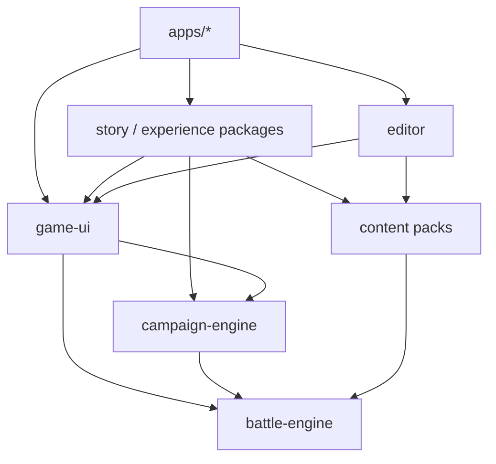

# 组织 SRPG monorepo

本页定义工作区的物理边界、依赖方向和组合根。它用于判断新代码应进入哪个包，以及哪些导入关系会破坏引擎的可复用性。

> 文档类型：Reference · 状态：已落地 · 代码真值：根 `package.json`、各 workspace `package.json`、`tsconfig.json`

## 工作区边界

每个包必须形成自洽能力，不能按类或工具函数拆成细碎插件。

| 工作区 | 负责 | 禁止承担 |
| --- | --- | --- |
| `@empire/battle-engine` | 单场战斗状态、规则、Action、Event、AI、空间、目标和场景 DSL | DOM、素材路径、章节流程、人物或题材特判 |
| `@empire/campaign-engine` | 节点状态机、持久名单、战斗桥、存档与迁移 | 伤害、寻路、射程和战场动画 |
| `@empire/content-common` | 跨题材移动、状态、结构、战术、阵形和覆盖层定义 | 应用入口与剧情流程 |
| `@empire/content-ancient-empires` | 一套可玩的通用数值内容和演示关卡 | 引擎分支、界面逻辑、跨关状态 |
| `@empire/game-ui` | 通用棋盘、HUD、控制器、战役外壳和表现端口 | 直接导入具体题材包 |
| `@empire/editor` | 编辑器文档聚合、地图交互和关卡表单 | 运行中战斗状态与战斗规则副本 |
| `@empire/story-candidate-*` | 独立题材的内容、关卡、流程、演出适配和素材 | 修改通用包来迁就局部内容 |
| `@empire/experience-lab` | 组合生产机制的纵向体验关卡 | Lab 专属战斗规则 |
| `apps/*` | 安装内容、注册表现、挂载页面和决定发布方式 | 可复用领域逻辑 |

## 依赖方向

依赖只能向下。`battle-engine` 是最小稳定底座，应用和题材包是组合根附近的叶子。

架构测试会扫描生产源码并拒绝以下关系：

- 战斗内核导入内容、界面、编辑器或题材包
- 内容包导入表现包
- 引擎与内容包导入 DOM 相关模块
- 核心生产模块形成循环依赖
- 编辑器文档聚合导入 DOM 或渲染模块

## 四个应用入口

应用只负责装配和发布，不拥有规则。

| 应用 | 命令 | 用途 | 输出目录 |
| --- | --- | --- | --- |
| `@empire/game-app` | `npm run dev` | 主游戏、内置关卡与战役外壳 | `dist/game` |
| `@empire/editor-app` | `npm run dev --workspace @empire/editor-app` | 关卡编辑器 | `dist/editor` |
| `@empire/engine-demo-app` | `npm run demo` | 解释微内核、预测、资源和事件 | `dist/engine-demo` |
| `@empire/experience-lab-app` | `npm run experience` | 面向体验验证的单关纵向切片 | `dist/experience-lab` |

`apps/experience-lab` 使用 `vite-plugin-singlefile`。`npm run build:experience` 会把 JavaScript、CSS 和引用素材内联到一个 HTML 文件，该文件可以通过 `file://` 直接打开。

## 组合根规则

内容注册只能出现在 `apps/*/src/main.ts`，或测试里的 `@empire/test-content`。导入一个包不会安装任何内容：没有环境目录，同一个进程里的两个引擎可以跑不同题材。

标准装配顺序如下：

1. `createContentCatalog()` 建一个空目录
2. `new ContentPackInstaller(catalog).install(...packs)` 装入内容定义
3. `createBattleEngine({ content })` —— 唯一的建引擎入口，需要额外插件时传 `plugins`
4. 把 `GameSession` / `CampaignRuntime` 和控制器挂到应用 DOM

表现由会话手里的规则集提供，不存在全局表现注册表。

## 导出策略

每个包只有一个代码入口：包根。没有 `"./*"` 通配子路径——它会把每个顶层模块变成桶文件之外的第二个名字，连 `__tests__` 都一起公开。

例外只有两类：

- 资源子路径（`@empire/game-ui/styles/*`），桶文件不导出样式表
- 桶文件**刻意不收**的入口，目前只有 `@empire/story-candidate-01/presentation`

所有包都声明 `"sideEffects": ["**/*.css"]`，否则打包器必须假设 import 桶文件会执行代码，把桶里点到的模块全部保留。

三条架构测试守着这一节。

新增导出时遵守以下规则：

- 默认导入路径应覆盖常见用法
- 不导出只为某个应用存在的内部状态
- 类型和执行器必须成对导出
- 内容定义通过 `ContentPack` 进入目录，不依赖初始化副作用
- 表现扩展通过端口注册，不在 `game-ui` 中增加题材判断

## 新功能归属

按以下顺序判断代码位置：

1. 改变单场战斗的合法性、状态或结算：进入 `battle-engine`
2. 只定义兵种、武器、地形或数值：进入内容包
3. 改变章节、持久名单或跨关结果：进入 `campaign-engine` 或上层适配器
4. 只改变素材解析、动画和场景图层：进入 `game-ui` 的表现端口或题材表现包
5. 只改变编辑体验：进入 `editor`
6. 只组合已有能力验证体验：进入 `experience-lab`

如果一项能力只能服务某个题材，优先放在题材包。只有当它能用故事中立的数据和事件表达，并且第二个题材也能复用时，才进入通用战斗内核。

## 仓库资源政策

运行时素材属于对应内容包。旧素材归档位于 Git 忽略目录 `.local-asset-archive/`，正式应用不得引用该目录。

生成产物统一写入 `dist/`，也不进入 Git。源码文档可以引用仓库内的技术截图，但不能把生成的体验 HTML 当作源码依赖。

## 相关文档

- [技术文档入口](./README.md)
- [战斗引擎架构](./combat-engine-architecture.md)
- [战役引擎架构](./campaign-engine-architecture.md)
- [质量与测试](./quality-and-testing.md)
