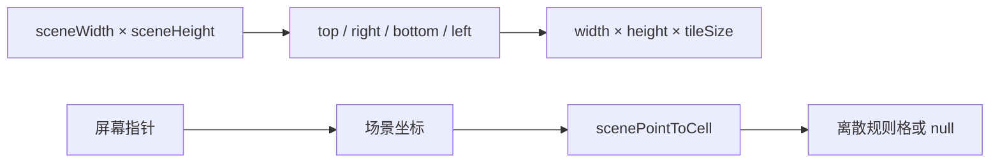

# 接入 SRPG 战场素材与动画

本页定义通用界面如何解析题材素材、组织战场图层、映射自然场景坐标并播放帧动画。表现系统只消费战斗状态和语义事件，不参与合法性与结算。

> 文档类型：Conceptual · 状态：通用端口、场景图层和帧动画已实现 · 代码真值：`packages/game-ui/src/art/`、`packages/game-ui/src/ui/board.ts`

## 表现层边界

战斗引擎输出事实，表现层决定如何显示事实。

表现层可以决定：

- 单位、地形、结构、图标、立绘和效果素材
- 场景画布留白与不规则外轮廓
- 道路、植被、建筑装饰和前景树冠
- 单位走路、攻击、受击、治疗和死亡动画
- 题材色板、描边和视觉密度

表现层不能决定：

- 单位是否能站在某个位置
- 路径和移动成本
- 攻击目标、范围和视线
- 伤害、反击、援护和死亡
- 场景触发器和胜负

`GameController` 把点击翻译为 Action，并围绕 `GameSession.dispatch()` 编排动画。动画失败不能修改权威 `GameState`。

## 两级表现端口

系统用 `ArtProvider` 解析稳定领域 ID，用 `BattlePresentation` 组织整张战场的场景策略。

### ArtProvider

`ArtProvider` 适合按 ID 提供可复用素材：

| 方法 | 解析内容 |
| --- | --- |
| `unitMarkup` | 棋盘单位 |
| `unitIcon` | 菜单和列表单位图标 |
| `terrainMarkup` | 单格地形 |
| `portraitMarkup` | 角色或兵种立绘 |
| `structureMarkup` | 结构实例 |
| `iconMarkup` | 通用界面图标 |
| `abilityIcon`、`weaponIcon`、`statusIcon` | 规则对象图标 |
| `coverMarkup`、`markerMarkup` | 空间掩体和战场 marker |
| `weaponFx`、`effectMarkup` | 武器与语义效果 |

提供者按后注册优先的顺序查询。方法返回 `null` 表示不处理该 ID，解析器继续查询下一个提供者。注册函数返回注销回调，热更新和测试必须在结束时注销或重置。

题材提供者只能把领域 ID 映射到表现。不要在提供者中读取角色剧情状态或重新计算战斗规则。

### BattlePresentation

`BattlePresentation` 适合按 `levelId` 选择整张地图的表现策略：

- `matches(levelId)`：声明适用关卡
- `sceneProfile()`：声明场景画布留白
- `sceneFrame()`：提供战术区域外的背景和前景
- `sceneLayers()`：提供战术区域内的三层场景素材，每层是一串放在位置上的图（`BoardPiece[]`）
- `structure()` 和 `marker()`：覆盖题材实体表现
- `weaponFx()` 和 `effect()`：将语义效果转为 SVG 标记

没有匹配项时，系统使用 `generic` 表现。通用表现显示完整格线并使用内置矢量素材；题材表现使用自然场景和按需落点提示。

## 规则地图与场景画布

`SceneViewport` 把规则地图嵌入更大的视觉画布。规则坐标仍是 `width × height` 离散格，场景可以在四周增加不可交互的山林、河岸、城墙和装饰。



`createSceneViewport()` 计算：

- 规则区域像素尺寸
- 场景总尺寸
- 规则区域在场景中的原点
- 冻结后的 inset 配置

`scenePointToCell()` 只在规则区域内返回格坐标。点击场景留白会返回 `null`，不会误选最接近的边缘格。

这种结构允许地图看起来不是矩形棋盘，同时保留寻路、射程、存档和确定性。

## 每一层都问铺法要位置

画在棋盘上的东西没有一个可以自己算 `x * TILE`——那是「四方格」写进了表现层。`BoardLayout` 由铺法给出：`origin` / `center` / `outline` / `neighbour`，装饰、地形、战术家具都只通过它取位置。

两格之间的那条线（悬崖、方向掩体）由 `edgeLine(layout, at, toward, color, reach)` 画：垂直于两格中心连线，悬崖落在边界上（它属于两格），掩体落在自己那格里（它属于把它立起来的那一格）。铺法叫不出名字的朝向什么也不画。

这条约束是补出来的，不是设计出来的：`battlefield-layer.ts` 是第三个战术图层，也是唯一没跟上的那个——地形、单位、网格线、移动范围都搬到了铺法给的位置，而海拔角标、悬崖标记和掩体边仍按 `x * TILE` 画，缓存键还按四个固定朝向名做哈希，于是六边格上的方向掩体改了也不会重画。现在有一条守卫禁止任何模块再写出自己的朝向清单。

## 正式图层顺序

`BoardView` 的 SVG DOM 顺序就是深度契约。后出现的层绘制在前一层之上：

```text
sceneFrame.backdrop
  board-world
    ground
    terrain
    scenery            ← sceneLayers.underUnits
    spatial
    grid
    range
    path
    structures
    markers
    units
    foreground         ← sceneLayers.overUnits
    effects
    cursor
sceneFrame.foreground
```

各层用途如下：

| 层 | 应放内容 | 不应放内容 |
| --- | --- | --- |
| `sceneFrame.backdrop` | 战术矩形外的底层背景 | 可交互对象 |
| `ground` | 大片底色、阴影或地形下方背景 | 必须压在地形上方的道路 |
| `terrain` | 基础地形单格素材 | 高树冠和大型遮挡物 |
| `scenery` | 道路、地表装饰、单位下方植被和矮物件 | 会遮住单位身体的树冠 |
| `spatial` | 海拔、悬崖和方向掩体提示 | 场景装饰 |
| `grid` | 通用格线（题材场景不画格线，这一层是空的） | 地表纹理 |
| `range` | 移动、攻击、治疗、威胁和战争迷雾 | 永久场景素材 |
| `path` | 当前预览路径 | 道路素材 |
| `structures` | 有战斗状态的结构实体 | 纯装饰建筑 |
| `markers` | 尸体、溃退、投降和互动 marker | 普通场景装饰 |
| `units` | 活跃战斗单位 | 树冠和屋檐前景 |
| `foreground` | 有意跨过单位平面的树冠、屋檐和桥梁前栏 | 道路、地面和大面积不透明底图 |
| `effects` | 攻击、受击、治疗和回合效果 | 永久地形 |
| `cursor` | 选择环和鼠标指示 | 任何环境素材 |
| `sceneFrame.foreground` | 场景外框的最前景遮罩 | 战术区域中需要选择的对象 |

道路必须放在 `terrain` 或 `scenery`，不能放在 `foreground`。如果道路素材包含大块不透明背景，还应先裁掉背景或使用正确透明通道，否则即使图层顺序正确也会盖住下层地形。

树冠和屋檐可以进入 `foreground`，但需要满足：

- 遮挡范围小于完整单位轮廓
- 选中、移动和攻击时可以降低不透明度
- 不遮挡选择环、效果和光标
- 不使用前景层表达碰撞规则

## 隐藏格可读性

通用表现显示格线。**题材表现不画格线**——不是画出来再藏起来。

这一条曾经是两个人各说一遍：`GroundBoardDecorations.gridLines()` 在每格底下坐一个落点节点，`battle.css` 里再有一条 `.battlefield .board.candidate-map .layer-grid { opacity: 0 }` 把整层设成不可见。两句都是对的，玩家两句都没看见——`c01-16` 上是 4,131 个 piece、12,393 个节点，占整块棋盘的四分之一。

而那条 CSS 还是「一个战役的 class 出现在共享样式表里决定一种观感」，正是它上面八行那段注释在抱怨的形状（那段注释刚刚删掉了同一个形状的上一个实例）。一种观感有没有格线属于这种观感自己，端口的文档本来就写着这句：「Empty for art that already shows its own ground.」

现在不需要告诉任何人。格线要么画要么不画，没有样式表去藏它，第二个后端也不可能弄错。节点数：

| 棋盘 | 之前 | 之后 |
| --- | --- | --- |
| 题材 25×17 | 3,113 | 1,838 |
| 题材 75×51 | 27,889 | 16,414 |
| 画好的场景 27×17 | 5,532 | 4,155 |
| 画好的场景 81×51 | 46,932 | 34,539 |
| 通用 30×24 | 9,254 | 9,254（通用表现照旧画它的格线） |

只在战术交互时显示的离散信息不变：

- 合法落点使用椭圆或圆环
- 选择单位使用脚下环
- 光标使用独立颜色
- 移动路径使用平滑曲线，但节点仍对应格中心
- 威胁、攻击和治疗范围使用半透明落点区域
- 迷雾使用同一范围层覆盖不可见格

自然场景不能牺牲规则可读性。每个可交互点必须能回答：能否站立、移动成本、能否攻击、是否受掩体保护以及当前归属。

## 栅格素材与图集

`runtime-raster.ts` 支持三种运行时格式：

| 类型 | 用途 |
| --- | --- |
| `RuntimeUnitSheet` | 一行帧的单位精灵图 |
| `RuntimeCellAtlas` | 固定整数格的地形、结构、图标和效果图集 |
| `RuntimeGridAtlas` | 源格可以是小数尺寸的规则大图 |

所有图集渲染器都会校验尺寸、行列和索引。关卡或题材代码应先构造带元数据的资产对象，再调用标记生成器；不要在 UI 控制器里手写裁剪坐标。

单位帧条使用：

- `frameWidth` 和 `frameHeight`
- `frameCount`
- 脚底 `anchor`
- 可选 idle、walk 和 attack 帧

`runtimeUnitPicture()` 返回一个 `BoardPicture`：`body` 是属于棋盘的那部分（接触阴影和阵营环，棋盘坐标），`strip` 是声明出来的帧条——图、它坐在哪、以及 `BoardView` 会点名的那三个 clip。

它以前是一个 markup 字符串，帧条埋在三层元素里面：一个 `<g>` 给镜像、一个嵌套 `<svg>` 给视口、一个 `clipPath` 把同一件事再裁一遍，外加把帧条自己的描述序列化进 `data-frame-*` 属性给渲染器读回去。那个 clipPath 的 `id` 按帧尺寸固定，所以同尺寸的每个单位都往文档里放**同一个** `id`，每次引用都解析到最先出现的那个——它能工作是因为它们一模一样。

## 帧动画系统

`FrameAnimationSystem` 为所有已注册精灵共享一个 `requestAnimationFrame` 循环。没有多帧 clip 播放时，它会取消循环并休眠。

每个 `FrameAnimationClip` 定义：

- 稳定 `id`
- 帧索引数组
- 大于 0 的 `fps`
- 是否循环

动画目标只需要实现 `frameCount` 和 `setFrame(frame)`。因此时间线不依赖 SVG，也可以用于 Canvas 或 DOM 背景实现。

### 帧条是声明，不是自描述的 markup

曾经有一个 `registerSvgStrip()`：接一个 `<image>` 元素，从上面读 `data-frame-width`、`data-frame-count`、`data-frame-initial` 和 `JSON.parse(data-frame-clips)`，把四者都按「可能是坏数据」校验一遍，再注册一个移动该元素 `x` 的 target。这四个属性全部由 `runtimeFrameStripMarkup()` 从**正是这个形状**的数据写出来，它们存在的唯一原因是帧条要以字符串穿过渲染器接缝。

这也正是 GPU 后端上 `play` 曾经是空操作的原因：动画是一个 DOM 技巧，描述在只有 DOM 读者能找到的地方。

现在 `BoardStrip` 是声明的：图、一帧的尺寸、帧数、它坐在哪、可播的 clip，以及可选的 `playing`——「这张图被画出来时就已经在播的 clip」。爆炸动是因为它存在，不是因为有谁告诉它。SVG 后端以前把这件事拼成「注册这棵子树里能找到的每个帧条，然后播 JSON 里恰好排第一的那个 clip」，那是猜的。

两个后端各自兑现：DOM 在一张图上移动窗口（改 `viewBox`，那个属性就在 drawing 已经持有的元素上），GPU 把图切成每帧一张纹理再换 `sprite.texture`。**帧条在 GPU 上本来就是精灵图**，所以一个走路循环除了那张每个同类型单位都共享的图之外不花任何额外代价。

层只放静止的图。`BoardPiece` 是「markup + 位置」，不带帧条，所以换一层不可能遗留一个跑在已脱离节点上的 clip——`SvgBoardSurface` 里那张 `layerStrips` 表、以及 board 在它之前保存的同一张表，存在的意义就是防这件事，现在是删掉而不是修好。

`BoardView` 点名的 clip：

- 单位的 `idle`、`walk`、`attack`
- 武器和治疗特效由内容包声明 `playing`，出现即播
- 单位死亡、移除和视图销毁时，drawing 自己下线，连带它在时间线上的位置

如果系统检测到 `prefers-reduced-motion: reduce`，`play()` 会停在 clip 首帧并停止时间线。不要用 CSS 无限动画绕过这一策略。

## 战斗动画与权威状态

`GameController` 采用“预览、动画、提交、事件动画、刷新”的顺序协调交互。具体 Action 仍由 `GameSession` 权威提交。

常用动画包括：

- 格间移动 tween 和 walk clip
- 攻击前冲和 attack clip
- 受击数字与武器效果
- 治疗数字与治疗效果
- 死亡淡出
- 增援缩放出现
- 回合横幅

动画读取 Action 和 `GameEvent`，不能推断额外命中。范围攻击应按 `CombatPlan` 或提交事件逐个表现，不能重新扫描屏幕元素决定波及对象。

## 接入新题材表现

按以下步骤接入：

1. 为稳定领域 ID 准备透明背景运行时素材
2. 实现一个 `ArtProvider`
3. 为需要自然场景的关卡实现 `BattlePresentation`
4. 在题材包导出显式注册函数
5. 在 `apps/*/src/main.ts` 组合根注册
6. 为每个图层写结构测试
7. 挂载真实 `BoardView` 检查指针和遮挡
8. 用至少一个运行时关卡做截图审查

注册函数应可重复调用且返回注销能力。测试不能依赖前一个测试留下的全局提供者。

## 没人画过的地形，按规则能看到的东西画

一格地形有三个答案，按顺序取第一个有答案的：

1. **题材包的 `terrainMarkup` 按 id 认领**——最好的答案，authored 的贴图。
2. **本仓库自带的手绘表**——`plain` / `road` / `forest` / … 十一格，是这里第一款游戏的样子。
3. **按规则推导**——`terrain-from-rules.ts`。

第三条以前不存在：那一行写的是 `painters[id] ?? painters.plain`，**任何没人画过的地形都画成草地**。本仓库自己发布的 22 种地形里有 11 种撞在这一行上——熔岩、坟场、河岸、要塞全是同一片草坪——而地图编辑器一直用通用美术绘制，作者看到的整张战役地图就是这个样子。

补一张更长的表解决不了：通用引擎不知道下一个内容包的地形叫什么。所以推导只读**规则自己会读的字段**：

| 读什么 | 从哪来 | 画成什么 |
| --- | --- | --- |
| 有没有任何移动型能进 | `cost` 全为 `null` | 石质色系 + 立起来的实体 |
| 是不是只有少数能进 | 可进入的移动型不到一半 | 液面色系 + 波纹 |
| 进来贵不贵 | 可进入项里最大的消耗 | 碎石色系 + 丛簇，越贵越密 |
| 站上去挡不挡视线 | `obstructionHeight`、`cover` | 立体的高度 |
| 能不能被占 | `capturable` | 归属方颜色的旗 |
| 是不是能出兵 / 丢了就输 | `produces`、`hq` | 屋顶与门，`hq` 更大 |
| 到底是哪一种 | id 的哈希 | 同色系里选一档，两种同时发明的地形不会撞色 |

**刻意不认任何移动型的名字**：`MovementClass` 是开放字符串，内容包可以发明 hover / burrow / phase，去查 `foot` 就是把一款游戏的词汇写进通用层。推导读的是 cost 表的**形状**，一条测试盯着这一点——把四个常见名字换成四个发明的名字，画出来必须一模一样。

### 没人画过的兵种，同样按规则画

`sprites[type] ?? sprites.soldier` 是同一个谎的第二处：发布的 40 个兵种里 **31 个**撞在这一行上，通用美术下整支花名册是同一个剑士——包括 `c01.supply-wagon`，一辆能载两个步兵单位的车，画成了一个步兵。`portraits[type] ?? portraits.soldier` 在单位详情里又来了一次。

| 读什么 | 画成什么 |
|---|---|
| `maxHp` + `defense` | 躯干宽度 |
| `movement` | 前倾幅度 |
| `weapons.length` | 肩上的杆，最多两根 |
| `abilities` 含 `heal` / `capture` | 胸前十字 / 小旗 |
| `transport.capacity > 0` | 身侧的货箱 |
| `zoneOfControl === 0` | 不着戎装（挡路本不是它的差事） |
| `vision > 1` | 目镜 |
| `movementClass` | 脚下的底座形状 |
| `armorClass` | 头盔样式与钢色 |
| id 的哈希 | 一处饰色与冠饰 |

`movementClass` / `armorClass` 是开放字符串，所以它们只作**族**用——同样移动方式的单位站同样的底座。**具体形状是任意的，分组不是**，而玩家读的是分组。底座而不是坐骑或翅膀：给一个本模块不许读名字的移动型编一匹马，是把猜测打扮成事实。

id 的哈希是必须的：`c01.legion-shield` 和 `c01.rune-shield` 在本模块能读到的每一条规则上完全相同，`c01.stone-golem` 和 `c01.cemetery-colossus` 也一样。画成同一张图诚实但无用——玩家仍然要能分辨。加上饰色后 **40 个兵种的立绘与棋盘图各 40 张互不相同**（此前是 10 张）。

### 一条守卫封住这一整类

同一个形状在美术层出现过**四次**：地形、兵种、立绘，以及 `paths[name] ?? paths.crosshair`——一个拼错的图标名会得到一个真图标，看起来像故意的。现在有一条架构守卫禁止 `table[key] ?? table.fixedKey` 这个形状本身；图标改成画一个「缺失」方叉，因为图标名是**界面自己的词汇不是内容**，不认识就是拼错，就该看得出来。

### 规则跟踪的东西不许隐形

地形的谎是画错，结构和 marker 的谎是**根本不画**：棋盘问表现层，拿到 `null`，就什么都不画。本仓库发布的 6 种结构和 5 种 marker，在没有题材场景的棋盘上全部隐形。

而且在一个已发布章节里比隐形更糟：`c01-15` 放了一座 500 耐久的 `c01.mother-root`，胜利条件就是把它摧毁，而战役自己的美术没有这个类型的素材条目——**玩家被要求打碎一个没被画出来的东西**。同名的*地形*是画得出来的，所以那一格看起来就是普通的银林地面。

所以 `structure` / `marker` 返回 `null` 的含义被改正为「**无意见，问地板**」——和每个 `ArtProvider` 方法一直以来的约定一致。地板是通用推导，因此是全函数：

| 结构读什么 | 画成什么 |
|---|---|
| `blocksMovement` | 填满整格的墙；否则格心的台座装置 |
| `obstructionHeight` / `cover` | 立起来的高度 |
| `hp / maxHp` | 裂缝数量与状态条 |
| `targetable` | 不可被攻击的东西不画状态条——它没有状态可显示 |
| `disabled` | 去饱和 + 划叉 |
| 归属方 | 墙面上的色带 / 装置顶端的色球 |
| type 的哈希 | 石材色、砌层数、台座宽度 |

marker 只有两个诚实的事实可读：**是谁的**，以及**是不是有单位倒在这里**（`fallenUnit`）。有就画尸身，没有就画标桩；`kind` 是开放字符串，所以它只决定朝向变化而不假装知道含义——同一种永远长一样，两种永远不一样。

这条不变量由一条测试守着，而且**故意不用发布内容来测**：战役恰好回答了每一种 marker，所以拿它的关卡去测，把地板拆掉照样通过。测试用的是一个「什么都拒绝回答」的表现层。

## 战斗界面：一块场地，一层覆盖

战斗画面只有两个孩子：占满视口的场地，和铺在它上面的覆盖层。中间没有第三个东西。

在此之前它是「顶栏 + 内容 + 侧栏 + 模态根」——`.topbar` / `.panel` / `.stage` / `.board-scroll` 写在共享样式表里，编辑器和战斗外壳穿的是同一套。那是**工具**的形状，于是战斗看起来就是一份中间贴了张图的文档。这套版式现在归编辑器（工具就该长得像工具），战斗界面自己一份 `battle.css`：**挂载 `GameController` 的外壳必须导入它**，有守卫盯着。

覆盖层是 8 个区域，每个区域只回答一个问题；一块新面板要先说清自己回答哪个问题，才谈得上放在哪里：

| 区域 | 它回答的问题 | 里面是什么 |
| --- | --- | --- |
| `crown` | 谁在行动 | 关卡名、回合数、行动序条、咏唱条、当前阵营与资源、系统按钮 |
| `flank` | 这一战要打成什么 | 作战目标与各方兵力 |
| `aside` | 眼下能下什么令 | 指令、指挥战术、战斗预测、单位详情、战前编成 |
| `dispatch` | 刚刚发生了什么 | 最近四条战报，最新一条亮起 |
| `ledger` | 光标底下是什么地方 | 地形、归属、防御、海拔、掩体、产出、各移动型消耗 |
| `hint` | 下一步该怎么做 | 一句话，由当前 selection 拥有 |
| `dock` | 这一手到此为止 | 结束回合 / 确认部署，屏幕上唯一不可撤销的控件，单独站着 |
| `veil` | 需要先回答的事 | 征募名册、战斗结算 |

几条随之成立的约束：

- **场地填满视口。** `fitWithin` 是「填满」不是「塞进去」：它过去把缩放封在 1.25×，于是 20×14 的战场在任何一块正常屏幕上都是一块 800×560 的矩形浮在渐变中央——这是画面最像网页的单一原因。棋盘不再有雕框，场地与四周之间只有渐暗的光。
- **上下两条带子是场地的 padding，左右两列不是。** 所以选中一个单位不会让地图重新缩放；侧栏半透明，世界从它后面透出来。
- **一个区域只在内容真的变了才重写。** 整块面板一次 `innerHTML` 意味着指针每动一格就重建目标、兵力和战报，覆盖层里任何东西都不可能做动画或保住滚动位置。
- **`data-mode` 一个词说明玩家正被要求什么**（`commanding` / `targeting` / `deploying` / `waiting` / `recruiting` / `over`）。场地的暗角、覆盖层的着色是同一种情绪，四张样式表各自从不同 class 猜是它们走散的方式。
- **提示句只有一个主人。** selection 就是玩家所处的状态机，句子归它；HUD 曾在瞄准时自己再写一句。

## 渲染器是一个端口

`BoardView` 原本是两件事焊在一起：**决定战场长什么样**（有哪些层、每层放什么、每个角色站哪、什么在动），以及**把 SVG 元素塞进 DOM**。前者是全部的游戏知识、零渲染；后者是一个后端。5,575 个节点顶着一层整场颜色矩阵，是 DOM 的错误形状、GPU 的正确形状——而当时没有地方能放第二个后端。

`BoardSurface` 就是那道缝。跨过它的东西刻意很少：

| 跨过端口的 | 不跨过的 |
| --- | --- |
| 一层的全部内容（一串「图 + 位置」），按声明好的深度顺序 | 元素、类名、选择器 |
| 每个单位一份常驻 drawing，特效用临时的 | `getBoundingClientRect`、事件监听 |
| 「在这个单位身上播 `idle`」 | 帧动画系统、动画 id、注销时机 |
| `place` / `nudge` / `swell` / `opacity` 四个连续属性 | transform 字符串拼接 |
| 具名视觉状态（`facingLeft` / `selected` / …） | CSS 类名 |
| 屏幕坐标 → 场景坐标 | 场景坐标 → 格（那是铺法的答案，留在 board） |

**后两条是非 DOM 后端能存在的前提。** 走路、突刺、阵亡、增援、伤害数字上浮、爆点张开、回合旗横扫，原本是七处各写一遍的 DOM 手术——七个调用点各自决定 transform 里用逗号还是空格，还有靠标签名 `querySelector('circle')` 找到的圆去改 `r`。`querySelector('circle')` 不是第二个后端能兑现的契约，`data-part="burst"` 是。

改动由 `npm run board:digest` 证明而不是断言：36 张已发布关卡 × 两套美术 × 42,509 行，**396 行差异全部可归因于两处有意的改动**（单位 transform 的分隔符统一，以及 badges 组声明自己的角色），画面里没有别的东西动过。

### 题材的样子归题材

`app.css`——地图编辑器、引擎 Demo 和主菜单都会加载的基础样式表——里有 **25 条规则是某一个内容包的美术**：它的投影、它的两层颜色调色、它的图像平滑。三个从不绘制其中任何一条的应用在下发全部，而通用层握着一款它不该知道的游戏的细节。

这和「编辑器写死用通用美术」「格线规则写成 `.candidate-map .layer-grid`」是同一个缺陷：**一款游戏的具体写进了通用层**。现在题材包自己带一份 `@empire/story-candidate-01/styles/candidate-01.css`，组合了这个包的应用在旁边导入它。

量出来的结果：

| 应用 | 样式表 | 是否还携带该包的美术 |
| --- | --- | --- |
| 编辑器 | 20,572 → **17,800** 字节（−13.5%） | 不再 |
| 引擎 Demo | 22,746 → **19,980** 字节（−12%） | 不再 |
| 游戏 | 38,342 → **37,400** 字节 | 是（它要画） |

游戏自己也小了，因为那份「缩放时要暂停哪些效果」的 24 选择器清单**塌成了一条规则**：`.board.is-rescaling * { filter: none !important }`。手写清单会过期（它漏过两层最贵的调色），派生清单要靠测试维护，而且它必须从通用层点名一个题材包的 class——正是这一轮要去掉的耦合。`*` 不会过期，也不可能不知道某个包新发明了什么。`!important` 是刻意的：题材样式表在它之后加载，「现在什么都不画滤镜」不该在特异性上输掉争论。

一条守卫盯着这件事，而且**它第一版是假的**：提取 class 名时我要求 `class="..."` 里不含 `${}`，而几乎每一处都含——所以它什么都没收集到，然后通过了。现在插值是被抹成空格而不是整条跳过，并且断言至少收集到 10 个名字。

### 题材的样子随图走

归属对了还不够——**样式表在 markup 被栅格化成纹理时不在场**。所以这个包的 23 条棋盘规则搬进了它自己的美术：SVG 文档可以带一个 `<style>`，它在文档挂载时和被变成图片时**都生效**。于是投影和调色跟着画面走。

一处真值、零逐元素重复，而且那些**依上下文而异的规则**照原样有效——同一个道具在前景层穿的投影和在地面层不一样，这用逐元素 `style=` 属性表达会要求发射点知道自己在哪一层。

`.board.is-rescaling * { filter: none !important }` 的 `!important` 现在有了第二个理由：这份 style 出现在文档里比任何样式表都晚。

留在 `.css` 里的只有两条：HUD 的图标是页面里的 ``，没有图可以随。样式表从 25 条降到 2 条，游戏应用的样式表 38,342 → **34,930** 字节。

digest 证明：42,509 行里**每一处差异都可归因**——16 张题材关卡各多了一个 style 块，其中 15 张多了一个包装 `<g>`。画面没有别的东西动过。

### 特效画在自己的原点，由播放它的人摆位置

`animateHit` / `animateHeal` / `announce` 原本把格子的**场景坐标烘进自己的 markup**——`<circle cx="112" cy="80">`。这是棋盘上最后一处渲染器无法当成「一张放在某处的图」来处理的东西：要把一个伤害数字装进纹理，就得栅格化一张**整个战场大小**的图。

现在它们画在原点、由 `place()` 摆位置，和棋盘上其他所有东西一样。端口里 `effect(topic, cx, cy)` 也随之变成 `effect(topic)`——一个特效不该知道自己在哪。

这是最容易把数字摆错位置的一种改动，所以有测试钉住落点：cell (3,2) 的特效必须落在 `translate(112.00,80.00)`，回合旗必须落在 `场地高度 / 2 - 17`（写成关系而不是数字）。两个方向都破坏验过。

### 一层是一串放在位置上的图，不是一份文档

上面那句「一层的全部内容（markup）」曾经字面成立：`setLayer(layer, markup: string)`。生产方把每张图包进 `<g transform="translate(…)">` 再拼起来，**把自己手里已经有的结构扔掉了**——渲染器收到的是一份文档，想知道任何事都得把位置再解析回来。

代价是能量的，`tools/board-scale.ts` 就是量它的。**一张图的「身份」决定纹理缓存能不能成立**：同一块地砖画四千次是一张纹理。而身份当时和位置、还有一个 `data-tile="x,y"` 的把手混在一起——那个把手除了四个测试之外没有任何东西读。

量出来的样子（把已发布关卡平铺放大，美术和地形分布都是战役自己的）：

| 层 | 图的张数 | 不同的图 | 复用比 |
| --- | --- | --- | --- |
| terrain（题材，75×51） | 3,825 | 84 | 45.5:1 |
| terrain（画好的场景，81×51） | 4,131 | **4** | 1032.8:1 |
| grid 落点（81×51） | 4,131 | **1** | 4131:1 |
| units（题材，225 个单位） | 225 | 15 | 15:1 |
| terrain（通用美术，30×24） | 720 | 712 | 1.0:1 |

**从字符串里看，这些全都是 1:1。** 4,131 张一模一样的图被写成 4,131 个不同的字符串。

所以位置归渲染器，和特效、和单位一样。`BoardPiece` 就是「一张图 + 它的原点在哪」；没有位置的东西（横跨全场的线、一个 clip 定义）是**放在原点的一张图**——同一条规则，不是第二条。落地时顺带纠正了同一个毛病的另外几处：

- `actionSpot(layout, cell)` 变成 `actionSpot(layout, tint)`。它过去拿着格子返回一张已经摆好的图，于是大地图上的战争迷雾是四千份措辞不同的同一块暗色。
- `ring(layout, at, kind)` → `ring(layout, kind)`，落点节点、高度徽章、掩体道具同理。
- `BoardLayout.outline(at)` → `shape()`。一个格子的形状是**铺法的**答案，`TacticalGrid.outline()` 本来就不问是哪一格；把形状先搬到某一格再返回，正是四个调用点最后拿到「只能画在那一格」的图的原因。
- 删掉 `data-tile` / `data-structure`，以及 `.candidate-stand-node`——一个没有任何样式表读的包装组（图自己已经有组了，留着就是每格白付一个 DOM 节点）。

证明方式换了工具。`board:digest` 逐字节钉住 markup，对这种改动**每一行都会不同而画面完全没动**，它没法回答问题。`tools/board-flat.ts` 把位置**解析成绝对坐标**再列出来：只带 transform 的组是结构、不报告；其余每样东西报告它真正落在哪。于是包装组的出现与消失是隐形的，而任何东西移动一个像素都不是。

36 张关卡 × 两套美术，**唯一的差异是 12,001 行删除**（6,372 个 `data-tile`、5,620 个 `.candidate-stand-node` 包装、9 个 `data-structure`）。**没有新增一行，没有一个坐标改变。**

### 画出来的东西，活多久由画它的人决定

端口原本让 board 替 surface 收尾，四个地方：

- `effect(markup)` 返回 `{ drawing, animationIds }`，那串 id 唯一的用途是稍后注销——**注销由 surface 注册的东西**。
- `setLayer(...)` 同样返回一串 id，board 存成一个字段，在下一次 `setLayer` **之前**注销。而 `setLayer` 本来就要清掉那一层。
- 拿走一个单位要三步：`unregister(unitAnimationId(id))`、`drawing.remove()`、`dropUnit(id)`。顺序没人约束，任一步单独执行就留下幽灵元素或者泄漏的表项。
- `` `unit:${id}` `` **在两个文件里各写了一遍**：surface 铸造这个 key，board 又把它重新拼出来。

还有一条更直接的：取一个单位已有的 drawing 写作 `unit(id, () => '')`——一个**创建**的调用被用来**查询**，工厂函数在 id 不存在时会画出一个空单位。五处，每处都靠前面一句 `hasUnit` 兜着，也就是同一个查询写了两遍。这正是 `AGENTS.md` 那条「**问和做是两件不同的事，问不出来就返回 `null`**」。

现在：

| 之前 | 现在 |
| --- | --- |
| `hasUnit(id)` + `unit(id, () => '')` | `drawnUnit(id): BoardUnit \| null` |
| `unregister` + `remove` + `dropUnit` | `removeUnit(id)` |
| `effect() → { drawing, animationIds }` | `effect() → BoardEffect`，`remove()` 自己停掉时间线 |
| `setLayer() → string[]` | `setLayer() → void` |
| `frameAnimations.play(unitAnimationId(id), 'walk')` | `drawn.play('walk')` |
| board 持有 `FrameAnimationSystem` | surface 持有；board 不再知道任何动画 id |

`remove()` 从 `BoardDrawing` 上**移到了 `BoardEffect`**：只有特效的生命归调用方，单位的归 surface。这不是注释里的约定，是类型说的——单位的 drawing **没有** `remove` 可调，所以不可能绕过 surface 被摘掉。

**一个活过自己元素的 drawing 不是看得见的 bug，是一个永不停止的帧循环**，在一个已经不在树里的节点上转。所以四条守卫观察的正是这件事：起一个循环剪辑，摘掉它的宿主，然后数还有没有人在要下一帧。四条都用精准破坏验过（`removeUnit` 只忘表项 / `setLayer` 只清 DOM / `remove()` 只 detach / 查询顺手创建），各自变红。

markup 与几何都与上一轮**逐字节相同**——这一轮没有动画面，只动了「谁负责收尾」。

### 一个具名状态必须是有人真的会画的东西

`BoardState` 有六个成员，**三个什么都不画**：

| 状态 | 谁读它 |
| --- | --- |
| `facingLeft` | `app.css` 的镜像 transform |
| `selected` | `app.css` 的高光投影 |
| `hidden` | `display: none`（不是 class） |
| `done` | **没有人**——整仓 CSS / TS / HTML 全找过 |
| `attacking` | **没有人** |
| `moving` | board 自己用 `inState` 读回去 |

`done` 每次渲染都在设，`attacking` 每次突刺都在设，而没有任何一条规则读它们——单位行动完的变暗是 board 画的一块 badge，不是这个状态。`STATE_CLASS` 里那条 `hidden: 'is-hidden'` 更是**不可达**：`say` 和 `inState` 都在到达这张表之前就为 `hidden` 分了岔。

`moving` 是另一类问题：它不是一个「样子」，而是 **board 把自己的动画账本存在渲染器里**。第二个后端得为它存一个永远不会被画出来的东西。现在它是 board 自己的 `Set<number>`，顺带修掉一个潜在 bug——原来在循环前后设置和清除，中途抛异常就让这个单位的朝向永久冻结；现在是 `finally`。

于是 `BoardState` 剩三个，`inState` 整个消失。**GPU 后端要兑现的是一个镜像、一层高光、和不画**——而不是六个状态里猜哪三个有意义。

守卫：SVG 后端拼成 class 的每一个状态，都必须有某张样式表（包括内容包塞在自己图里的 `<style>`）为它写了规则。破坏验证——把 `facingLeft` 指向没人读的 `is-attacking`，红。

### Pixi 后端

`PixiBoardSurface` 在 `@empire/game-ui/pixi`，游戏应用用 `?renderer=pixi` 选它。

**能测的和不能测的，是刻意分开的。** Pixi 的 `Container` / `Sprite` / `Texture` 都是普通对象，不需要 GPU；只有 `Renderer` 需要。所以画面被拆成两半：

| | 谁 | 能不能在 jsdom 里断言 |
| --- | --- | --- |
| 画什么、画在哪、谁盖谁 | `PixiBoardSurface` 的场景图 | **能**，而且断言了 |
| 变成像素 | `ScenePainter` | 不能 |

`ScenePainter` 还拿着 canvas——不是 surface 的。Pixi 的 renderer 是异步创建的并且自带 canvas，如果 surface 自己造一个再交出去，构造函数里就有一个异步的洞、而且没有地方报告失败。现在组合一场战斗的人先 `await preparePixiPainter()`，之后既没有要等的东西、也没有会被吞掉的错误。

**两个后端必须给出同一个答案**：同一个 `BoardView` 跑两遍，逐层比对「几张图、在哪、什么顺序」。它是通过 board 跑的，这正是重点——断言的是 Pixi 后端**兑现了 board 发出的调用**，一个把单位画到地形底下、或者忽略 `place`、或者漏掉一层的后端，仍然满足 `BoardSurface` 的每一个类型。

顺带发现一处不对称并修掉了：`setLayer` 把图包在 `fromMarkup` 返回的那个组里，而单位的 drawing 是图层的直接子节点——「一层里的图」有两种拼法，比第二个后端能被约束的数量多了一种。现在只有一种。**这个改动 digest 变了 90 行而 `board:flat` 逐字节不变**，正好是两把尺子存在的理由。

`markup → 纹理` 有两件不显然的事，都是必须的：

1. **被当作图片栅格化的 SVG 是沙箱里的，什么都不许 fetch。** 这个战役的地砖是 `<image href="…terrain-graveyard-1.png">`，所以每张图指向的资源都得先搬进它里面——整个战役 62 个，各取一次。
2. **一张图不说自己多大。** `BoardPiece` 只有 markup 和位置，那是矢量渲染器需要的全部。与其让每个生产方（包括内容包的场景层）都声明一个盒子，尺寸是**从图自己量出来的**——每份不同的 markup 量一次，用浏览器排版时会用的那个 `getBBox`。

**两件它做不到的，都在 `app.css` 里，也就是不在图里**：每个单位的投影（没有）、选中的高光（换成了提亮滤镜，是个高光但不是同一个高光）。画好的场景的「格线永不显示」那条规则也在样式表里，Pixi 后端没被告知。

帧条的推进曾经也在这份清单上，而它不属于这里——那不是样式表的问题，是帧条以 markup 穿过接缝的问题。改成声明之后两个后端播的是同一份 clip，一条测试把它们钉在同一帧上。

**打包**：`pixi.js` 是 492 KB。从主 barrel 里 re-export 会让它进游戏的 bundle，不管这次会不会用——另外三个应用没事（它们从不点名它，barrel 会 tree-shake），但唯一提供这个选择的应用要先付钱。所以它有自己的入口，主 chunk 回到 938 KB，pixi 是按需加载的 490 KB。一条守卫盯着这件事：主入口可达的任何模块都不许点名 `pixi.js`。

### 之前缺的那些

三个已知障碍都拆掉了：题材的样子随图走，特效有了自己的原点，一层是一串放在位置上的图。剩下的是纯实现：

1. `PixiBoardSurface implements BoardSurface` —— 四个连续属性 + 具名状态 + `BoardPiece` 分层，都是 Pixi 能直接兑现的。
2. **markup → 纹理缓存**：键就是 `BoardPiece.markup`，比例见上表。帧条**不要**再做一个 Pixi 版的 `registerSvgStrip`——那会是同一份序列化属性的第二个解析器。帧条改成声明的（`BoardStrip`），`data-frame-*` 和读它的那段代码一起删掉。
3. **display-list 断言**：两个后端必须对「画什么、画在哪、谁盖谁」给出同一个答案。它证明不了纹理烘得对，所以**视觉验收仍然要人看一眼**。

~~还剩一件量出来的事：画好的场景整层只有一张图。~~ **做完了。**

`BattlePresentation.sceneLayers` 现在返回 `BoardPiece[]`,不是字符串。这是最后一处「一层以文档的形式穿过渲染器接缝」——前面几轮在别处修掉的同一个缺陷。81×51 时 `ground` 层是 20,339 个节点的一张图,占整块棋盘的 59%,而它的 4,131 个地表格里**只有 4 张不同的图**,每一张都因为自己格子的坐标被写进了自己的 markup 而成了不同的字符串。

| | 之前 | 之后 |
| --- | --- | --- |
| `ground` piece 数 | 1 | 6,779 |
| `ground` 不同图数 | 1 | 129 |
| `scenery` 不同图数 | 1 | 35 |
| 棋盘总节点 | 34,539 | 37,136 |

（后来又降到 28,946,见下节。）

**代价说清楚:DOM 多了 2,597 个节点(+7.5%)**,来源是每条路格一个、每个道具一个额外的 `<g transform>`——piece 模型需要一个放位置的组,而那两类的 class 自己也需要一个组(路的滤镜、道具的 opacity)。地表格和林缘过渡格是净零:它们原来那个 `<g class data-* transform>` 本来就在,现在被 piece 的组替掉了。

换来的是这一层第一次可以被缓存。烘一张场地大小的 SVG、里面内联 4,131 张 PNG,不是任何后端能做的事;烘 129 张小图是。

顺带删掉的:三个包装组(`candidate-scene-ground`、`candidate-map-scenery-under`、`candidate-map-foreground`,只带 `data-depth` 和 `pointer-events`)、八个没人读的标签、以及 `.candidate-map-scenery { isolation: isolate }` 和它守着的 `.candidate-map-ambient { mix-blend-mode: screen }`——后者是全仓库唯一一处混合模式,而没有任何模块发出那个 class。

**位置有一个可测的微小变化**:13,432 个有位置的节点里 224 个动了,最大 0.05 单位(一格是 32 单位)。原因是道具的锚点偏移原来是先加到落点上再四舍五入到 0.1,现在偏移单独保留到 0.001、位置由 piece 给出——也就是说**新的位置是精确值,旧的最多偏 0.05**。这一条是去掉了一个舍入误差,不是引入一个。

## 缩放时的代价

一块 `c01-01` 棋盘的实测数字：**5,575 个 SVG 节点、993 个栅格图元、数百次 drop-shadow**，以及 `.layer-terrain` 与 `.layer-ground` 上各一层 `saturate/contrast/brightness`——**整张场地（含 993 个图元）过一遍颜色矩阵**，这两条是最贵的。缩放是改 CSS 宽高，于是上面每一项都要在新尺寸下重算一遍。

三件事：

1. **一帧最多改一次比例。** 触控板的 wheel 事件比屏幕刷新快得多，原本每一个都当场改尺寸——两指一划就让浏览器把 5,575 个节点的场地重绘十几次，只为显示一个结果。现在累加 delta，下一帧应用一次。HUD 的按钮也走同一条路（延迟一帧，感知不到），因为没有理由让同一个数字有两种改法。
2. **比例移动期间不画阴影与调色。** 那些效果在手势中间是画完就扔。棋盘在手势期间变平，最后一次输入之后 140ms 恢复。
3. ~~**落点节点自带影子而不是靠 filter。**~~ 那 459 个直径 2.2px 的落点每个都挂着一次 `drop-shadow`，先改成多画一个下移 1px 的深色圆（459 次模糊 → 459 次实心填充）。**后来发现它们从来就没被看见过**：题材场景的那一层被一条 CSS 设成 `opacity: 0`。整个节点连同它的影子一起删掉了，459 次填充也不用付。这条记录留在这里，是因为「先优化一件东西，再发现它根本不该存在」值得记住。

**那份「要暂停哪些效果」的清单不是手写维护的。** 一条测试从样式表和一块真实棋盘里推导出来：凡是样式表给它加了 `filter` 且棋盘上真实存在的 class，都必须在 `.board.is-rescaling` 规则里。第一版清单是手写的，漏掉的正是两条最贵的颜色矩阵。

## 视觉验收清单

发布题材场景前确认：

1. 道路和地表装饰是否始终位于单位下方？
2. 前景树冠是否只产生有意、局部的遮挡？
3. 结构实体与装饰建筑是否分层正确？
4. 选择环、路径、范围、效果和光标是否始终可见？
5. 点击场景边缘是否返回 `null` 而不是错误格？
6. 缩放和适配窗口后，指针映射是否仍准确？
7. 单位脚底 anchor 是否落在格中心？
8. 动画结束后是否回到正确 idle 帧？
9. 销毁视图后是否清理 RAF、ResizeObserver 和事件监听？
10. 减少动态效果模式是否保持完整信息？
11. 素材是否使用透明通道且没有不透明矩形底？
12. 失败加载时是否有通用表现回退？
13. 场地是否填满了视口，而不是浮在渐变中央？
14. 覆盖层每个区域是否只说自己那件事，无话可说时是否把地方还给世界？
15. 战场中央是否始终空着——覆盖层只占四角与两侧？
16. 没人画过的地形、兵种、结构和 marker，是否都画得出彼此的区别？
17. 无人认领的关卡是否也有光与边缘衰减，而不是一块打平的矩形？
18. 新加的 `filter` 是否进了 `.board.is-rescaling` 的暂停清单？（有测试会问）

## 当前缺口

以下表现能力尚未形成通用系统：

- 音效、音乐和语音端口
- 镜头时间线、屏幕震动和复杂转场编排
- 粒子系统和粒子编辑器
- 场景素材可视化摆放工具
- 深度遮挡 mask 和单位自动淡化
- WebGL 或 Canvas 大规模渲染后端
- 素材预加载、流式加载和显存预算

当前 SVG 架构适合小型和中型战场。扩大单位和装饰数量前，先测量 DOM 节点、布局、绘制和图片解码，而不是预先迁移渲染后端。

## 相关文档

- [引擎能力目录](./engine-capabilities.md)
- [关卡数据格式](./level-format.md)
- [关卡编辑器](./editor-guide.md)
- [战斗引擎架构](./combat-engine-architecture.md)


## `null` 是没有意见,空是一个答案

`ArtDirection.resolve` 返回 `T | null`,在第一个作答的 provider 处停下。所以一个内容包能说两件**不同**的事:

- `null` ——「我对这块地形没有看法,按规则画它」
- `''` ——「我画好的场景已经把这块地面画完了,别画瓦片」

**四个消费方把这两件事合成了一件**,做法是拿到答案后测真值。于是第二件事说不出来。

战役只剩一条路可走:`candidate01TerrainMarkup` 返回一个**看不见但非空**的组,好让兜底不触发。注释里写着「非空标记有意抑制通用地形兜底,同时保持视觉透明」——一句准确描述这个变通的话。代价是**每格一个空元素**:`c01-16` 上 4,131 个空组、8,352 个节点,占整块棋盘的 22%,画的是什么都没有。

改掉之后:

| 棋盘 | 之前 | 之后 |
| --- | --- | --- |
| 画好的场景 27×17 | 4,536 | 3,626 |
| 画好的场景 81×51 | **37,136** | **28,946** |
| `terrain` 层(81×51) | 4,131 piece / 8,352 节点 | 36 piece / 162 节点 |

剩下的 36 个是这套美术**真的**会画的东西:地图结构。而 `.candidate-map .layer-terrain` 上那层颜色矩阵——缩放代价清单里最贵的两条之一——现在过的是 162 个节点而不是 8,352 个。

一条守卫盯住它:`resolve` 的答案不许被**替换成兜底**(`if (x) return x` 接一层地板、`x || floor`、`x ? x : floor`)。`?? floor` 就是跟 `null` 比,是对的。而**丢掉**一个空答案不是同一个错误,是允许的——掩体道具的 `if (prop) pieces.push(…)` 什么都没丢,因为空 markup 无论怎么空都不是一个 piece。

## 没人读的标签不是契约

连着三轮都是手工发现的:最大那层里每格骑着八个标签、一个 `data-tile="x,y"` 把 4,131 个一样的瓦片变成 4,131 张不同的图、场景层的包装 class、把帧条自己的描述序列化出去的 `data-frame-*`。每一个都长得像契约,但都不是。

**现在有一条守卫**:markup 里的 class 和 data 属性,必须有样式表选它、有查询找它、或有测试断言它。它上线时抓到 11 个:

- class:`battle-column`、`candidate-unit-icon`、`rc-body`、`sprite-derived`、`sprite-raster`、`unit-card`
- 属性:`data-cell`、`data-custom`、`data-level`、`data-scene-layout`、`data-unit`

最后两个值得单说。`data-scene-layout` 的最后一个读者是上一轮删掉的那条 CSS 规则,我没注意到。`data-unit` 是留给人看的——好在 `board-digest` 的输出里认出某一块属于哪个单位;而**全仓库唯一提到它的代码是 `tools/board-scale.ts`,把它去掉**,因为它让每个单位的包装组都成了一张不同的图。一个需要工具绕开的标签,不是任何东西在读的标签。

写这条守卫本身踩了它自己警告过的坑:它的说明段落里点名了 `data-tile` 和 `.sprite-raster`,而注释没被剥掉时,守卫把自己的散文当成了「有人在读」的证据——两个标签重新发出来它照样通过。现在每个文件的注释都先剥掉。
