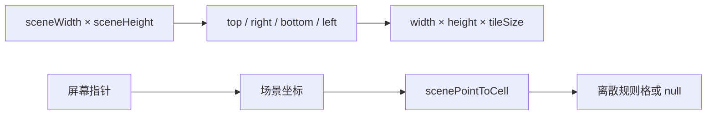

# 接入 SRPG 战场素材与动画

本页定义通用界面如何解析题材素材、组织战场图层、映射自然场景坐标并播放帧动画。表现系统只消费战斗状态和语义事件，不参与合法性与结算。

> 文档类型：Conceptual · 状态：通用端口、场景图层和帧动画已实现 · 代码真值：`packages/game-ui/src/art/`、`packages/game-ui/src/ui/board.ts`

## 表现层边界

战斗引擎输出事实，表现层决定如何显示事实。

表现层可以决定：

- 单位、地形、结构、图标、立绘和效果素材
- 场景画布留白与不规则外轮廓
- 道路、植被、建筑装饰和前景树冠
- 单位走路、攻击、受击、治疗和死亡动画
- 题材色板、描边和视觉密度

表现层不能决定：

- 单位是否能站在某个位置
- 路径和移动成本
- 攻击目标、范围和视线
- 伤害、反击、援护和死亡
- 场景触发器和胜负

`GameController` 把点击翻译为 Action，并围绕 `GameSession.dispatch()` 编排动画。动画失败不能修改权威 `GameState`。

## 两级表现端口

系统用 `ArtProvider` 解析稳定领域 ID，用 `BattlePresentation` 组织整张战场的场景策略。

### ArtProvider

`ArtProvider` 适合按 ID 提供可复用素材：

| 方法 | 解析内容 |
| --- | --- |
| `unitMarkup` | 棋盘单位 |
| `unitIcon` | 菜单和列表单位图标 |
| `terrainMarkup` | 单格地形 |
| `portraitMarkup` | 角色或兵种立绘 |
| `structureMarkup` | 结构实例 |
| `iconMarkup` | 通用界面图标 |
| `abilityIcon`、`weaponIcon`、`statusIcon` | 规则对象图标 |
| `coverMarkup`、`markerMarkup` | 空间掩体和战场 marker |
| `weaponFx`、`effectMarkup` | 武器与语义效果 |

提供者按后注册优先的顺序查询。方法返回 `null` 表示不处理该 ID，解析器继续查询下一个提供者。注册函数返回注销回调，热更新和测试必须在结束时注销或重置。

题材提供者只能把领域 ID 映射到表现。不要在提供者中读取角色剧情状态或重新计算战斗规则。

### BattlePresentation

`BattlePresentation` 适合按 `levelId` 选择整张地图的表现策略：

- `matches(levelId)`：声明适用关卡
- `sceneProfile()`：声明场景画布留白
- `sceneFrame()`：提供战术区域外的背景和前景
- `sceneLayers()`：提供战术区域内的三层场景素材
- `structure()` 和 `marker()`：覆盖题材实体表现
- `weaponFx()` 和 `effect()`：将语义效果转为 SVG 标记

没有匹配项时，系统使用 `generic` 表现。通用表现显示完整格线并使用内置矢量素材；题材表现使用自然场景和按需落点提示。

## 规则地图与场景画布

`SceneViewport` 把规则地图嵌入更大的视觉画布。规则坐标仍是 `width × height` 离散格，场景可以在四周增加不可交互的山林、河岸、城墙和装饰。



`createSceneViewport()` 计算：

- 规则区域像素尺寸
- 场景总尺寸
- 规则区域在场景中的原点
- 冻结后的 inset 配置

`scenePointToCell()` 只在规则区域内返回格坐标。点击场景留白会返回 `null`，不会误选最接近的边缘格。

这种结构允许地图看起来不是矩形棋盘，同时保留寻路、射程、存档和确定性。

## 每一层都问铺法要位置

画在棋盘上的东西没有一个可以自己算 `x * TILE`——那是「四方格」写进了表现层。`BoardLayout` 由铺法给出：`origin` / `center` / `outline` / `neighbour`，装饰、地形、战术家具都只通过它取位置。

两格之间的那条线（悬崖、方向掩体）由 `edgeLine(layout, at, toward, color, reach)` 画：垂直于两格中心连线，悬崖落在边界上（它属于两格），掩体落在自己那格里（它属于把它立起来的那一格）。铺法叫不出名字的朝向什么也不画。

这条约束是补出来的，不是设计出来的：`battlefield-layer.ts` 是第三个战术图层，也是唯一没跟上的那个——地形、单位、网格线、移动范围都搬到了铺法给的位置，而海拔角标、悬崖标记和掩体边仍按 `x * TILE` 画，缓存键还按四个固定朝向名做哈希，于是六边格上的方向掩体改了也不会重画。现在有一条守卫禁止任何模块再写出自己的朝向清单。

## 正式图层顺序

`BoardView` 的 SVG DOM 顺序就是深度契约。后出现的层绘制在前一层之上：

```text
sceneFrame.backdrop
  board-world
    ground
    terrain
    scenery            ← sceneLayers.underUnits
    spatial
    grid
    range
    path
    structures
    markers
    units
    foreground         ← sceneLayers.overUnits
    effects
    cursor
sceneFrame.foreground
```

各层用途如下：

| 层 | 应放内容 | 不应放内容 |
| --- | --- | --- |
| `sceneFrame.backdrop` | 战术矩形外的底层背景 | 可交互对象 |
| `ground` | 大片底色、阴影或地形下方背景 | 必须压在地形上方的道路 |
| `terrain` | 基础地形单格素材 | 高树冠和大型遮挡物 |
| `scenery` | 道路、地表装饰、单位下方植被和矮物件 | 会遮住单位身体的树冠 |
| `spatial` | 海拔、悬崖和方向掩体提示 | 场景装饰 |
| `grid` | 通用格线或题材落点节点 | 地表纹理 |
| `range` | 移动、攻击、治疗、威胁和战争迷雾 | 永久场景素材 |
| `path` | 当前预览路径 | 道路素材 |
| `structures` | 有战斗状态的结构实体 | 纯装饰建筑 |
| `markers` | 尸体、溃退、投降和互动 marker | 普通场景装饰 |
| `units` | 活跃战斗单位 | 树冠和屋檐前景 |
| `foreground` | 有意跨过单位平面的树冠、屋檐和桥梁前栏 | 道路、地面和大面积不透明底图 |
| `effects` | 攻击、受击、治疗和回合效果 | 永久地形 |
| `cursor` | 选择环和鼠标指示 | 任何环境素材 |
| `sceneFrame.foreground` | 场景外框的最前景遮罩 | 战术区域中需要选择的对象 |

道路必须放在 `terrain` 或 `scenery`，不能放在 `foreground`。如果道路素材包含大块不透明背景，还应先裁掉背景或使用正确透明通道，否则即使图层顺序正确也会盖住下层地形。

树冠和屋檐可以进入 `foreground`，但需要满足：

- 遮挡范围小于完整单位轮廓
- 选中、移动和攻击时可以降低不透明度
- 不遮挡选择环、效果和光标
- 不使用前景层表达碰撞规则

## 隐藏格可读性

通用表现显示格线。题材表现隐藏格线，只在战术交互时显示离散信息：

- 合法落点使用椭圆或圆环
- 选择单位使用脚下环
- 光标使用独立颜色
- 移动路径使用平滑曲线，但节点仍对应格中心
- 威胁、攻击和治疗范围使用半透明落点区域
- 迷雾使用同一范围层覆盖不可见格

自然场景不能牺牲规则可读性。每个可交互点必须能回答：能否站立、移动成本、能否攻击、是否受掩体保护以及当前归属。

## 栅格素材与图集

`runtime-raster.ts` 支持三种运行时格式：

| 类型 | 用途 |
| --- | --- |
| `RuntimeFrameSheet` | 水平帧条动画 |
| `RuntimeCellAtlas` | 固定整数格的地形、结构、图标和效果图集 |
| `RuntimeGridAtlas` | 源格可以是小数尺寸的规则大图 |

所有图集渲染器都会校验尺寸、行列和索引。关卡或题材代码应先构造带元数据的资产对象，再调用标记生成器；不要在 UI 控制器里手写裁剪坐标。

单位帧条使用：

- `frameWidth` 和 `frameHeight`
- `frameCount`
- 脚底 `anchor`
- 可选 idle、walk 和 attack 帧
- 可选具名 clip 列表

`runtimeUnitMarkup()` 把完整水平帧条放入一个裁剪窗口。当前帧通过修改内部 `<image>` 的 `x` 坐标选择，不会为每一帧创建新图片节点。

## 帧动画系统

`FrameAnimationSystem` 为所有已注册精灵共享一个 `requestAnimationFrame` 循环。没有多帧 clip 播放时，它会取消循环并休眠。

每个 `FrameAnimationClip` 定义：

- 稳定 `id`
- 帧索引数组
- 大于 0 的 `fps`
- 是否循环

动画目标只需要实现 `frameCount` 和 `setFrame(frame)`。因此时间线不依赖 SVG，也可以用于 Canvas 或 DOM 背景实现。

### 自描述 SVG 帧条

`runtimeFrameStripMarkup()` 把动画元数据写入 `data-frame-*` 属性。`registerSvgStrip()` 读取并校验元数据，再注册到共享系统。

`BoardView` 自动处理：

- 单位 idle、walk 和 attack clip
- 场景层中嵌入的帧条
- 武器和治疗效果中嵌入的帧条
- 单位死亡、移除和视图销毁时注销 track

如果系统检测到 `prefers-reduced-motion: reduce`，`play()` 会停在 clip 首帧并停止时间线。不要用 CSS 无限动画绕过这一策略。

## 战斗动画与权威状态

`GameController` 采用“预览、动画、提交、事件动画、刷新”的顺序协调交互。具体 Action 仍由 `GameSession` 权威提交。

常用动画包括：

- 格间移动 tween 和 walk clip
- 攻击前冲和 attack clip
- 受击数字与武器效果
- 治疗数字与治疗效果
- 死亡淡出
- 增援缩放出现
- 回合横幅

动画读取 Action 和 `GameEvent`，不能推断额外命中。范围攻击应按 `CombatPlan` 或提交事件逐个表现，不能重新扫描屏幕元素决定波及对象。

## 接入新题材表现

按以下步骤接入：

1. 为稳定领域 ID 准备透明背景运行时素材
2. 实现一个 `ArtProvider`
3. 为需要自然场景的关卡实现 `BattlePresentation`
4. 在题材包导出显式注册函数
5. 在 `apps/*/src/main.ts` 组合根注册
6. 为每个图层写结构测试
7. 挂载真实 `BoardView` 检查指针和遮挡
8. 用至少一个运行时关卡做截图审查

注册函数应可重复调用且返回注销能力。测试不能依赖前一个测试留下的全局提供者。

## 战斗界面：一块场地，一层覆盖

战斗画面只有两个孩子：占满视口的场地，和铺在它上面的覆盖层。中间没有第三个东西。

在此之前它是「顶栏 + 内容 + 侧栏 + 模态根」——`.topbar` / `.panel` / `.stage` / `.board-scroll` 写在共享样式表里，编辑器和战斗外壳穿的是同一套。那是**工具**的形状，于是战斗看起来就是一份中间贴了张图的文档。这套版式现在归编辑器（工具就该长得像工具），战斗界面自己一份 `battle.css`：**挂载 `GameController` 的外壳必须导入它**，有守卫盯着。

覆盖层是 8 个区域，每个区域只回答一个问题；一块新面板要先说清自己回答哪个问题，才谈得上放在哪里：

| 区域 | 它回答的问题 | 里面是什么 |
| --- | --- | --- |
| `crown` | 谁在行动 | 关卡名、回合数、行动序条、咏唱条、当前阵营与资源、系统按钮 |
| `flank` | 这一战要打成什么 | 作战目标与各方兵力 |
| `aside` | 眼下能下什么令 | 指令、指挥战术、战斗预测、单位详情、战前编成 |
| `dispatch` | 刚刚发生了什么 | 最近四条战报，最新一条亮起 |
| `ledger` | 光标底下是什么地方 | 地形、归属、防御、海拔、掩体、产出、各移动型消耗 |
| `hint` | 下一步该怎么做 | 一句话，由当前 selection 拥有 |
| `dock` | 这一手到此为止 | 结束回合 / 确认部署，屏幕上唯一不可撤销的控件，单独站着 |
| `veil` | 需要先回答的事 | 征募名册、战斗结算 |

几条随之成立的约束：

- **场地填满视口。** `fitWithin` 是「填满」不是「塞进去」：它过去把缩放封在 1.25×，于是 20×14 的战场在任何一块正常屏幕上都是一块 800×560 的矩形浮在渐变中央——这是画面最像网页的单一原因。棋盘不再有雕框，场地与四周之间只有渐暗的光。
- **上下两条带子是场地的 padding，左右两列不是。** 所以选中一个单位不会让地图重新缩放；侧栏半透明，世界从它后面透出来。
- **一个区域只在内容真的变了才重写。** 整块面板一次 `innerHTML` 意味着指针每动一格就重建目标、兵力和战报，覆盖层里任何东西都不可能做动画或保住滚动位置。
- **`data-mode` 一个词说明玩家正被要求什么**（`commanding` / `targeting` / `deploying` / `waiting` / `recruiting` / `over`）。场地的暗角、覆盖层的着色是同一种情绪，四张样式表各自从不同 class 猜是它们走散的方式。
- **提示句只有一个主人。** selection 就是玩家所处的状态机，句子归它；HUD 曾在瞄准时自己再写一句。

## 视觉验收清单

发布题材场景前确认：

1. 道路和地表装饰是否始终位于单位下方？
2. 前景树冠是否只产生有意、局部的遮挡？
3. 结构实体与装饰建筑是否分层正确？
4. 选择环、路径、范围、效果和光标是否始终可见？
5. 点击场景边缘是否返回 `null` 而不是错误格？
6. 缩放和适配窗口后，指针映射是否仍准确？
7. 单位脚底 anchor 是否落在格中心？
8. 动画结束后是否回到正确 idle 帧？
9. 销毁视图后是否清理 RAF、ResizeObserver 和事件监听？
10. 减少动态效果模式是否保持完整信息？
11. 素材是否使用透明通道且没有不透明矩形底？
12. 失败加载时是否有通用表现回退？
13. 场地是否填满了视口，而不是浮在渐变中央？
14. 覆盖层每个区域是否只说自己那件事，无话可说时是否把地方还给世界？
15. 战场中央是否始终空着——覆盖层只占四角与两侧？

## 当前缺口

以下表现能力尚未形成通用系统：

- 音效、音乐和语音端口
- 镜头时间线、屏幕震动和复杂转场编排
- 粒子系统和粒子编辑器
- 场景素材可视化摆放工具
- 深度遮挡 mask 和单位自动淡化
- WebGL 或 Canvas 大规模渲染后端
- 素材预加载、流式加载和显存预算

当前 SVG 架构适合小型和中型战场。扩大单位和装饰数量前，先测量 DOM 节点、布局、绘制和图片解码，而不是预先迁移渲染后端。

## 相关文档

- [引擎能力目录](./engine-capabilities.md)
- [关卡数据格式](./level-format.md)
- [关卡编辑器](./editor-guide.md)
- [战斗引擎架构](./combat-engine-architecture.md)
