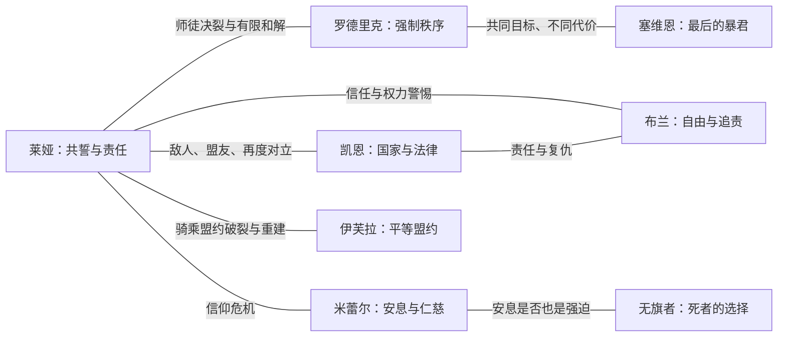

# 候选剧本 1：《断冠之誓》

> 文档类型：SRPG 长篇战役总纲
> 状态：候选方案，尚未定稿
> 主线规模：7 个大章、36 场主线战斗
> 建议支线：8～12 场人物与阵营任务
> 故事时间：约 9 年
> 主角年龄：18 岁至 27 岁
> 核心类型：政治奇幻、成长史诗、军团 SRPG

## 文档导航

| 章节 | 时间 | 主角身份 | 文档 |
| --- | --- | --- | --- |
| 第一章：边境之火 | 第 0 年 | 边境见习军官 | [01-border-fire.md](./01-border-fire.md) |
| 第二章：灰旗流亡 | 第 1 年 | 逃亡者、灰旗队长 | [02-grey-banner-exile.md](./02-grey-banner-exile.md) |
| 第三章：古老诸族 | 第 2～3 年 | 远征队领袖 | [03-elder-peoples.md](./03-elder-peoples.md) |
| 第四章：灰旗女王 | 第 4 年 | 解放者、联盟象征 | [04-grey-banner-queen.md](./04-grey-banner-queen.md) |
| 第五章：两种和平 | 第 5～6 年 | 实际统治者 | [05-two-peaces.md](./05-two-peaces.md) |
| 第六章：七塔战争 | 第 7～8 年 | 大陆联军统帅 | [06-war-of-seven-towers.md](./06-war-of-seven-towers.md) |
| 第七章：无王之座 | 第 9 年 | 新时代奠基者 | [07-throne-without-king.md](./07-throne-without-king.md) |

---

## 1. 核心提案

### 1.1 一句话梗概

> 在一个“誓言可以成为魔法”的大陆上，年轻边境军官莱娅发现战争正被人为制造，每一名阵亡者都在为能够奴役众生的远古王冠积蓄力量。她从拒绝一道屠杀命令开始，历经九年流亡、远征、解放、分裂与统治，最终必须决定：摧毁能结束战争的王冠，还是戴上它成为所有人期待的和平君主。

### 1.2 主角成长命题

莱娅最初认为：

> 只要指挥官作出正确决定，士兵就应该服从。

中期她相信：

> 只要推翻错误的统治者，人们就会获得自由。

最终她必须明白：

> 真正的领袖不是永远作出正确决定的人，而是建立一个即使自己作出错误决定，也有人能够阻止自己的世界。

### 1.3 核心主题

1. **自由与和平**：如果自由必然带来冲突，强制的和平是否仍然是和平？
2. **服从与责任**：执行命令的人、签发命令的人和未能阻止命令的人分别承担什么责任？
3. **解放与治理**：推翻暴君之后，谁负责粮食、法律、治安和失败的后果？
4. **死者的权利**：死者应该安息，还是有权继续表达未竟的意志？
5. **历史的终结**：结束旧时代的魔法，也意味着失去它带来的治疗、保护和奇迹。
6. **有限和解**：和解不是抹除分歧，而是承认彼此有选择不同道路的权利。

---

## 2. 创作方向与边界

### 2.1 西幻史诗感的来源

本剧本吸收经典西方奇幻的以下气质：

- 当代战争只是古老时代留下的后果；
- 世界通过漫长旅途、遗迹、歌曲、种族记忆和衰败文明逐步展开；
- 古老力量并非单纯武器，而是一项带有道德代价的选择；
- 精灵、矮人、兽族、亡灵和巨龙拥有自己的政治诉求；
- 大规模战争始终由一小群具体人物的关系支撑；
- 最终胜利同时意味着一个魔法时代的结束。

### 2.2 不直接复制的内容

为了保持原创性和项目自身身份，明确避免：

- 隐藏王族血统和“天生合法继承人”；
- 以收复祖传王位作为主角的唯一目标；
- 复制某件必须送往火山销毁的邪恶戒指；
- 复制流亡公主、三条幼龙和血统称王的具体组合；
- 把精灵写成永远正确的高等种族；
- 把兽人、巨魔和亡灵写成没有意志的纯粹怪物；
- 让主角在结尾突然失去理智，以此替代长期铺垫的权力冲突；
- 用预言证明主角的一切选择天然正确。

### 2.3 本作的原创核心

“誓约王冠”的腐化不是诱发疯狂，而是让使用者不再需要说服别人。

它可以：

- 强迫一支军队停止战斗；
- 让城市居民遵守同一条命令；
- 从死者记忆中提取服从并制造亡灵士兵；
- 通过烽塔治疗、防护和维持城市基础设施；
- 把一位统治者的意志传遍大陆。

它最危险的地方在于：它确实有效，而且第一次使用往往真的能够拯救许多人。

---

## 3. 世界与历史

### 3.1 大陆：伊瑟兰

伊瑟兰大陆横跨寒冷北境、中央河谷、西部古林、南方荒原和东部山脉。不同文明并非平均分布，而是围绕远古“誓约烽塔”形成城市、道路与战争边界。

主要区域：

| 区域 | 地貌 | 主要势力 | 叙事用途 |
| --- | --- | --- | --- |
| 灰境 | 丘陵、河谷、边境城镇 | 洛恩、维尔萨、自由民 | 主角故乡与战争起点 |
| 洛恩腹地 | 农田、旧城堡、王都 | 洛恩王国 | 旧秩序和导师线 |
| 维尔萨平原 | 大道、堡垒、军屯 | 维尔萨帝国 | 凯恩的责任与秩序理念 |
| 银林 | 古森林、树城、迷雾 | 银林长生者 | 衰退的魔法与自由代价 |
| 山炉群峰 | 山道、矿井、地下炉城 | 山炉氏族 | 王冠建造真相和技术责任 |
| 南方荒原 | 草原、峡谷、风暴 | 荒原诸部 | 被历史妖魔化的旧帝国边防族群 |
| 龙眠山脉 | 高峰、火山、龙巢 | 古龙 | 王冠守护者与平等盟约 |
| 圣辉领 | 圣城、墓园、白塔 | 圣辉教廷 | 复活技术、档案与战争阴谋 |
| 阿斯塔里亚废都 | 七塔交汇的古都 | 摄政王与王冠军 | 最终战争所在地 |

### 3.2 三个历史时代

#### 第一时代：诸族盟约

人类尚未统一时，银林长生者、山炉氏族、荒原诸部和古龙以地域盟约共同对抗魔潮。盟约必须由各方自愿重复确认，因此力量有限，却无法被一人独占。

#### 第二时代：阿斯塔里亚帝国

人类皇帝将盟约语言改造成“誓文”，并命山炉工匠建造七座主烽塔。烽塔起初用于：

- 跨越远距离传递命令；
- 保护城市免受魔潮；
- 治疗守军；
- 保存阵亡者的记忆；
- 让不同种族共同维持道路和水利。

帝国后期，皇帝试图用誓约王冠让所有臣民永久服从。七名将领发动“断冠之战”，王冠破碎，帝国随之解体。

#### 第三时代：断冠纪

三百年后，七塔仍在维持城市，却无人理解完整代价。洛恩王国、维尔萨帝国和圣辉教廷都宣称继承旧帝国的一部分合法性。

圣辉教廷逐渐垄断治疗和亡者技术。洛恩摄政王塞维恩秘密允许教廷制造战争，希望用足够多的阵亡记忆重启王冠，从而一次性结束大陆冲突。

---

## 4. 魔法与超自然规则

### 4.1 誓火

所有魔法本质上都需要“意志、名字和见证”。施法者通过说出真实意图并承担相应代价，让世界暂时承认这项誓言。

普通魔法的限制：

- 誓言越具体，力量越稳定；
- 违背自己誓言的人会失去部分施法能力；
- 群体法术需要共同见证或烽塔放大；
- 死者的真名可以唤回记忆，但不等于真正复活；
- 巨龙不受人类誓文天然控制，因为它们使用更古老的盟约语言。

### 4.2 誓约烽塔

七座主烽塔与大量地方节点构成远古网络。游戏中的建筑治疗、生产强化、亡灵复活和部分指挥能力都由它解释。

每座主塔保存一种社会功能：

| 主塔 | 功能 | 失去后的代价 |
| --- | --- | --- |
| 赤石塔 | 军事指挥与边境道路 | 军团调动速度降低 |
| 沉钟塔 | 水利与河流净化 | 河谷可能洪水或干涸 |
| 圣辉塔 | 治疗与记忆保存 | 大范围治疗奇迹消失 |
| 龙眠塔 | 魔潮屏障 | 野外魔物活动增强 |
| 北境风塔 | 气候与山口保护 | 北境暴雪失控 |
| 苍林梦塔 | 森林生命循环 | 银林加速衰亡 |
| 钢铁誓塔 | 城防、道路和王冠中枢 | 王都与帝国遗迹失去保护 |

因此“摧毁王冠”不能等同于毫无代价地关闭邪恶机器。

### 4.3 亡灵

亡灵分为三类：

- **回声**：死者最后一段记忆，无完整人格；
- **归名者**：保留姓名、选择和部分生前记忆；
- **聚忆体**：大量无名死者共同形成的新意识，“无旗者”属于此类。

教廷宣称所有亡灵都是工具或污染。米蕾尔与无旗者的故事将证明，是否具有人格不能只由活人决定。

### 4.4 巨龙盟约

巨龙不是坐骑种族，也不承认“主人”。龙可以与人签订平等盟约：双方都能拒绝命令，任何一方试图强制另一方时盟约自动破裂。

幼龙伊芙拉与莱娅共同成长。它的存在不证明莱娅拥有神圣血统，只证明她曾经赢得一位非人盟友的信任。

---

## 5. 主要势力与文化

### 5.1 洛恩王国

一个依靠旧贵族、骑士封地和圣辉治疗维持的衰落王国。

- 优点：地方自治传统、骑士保护制度、成熟农业；
- 问题：贵族割据、对边境平民漠视、依赖教廷；
- 军事风格：剑士、枪兵、骑士、长弓与城堡防守；
- 核心人物：罗德里克、摄政王塞维恩。

### 5.2 维尔萨帝国

由长期边境战争塑造的军事国家，以统一法律和公共道路为荣。

- 优点：军纪、工程、跨地域行政、对平民出身军官开放；
- 问题：扩张主义、强制征兵、相信秩序可以替代同意；
- 军事风格：军团盾卫、长枪骑兵、重装骑士、战斗法师；
- 核心人物：凯恩。

### 5.3 圣辉教廷

掌握治疗、守墓和烽塔知识的跨国教会。

- 优点：医院、识字教育、灾难救援、保存历史；
- 问题：垄断复活技术、删除不利记忆、以战争维持权力；
- 军事风格：圣殿骑士、审判官、守墓人、亡灵与光系法术；
- 核心人物：大祭司奥德伦、米蕾尔。

### 5.4 灰境自由领

由边境城市、农庄、佣兵和难民组成，没有统一国家身份。

- 优点：务实、包容、地方自治；
- 问题：缺少统一法律，容易被军阀和商团控制；
- 军事风格：混编步兵、游侠、工程师、佣兵和缴获装备；
- 核心人物：莱娅、布兰、塔莎。

### 5.5 银林长生者

寿命漫长但人口持续减少的森林文明。他们认为人类王国只是短暂浪潮。

- 优点：生态魔法、历史记忆、远程和森林作战；
- 问题：傲慢、消极避世、愿意牺牲人类城市换取森林延续；
- 军事风格：长弓守卫、林地行者、德鲁伊、灵火、白鹿骑手。

### 5.6 山炉氏族

矮人炉城的后裔，祖先参与建造七塔，因此背负集体罪责。

- 优点：工程、符文、城防和可靠契约；
- 问题：氏族封闭、掩盖祖先责任、过度相信技术中立；
- 军事风格：符文盾卫、战斧兵、工匠、石魔像、火炮车。

### 5.7 荒原诸部

由兽人、巨魔、狼骑部族和人类游牧群体构成。旧帝国曾雇佣他们守卫南境，帝国灭亡后又把他们写成野蛮入侵者。

- 优点：部族盟誓、机动、适应恶劣环境；
- 问题：内部复仇传统、缺少长期共同机构；
- 军事风格：狼骑、巨魔、狂战士、萨满、投矛猎手。

### 5.8 古龙

古龙是第一时代盟约的见证者。他们不是统一国家，彼此甚至会因对人类的判断发生冲突。

- 优点：飞行、古老记忆、对誓约控制的抵抗；
- 问题：数量稀少、拒绝介入、对短生种缺乏耐心；
- 军事风格：巨龙主要作为英雄、盟军或首领，不能常规量产。

---

## 6. 主要人物

### 6.1 莱娅·维恩

| 项目 | 内容 |
| --- | --- |
| 初登场 | 18 岁，洛恩边境见习军官 |
| 终章 | 27 岁，大陆联盟实际领袖 |
| 初始信念 | 正确的指挥官有权要求服从 |
| 核心恐惧 | 自己无力保护追随者 |
| 核心缺陷 | 把承担一切责任误认为领导力 |
| 主要诱惑 | 王冠可以让她的正确决定立即生效 |
| 完整成长 | 从亲自作出所有决定，到建立能够反对自己的联盟 |

视觉阶段：

1. **18 岁**：边境轻甲、蓝灰斗篷、尚未拥有个人旗帜；
2. **22 岁**：灰旗军装、战斗伤痕、龙盟纹章，被民众称作女王；
3. **27 岁**：不戴王冠，以多族盟约扣连接披风，装备更像统帅而非斗士。

战斗成长：

- 前期：小范围防御与鼓舞；
- 中期：骑乘伊芙拉、突破和全军士气；
- 后期：核心能力不是范围伤害，而是允许多名盟军指挥官分别发动一次能力。

### 6.2 罗德里克·赫恩

莱娅的导师，洛恩老骑士。

- 真正爱护莱娅，也真正相信王冠是唯一和平方案；
- 第一章作为可操作友军展示强大指挥光环；
- 第二章奉命追捕莱娅，但给予投降机会；
- 第四章公开承认自己知道阴谋并主动选择摄政王；
- 第六章与莱娅完成最终理念决战；
- 和解不以“你是对的”结束，而以“我不能剥夺下一代尝试的机会”结束。

### 6.3 凯恩·阿尔德

维尔萨帝国年轻将领。

- 相信统一法律和强大国家能够减少长期战争；
- 第一章作为敌人保护桥上平民；
- 第三章与莱娅被迫合作，随后因抗命被帝国视为叛徒；
- 加入灰旗军后与布兰产生持续冲突；
- 第五章可能因烽塔选择暂时离队并成为敌方指挥官；
- 最终不会放弃帝国身份，而是以独立盟友身份参与新秩序。

### 6.4 布兰·洛克

被焚村庄的猎人和斥候，后成为刺客型指挥官。

- 代表被国家叙事忽略的普通受害者；
- 认为没有审判和追责的和解只是让强者逃脱；
- 凯恩的印章曾出现在焚村命令上；
- 即使知道命令遭到伪造，也拒绝让凯恩以“不知情”摆脱责任；
- 第五章可能因莱娅控制烽塔而离队；
- 最好的关系结局不是原谅凯恩，而是愿意把战场右侧交给他。

### 6.5 米蕾尔·索恩

圣辉教廷守墓人。

- 起初相信净化所有亡灵就是仁慈；
- 能听见墓碑中的记忆，却害怕承认它们拥有完整人格；
- 与无旗者围绕“安息是否也是强迫”发生冲突；
- 第五章发现莱娅第一次使用王冠时也控制了死者；
- 最终提出“最后誓约”：死者可以完成一件未竟之事，但不能被无限召回。

### 6.6 塔莎·莫恩

自由佣兵团首领，代表生存和现实利益。

- 不相信宏大理念，只相信能否按时发粮和支付抚恤；
- 经常指出灰旗军的道德选择由普通士兵承担成本；
- 可以成为军需、佣兵和工程体系负责人；
- 若莱娅长期牺牲物资换取象征性胜利，她会暂时退出；
- 她的认可意味着莱娅学会治理，而不只是学会演讲。

### 6.7 无旗者

由无数无名阵亡者形成的聚忆体。

- 不属于活人任何国家；
- 反对教廷使用死者，也反对活人擅自让所有死者安息；
- 希望亡者在新秩序中拥有发言权；
- 一度试图建立不会背叛的亡灵国家；
- 与米蕾尔和解后接受“自愿且有限的归来”。

### 6.8 伊芙拉

第二章从教廷运输队中被释放的幼龙。

- 不说人类语言时仍能表达明确意志，后期才学会使用誓语；
- 与莱娅共同成长，而不是成为她的所有物；
- 第四章在龙眠山脉主动选择与莱娅缔结盟约；
- 第五章莱娅使用王冠后解除骑乘盟约；
- 第六章是否重新参战取决于莱娅是否愿意步行、等待和接受拒绝；
- 终章作为独立盟军指挥官，而非莱娅的装备。

### 6.9 摄政王塞维恩

洛恩实际统治者，主要政治对手。

- 曾试图通过传统盟约结束战争，但亲眼见证三次停战失败；
- 知道教廷制造冲突，却认为这些牺牲能够换来永久和平；
- 不追求个人享乐，也不把王冠视为荣耀；
- 相信自己有责任成为最后一个暴君；
- 最终败因不是不理解自由，而是不相信普通人有承担自由后果的能力。

### 6.10 大祭司奥德伦

圣辉教廷领袖。

- 与塞维恩目标不同：塞维恩想结束战争，奥德伦需要战争持续；
- 教廷的治疗奇迹依赖亡者记忆，他担心王冠统一后教廷失去存在价值；
- 中期试图同时操纵王国、帝国和灰旗军；
- 后期被自己保存的大量记忆反噬，成为王冠聚忆体诞生的推动者。

---

## 7. 人物冲突网络



关系写作原则：

- 角色离队前必须长期表达底线；
- 不以精神控制解释主要人物的政治选择；
- 化敌为友必须通过共同承担风险，而不是一场对话；
- 和解必须保留无法抹去的损失；
- 不是所有关系都有完美结局；
- 关系变化要反馈到援护、组合能力、指挥光环或最终援军。

---

## 8. 九年时间线与七章结构

| 章 | 年份 | 年龄 | 主线关卡 | 核心事件 | 机制层次 |
| --- | ---: | ---: | ---: | --- | --- |
| 一 | 0 | 18 | 1～5 | 发现伪造战争、拒绝焚村 | 移动、攻击、占领、护送 |
| 二 | 1 | 19 | 6～10 | 逃亡、建军、释放幼龙 | 招募、军需、指挥范围 |
| 三 | 2～3 | 20～21 | 11～16 | 远征诸族、亡灵真相、凯恩加入 | 状态、种族兵种、合作目标 |
| 四 | 4 | 22 | 17～21 | 联盟、龙盟、被称女王、导师决裂 | 英雄、气势、援护、联盟军 |
| 五 | 5～6 | 23～24 | 22～26 | 治理失败、首次使用王冠、队伍分裂 | 政策后果、动态阵营、反应姿态 |
| 六 | 7～8 | 25～26 | 27～32 | 非线性七塔战争、同伴回归、旧旗终战 | 多军团、结构、战略选择 |
| 七 | 9 | 27 | 33～36 | 王都决战、无名之王、制度选择 | 全系统综合、结局兑现 |

### 8.1 三部发行结构

为了控制制作风险，七章可以拆成三个拥有阶段性结局的部分：

```text
第一部《灰旗崛起》
第一至第三章，16 场主线

第二部《破碎王冠》
第四至第五章，10 场主线

第三部《无王时代》
第六至第七章，10 场主线
```

第一部结尾已经揭示亡者与王冠真相，可以作为独立版本收束；第二部以队伍分裂和灰誓议会结束；第三部完成大陆战争与结局。

---

## 9. 主线关卡总表

| 编号 | 关卡 | 章节 | 主要目标 |
| ---: | --- | --- | --- |
| 01 | 双子丘陵 | 一 | 占领中央村庄 |
| 02 | 三桥河谷 | 一 | 控制桥梁并护送平民 |
| 03 | 赤石围城 | 一 | 突破城防、调查异常守军 |
| 04 | 黑旗营地 | 一 | 营救失踪士兵、夺取命令证据 |
| 05 | 焚村令 | 一 | 抗命并护送村民撤离 |
| 06 | 白河夜渡 | 二 | 在追兵抵达前完成撤离 |
| 07 | 无主之城 | 二 | 防守自由城并恢复生产 |
| 08 | 佣兵之价 | 二 | 解决粮道和佣兵冲突 |
| 09 | 笼中之火 | 二 | 劫取粮车并释放幼龙伊芙拉 |
| 10 | 旧旗下的追兵 | 二 | 面对罗德里克并突围 |
| 11 | 无声墓园 | 三 | 穿越复活战场、保护米蕾尔 |
| 12 | 沉没钟塔 | 三 | 与凯恩从遗迹共同逃生 |
| 13 | 圣城档案 | 三 | 获取两国伪造命令证据 |
| 14 | 山炉余烬 | 三 | 解决炉城内战、取得塔图纸 |
| 15 | 银林长梦 | 三 | 阻止森林梦境吞噬边境居民 |
| 16 | 记住我的名字 | 三 | 释放归名者并认识无旗者 |
| 17 | 白旗会议 | 四 | 保护和谈代表 |
| 18 | 三军之战 | 四 | 在三方混战中建立临时联盟 |
| 19 | 龙眠之山 | 四 | 通过古龙试炼、缔结平等盟约 |
| 20 | 灰旗加冕 | 四 | 解放城市并阻止报复屠杀 |
| 21 | 导师之誓 | 四 | 与罗德里克首次正式决战 |
| 22 | 跪下的城市 | 五 | 调查自愿接受王冠的城市 |
| 23 | 无王的城市 | 五 | 平息解放区内战和粮荒 |
| 24 | 第一次命令 | 五 | 在屠杀发生前决定是否使用王冠 |
| 25 | 第三面旗 | 五 | 处理队内分裂与烽塔命运 |
| 26 | 灰誓议会 | 五 | 保护各族代表完成表决 |
| 27 | 北境风塔 | 六 | 控制暴雪与山口 |
| 28 | 苍林梦塔 | 六 | 决定银林和人类聚落的共同命运 |
| 29 | 白骨军塔 | 六 | 决定亡者是否进入联盟 |
| 30 | 钢铁誓塔 | 六 | 突破王冠军核心防线 |
| 31 | 旧旗终战 | 六 | 与罗德里克完成最终理念决战 |
| 32 | 七塔合鸣 | 六 | 阻止奥德伦强制启动全部烽塔 |
| 33 | 王都城下 | 七 | 联军会师、突破外城 |
| 34 | 万人跪拜之城 | 七 | 解除居民控制并避免平民伤亡 |
| 35 | 最后的摄政王 | 七 | 击败塞维恩及残余王冠军 |
| 36 | 无王之座 | 七 | 对抗聚忆体并决定新时代制度 |

---

## 10. 选择系统

### 10.1 三种公开倾向

不使用隐藏善恶值，战役纪事公开记录三种倾向和具体行为。

| 倾向 | 代表行为 | 可能代价 |
| --- | --- | --- |
| 秩序 | 控制烽塔、维持城市设施、接受必要牺牲 | 同伴怀疑、控制依赖、自由受损 |
| 自由 | 摧毁节点、拒绝强制服从、支持地方自治 | 失去治疗与基础设施、短期混乱 |
| 共誓 | 保护平民、接受投降、协商共管、承认亡者选择 | 成本高、条件苛刻、无法快速解决问题 |

倾向不是传统阵营锁。玩家可以在不同事件中选择不同方法，但长期行为会影响角色信任、关卡资源和最终制度。

### 10.2 关键剧情标记

候选标记如下：

```text
protected_bridge_refugees
spared_redstone_soldiers
rescued_mirel_records
freed_ivra_without_binding
roderick_old_guard_spared
cain_accepted_responsibility
bran_survivor_truth
dwarves_publicly_confessed
silverwood_shared_the_tower
dragon_pact_equal
grey_city_revenge_stopped
first_crown_command_used
first_crown_command_released_early
party_split_resolved_without_kills
dead_granted_voice
tower_outcomes[7]
grey_council_trust
```

重要原则：

- 真结局条件不能完全隐藏；
- 关键选择在发生前必须说明不可逆后果；
- 不要求玩家完成所有支线才能得到合理结局；
- 支线主要改变人物后日谈、组合能力和最终援军；
- 不通过大量永久属性奖励强迫玩家选择“善良”。

---

## 11. 结局框架

### 11.1 王冠结局

莱娅戴上王冠，战争和犯罪迅速减少。多年后城市繁荣，但所有人在见到她时都会不由自主地下跪。

成立条件：秩序倾向明显、保留多数烽塔、联盟信任不足以支撑共管。

这不是纯坏结局：大量平民确实得到安全，代价是政治选择权永久集中于一个人。

### 11.2 断冠结局

莱娅摧毁王冠和主要控制功能。魔法治疗、亡灵召回和部分城市防护逐渐消失，各国恢复完全自主。

成立条件：自由倾向明显、摧毁多数控制节点。

战争没有自动终结，但人们第一次签订一份可以拒绝、修改和退出的盟约。

### 11.3 灰誓结局

莱娅把王冠拆分为由不同城市、种族、活人与归名者共同保管的“自由誓石”。任何跨地区命令都必须得到多个独立持有者确认。

成立条件：

- 共誓倾向达到要求；
- 主要阵营保有足够信任；
- 至少数座烽塔完成共管，而非简单占领或摧毁；
- 关键队内冲突以有限和解结束；
- 玩家没有长期依赖王冠强制服从。

### 11.4 孤王结局

莱娅击败所有敌人并摧毁或夺取王冠，但主要盟友均已离开。她赢得战争，却只能依靠自己的军队维持秩序。

这用于承接战术上成功、关系和政治上失败的路线，而不是简单 Game Over。

---

## 12. 兵种扩充方案

### 12.1 规模原则

整个项目可以拥有约 28～32 个单位定义，但单次流程常规可招募单位控制在 14～18 种。其余作为：

- 阵营专属单位；
- 指挥官解锁单位；
- 条件盟军；
- 召唤和亡灵；
- Boss 与剧情单位。

避免所有单位同时出现在一个城堡招募列表。

### 12.2 灰旗与人类通用兵种

| 兵种 | 职责 | 主要机制 |
| --- | --- | --- |
| 剑士 | 廉价战线、占领 | 防守与稳定交换 |
| 枪兵 | 反骑、保护后排 | 对骑兵专属克制、护卫 |
| 弓箭手 | 对空、安全消耗 | 对飞行专属克制 |
| 游侠 | 侦察、森林作战 | 毒箭、森林移动 |
| 刺客 | 切后排、夺点 | 克制辅助/施法/远程 |
| 牧师 | 治疗、净化 | 治疗和状态解除 |
| 法师 | 破甲、范围控制 | 魔法、范围模板 |
| 骑士 | 高机动突击 | 冲锋、侧翼 |
| 工程师 | 建筑与攻城辅助 | 修复、路障、拆除 |
| 旗卫 | 指挥官保护 | 援护防御、指挥范围延伸 |
| 弩车 | 远程与攻城 | 最小射程、不能移动后攻击 |

### 12.3 维尔萨帝国

| 兵种 | 职责 | 主要机制 |
| --- | --- | --- |
| 军团盾卫 | 阵线核心 | 相邻盾墙、正面减伤 |
| 长枪骑兵 | 直线突破 | 移动距离转化为冲锋伤害 |
| 重装骑士 | 高价攻坚 | 高护甲、复杂地形受限 |
| 战斗法师 | 武器附魔 | 临时改变伤害类型 |
| 鹰骑斥候 | 飞行侦察 | 高视野、低耐久 |

### 12.4 银林长生者

| 兵种 | 职责 | 主要机制 |
| --- | --- | --- |
| 长弓守卫 | 远距离直射 | 三格射程、需要视线 |
| 林地行者 | 隐蔽机动 | 森林中移动后隐蔽 |
| 德鲁伊 | 地形与控制 | 缠绕、治疗森林地形 |
| 灵火精怪 | 光环与净化 | 支援光环、克制亡灵 |
| 白鹿骑手 | 林地轻骑 | 在森林中不受骑乘惩罚 |

### 12.5 山炉氏族

| 兵种 | 职责 | 主要机制 |
| --- | --- | --- |
| 符文盾卫 | 抗魔重甲 | 魔法减伤、援护 |
| 战斧兵 | 近战破甲 | 对重甲和建筑 |
| 符文工匠 | 工程支援 | 修复结构、布设符文 |
| 石魔像 | 构装肉盾 | 极高防御、无法占领 |
| 火炮车 | 重型攻城 | 范围炮击、部署后开火 |

### 12.6 荒原诸部

| 兵种 | 职责 | 主要机制 |
| --- | --- | --- |
| 狼骑兵 | 追击与侧翼 | 击杀后小幅再移动 |
| 巨魔 | 护卫与击退 | 高 HP、援护防御 |
| 狂战士 | 风险输出 | 重伤强化但防御降低 |
| 萨满 | 状态和天气 | 毒、鼓舞、风暴 |
| 投矛猎手 | 对大型目标 | 克制飞行和大型单位 |

### 12.7 教廷与亡灵

| 兵种 | 职责 | 主要机制 |
| --- | --- | --- |
| 圣殿骑士 | 抗魔和光环 | 沉默抗性、附近友军抗魔 |
| 审判官 | 反施法 | 沉默、驱散增益 |
| 守墓人 | 亡者管理 | 净化或唤醒墓碑 |
| 骸骨卫士 | 临时前排 | 低成本召唤、时限存在 |
| 幽魂 | 穿行骚扰 | 穿越部分阻挡、惧怕圣光 |
| 墓地巨像 | 亡灵首领 | 多格/大型目标、墓碑强化 |

### 12.8 巨龙与龙裔

| 单位 | 定位 | 规则 |
| --- | --- | --- |
| 伊芙拉幼年 | 护送/剧情单位 | 不能常规招募，主要自保 |
| 伊芙拉青年 | 英雄盟友 | 与莱娅可建立骑乘盟约 |
| 伊芙拉成年 | 独立指挥官 | 终章拥有自己的行动和部队 |
| 飞龙骑手 | 可招募飞行兵 | 条件解锁，弱于真正巨龙 |
| 古龙 | 盟军或首领 | 不可量产，拥有多阶段能力 |

### 12.9 解锁节奏

| 章节 | 主要解锁 |
| --- | --- |
| 一 | 剑士、弓箭手、牧师、骑士、弩车 |
| 二 | 枪兵、游侠/刺客、工程师、旗卫；伊芙拉作为剧情单位 |
| 三 | 守墓人、灵火、矮人工程与石魔像、银林单位、荒原单位 |
| 四 | 维尔萨军团单位、飞龙相关单位、英雄气势 |
| 五 | 亡灵条件单位、审判官、阵营分裂版本单位 |
| 六 | 各阵营高级兵种、火炮车、成年伊芙拉、联盟指挥官 |
| 七 | 不再大量新增兵种，集中兑现既有阵容与组合能力 |

---

## 13. 人物关系与战斗反馈

关系不做成庞大的全员好感矩阵，只追踪少数经过编写的关键关系。

| 关系状态 | 战斗反馈 |
| --- | --- |
| 敌对 | 作为敌方指挥官、特殊对话 |
| 暂时合作 | 可共同完成目标，但不能共享指挥光环 |
| 互不信任 | 不能发动援护或组合能力 |
| 建立尊重 | 相邻时获得小幅防御或士气 |
| 真正信任 | 解锁援护攻防 |
| 有限和解 | 解锁组合能力，同时保留独立指挥权 |
| 尊重但不同行 | 终章作为独立盟军出现 |
| 彻底破裂 | 拒绝出战、加入敌方或离开大陆 |

主要组合能力候选：

- 莱娅 + 凯恩：“双旗推进”，两支军团分别获得一次移动；
- 凯恩 + 布兰：“右侧交给你”，凯恩援护防御后布兰发动追击；
- 米蕾尔 + 无旗者：“最后誓约”，自愿亡灵完成一次行动后安息；
- 莱娅 + 伊芙拉：“自由之翼”，双方各自行动而非合并为骑乘单位；
- 莱娅 + 罗德里克：“旧誓新答”，终章一次性解除全军控制状态。

---

## 14. 叙事演出规范

### 14.1 每关节奏

建议每场主线战斗包含：

- 战前核心场景：1～3 分钟；
- 战前部署对话：1 个明确冲突；
- 战中触发：2～4 个，不连续打断操作；
- 动态目标变化：重要关卡 1 次；
- 战后主场景：1 个结果和 1 个新问题；
- 营地可选对话：2～4 组；
- 战役纪事：记录选择、伤亡和地区变化。

### 14.2 对话原则

- 每场对话必须改变关系、信息、目标或选择，不能只重复世界观；
- 角色不直接陈述自己的完整主题；
- 政治立场通过具体的人、粮食、伤亡和命令体现；
- 反派可以准确指出主角的失败；
- 主角不能每次都拥有最后一句正确答案；
- 重要和解应发生在共同行动之后，而不是行动之前；
- 对话选择不设置明显“善良答案”，而是对应不同成本。

### 14.3 时间流逝表现

- 莱娅至少三套年龄阶段立绘；
- 核心角色在第四章和第七章更新服装、伤痕或发型；
- 第一章救下的孩子可在第六章成为新兵、医师或使者；
- 旧地图以新地形和新归属重新出现；
- 被毁村庄可能重建、荒废或变成纪念地；
- 老兵可能升为指挥官、伤残退役或成为阵亡墓碑；
- 人物对莱娅的称呼从“小姐/见习官”变为“队长”“将军”“女王”，最终由结局决定。

---

## 15. 叙事与系统对应

| 世界设定 | 游戏机制 |
| --- | --- |
| 誓约军旗 | 指挥范围、军团归属、指挥能力 |
| 烽塔网络 | 建筑治疗、生产、复活、地图结构 |
| 亡者记忆 | 墓碑、召唤、状态和任务目标 |
| 巨龙盟约 | 英雄援护、飞行、关系解锁，不是所有权 |
| 多族联盟 | 阵营专属兵种与指挥官 |
| 王冠诱惑 | 可立即解决危机但改变信任和结局的强制能力 |
| 九年成长 | 军衔、英雄等级、职业、立绘和地图变化 |
| 队内理念分裂 | 角色离队、动态阵营、援护失效与重新解锁 |
| 灰誓议会 | 多目标防守、代表存活影响结局 |
| 七塔选择 | 非线性任务、最终战模块变化 |

---

## 16. 生产规模与控制

### 16.1 建议内容规模

- 36 场主线战斗；
- 8～12 场可选支线；
- 7 个大区域加若干重访变体；
- 8～10 名核心人物；
- 约 28～32 个总单位定义；
- 单次流程 14～18 个常规可用兵种；
- 莱娅 3 套主立绘，其余核心角色 1～2 次阶段变化；
- 4 个主要结局和人物后日谈组合。

### 16.2 控制成本的方法

- 后期重访双子丘陵、三桥河谷、赤石城等旧地图；
- 同一地图通过季节、破坏、建筑和阵营变化产生新玩法；
- 阵营兵种复用同一底层武器、状态和移动系统；
- 分支优先改变目标、部署、盟军和对话，不大量制作完全独立地图；
- 第五章队伍分裂采用同图交换角色立场；
- 第六章塔战允许选择顺序，但最终仍汇合；
- 人物支线优先复用主线地区的小型地图。

### 16.3 第一阶段可交付范围

建议先完整制作第一章 5 场主线，作为叙事和系统垂直切片：

- 使用现有三张地图改编前三关；
- 新增黑旗营地和焚村令；
- 完成莱娅、罗德里克、凯恩、米蕾尔的第一阶段立绘；
- 建立战前、战中、战后对话触发；
- 验证护送、动态目标、友军转敌和非歼灭胜利；
- 以“莱娅举起灰旗”作为试玩版结尾。

---

## 17. 名词表

| 名称 | 含义 |
| --- | --- |
| 伊瑟兰 | 故事发生的大陆 |
| 阿斯塔里亚 | 三百年前统一大陆的古帝国 |
| 断冠之战 | 七名将领摧毁誓约王冠的历史战争 |
| 誓火 | 以意志、名字和见证驱动的魔法 |
| 誓文 | 帝国将古老盟约改造成的命令语言 |
| 誓约烽塔 | 维持城市、军队、治疗和记忆的远古网络 |
| 誓约王冠 | 能把一人意志传遍七塔的控制中枢 |
| 灰旗军 | 莱娅抗命后建立的多族军团 |
| 灰誓 | 必须由不同群体共同确认、允许拒绝的盟约原则 |
| 回声 | 只保留死前片段的亡者记忆 |
| 归名者 | 保留名字与选择的亡者 |
| 聚忆体 | 多个亡者记忆形成的新意识 |
| 无旗者 | 无名阵亡者形成的聚忆体角色 |
| 龙盟 | 人与龙双方都可拒绝命令的平等盟约 |

---

## 18. 待定事项

以下内容在正式剧本阶段决定：

- 人物、国家和城市名称是否保留当前候选；
- 莱娅初始年龄使用 17、18 还是 19 岁；
- 伊芙拉是否从幼龙开始可操作，还是仅作为地图 NPC；
- 凯恩是否拥有帝国贵族身份；当前推荐为平民晋升军官，减少王族角色数量；
- 第五章首次王冠命令是强制剧情，还是允许玩家找到高难度替代解；
- 罗德里克是否可以在最佳路线存活；
- 无旗者进入议会时以一个席位还是多个亡者代表席位参与；
- 灰誓结局是否让莱娅继续担任联盟统帅，还是主动卸任；
- 每章支线数量和哪些支线进入主线必经内容；
- 兵种最终命名、美术风格和文化语言规则。

