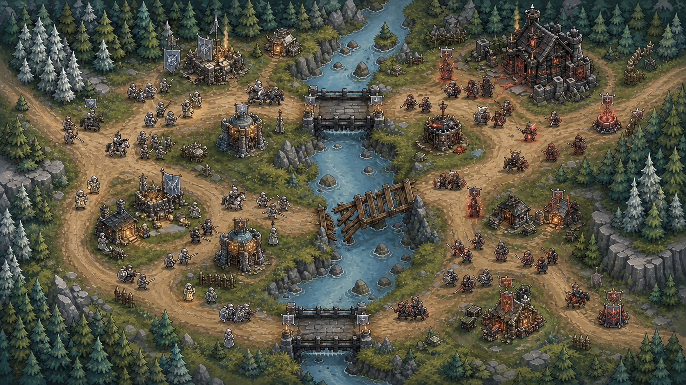

# 确认《断冠之誓》的美术方向

《断冠之誓》采用明亮、粗轮廓、夸张比例的俯视卡通战场风格。画面保留阴雨中世纪气氛，但不能让森林、道路、建筑和单位沉入黑色块面。

## 使用这张基准图

后续地图、建筑和单位以这张定稿样张为唯一视觉基准。定稿降低饱和度与塑料高光，保留粗描边和清晰的玩法层级：

样张只定义风格与信息层级，不是最终关卡地图。不要从样张裁切运行时素材，也不要复制其中未登记的临时构图。

## 保持统一的视觉规则

所有新素材遵循以下规则：

- **轮廓**：单位、建筑和道路边缘使用稳定的深色描边
- **明度**：森林使用松绿、蓝绿和苔绿分层，道路保持暖赭色，河流保持冷灰蓝
- **比例**：人物头身与武器适度夸张，建筑比真实比例更矮更宽
- **材质**：石材、湿木、金属和布料使用大块明暗面，不使用细碎噪点堆质感
- **阵营色**：灰旗阵营使用银灰与暖琥珀，敌对誓军使用黑铁与受控红
- **玩法层级**：道路、桥梁、建筑基座和单位轮廓在缩略图中仍能区分
- **特效**：誓火、治疗灯与命中效果使用小面积高饱和色，不能覆盖单位轮廓

## 保留剧本辨识度

这套风格使用卡通战场的可读性，不复制任何既有游戏的角色、塔楼、界面或地图。原创辨识度来自灰旗、誓约烽塔、银林、山炉、亡者记忆和断冠战争。

## 各类素材怎么画

| 类别 | 视觉要求 |
| --- | --- |
| 地图 | 路线宽度清楚，三桥、河流与丘陵形成明确战术节点 |
| 单位 | 先区分兵器与体型，再补阵营颜色和职业细节 |
| 建筑 | 轮廓矮宽，入口、旗点、损坏态和占领态一眼可见 |
| 物件 | 箱、盾墙、粮车、火盆和誓石保持单格识别度 |
| 图标 | 先读形状，再读颜色；避免细线和写实缩略图 |
| 场景 | 沿用卡通块面与粗描边，可以提高人物和环境细节 |
