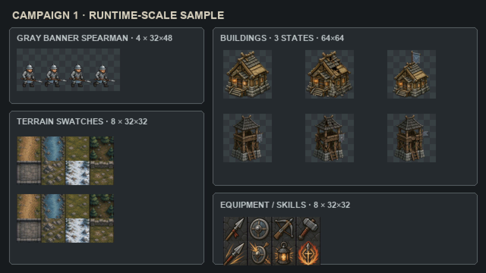

# 《断冠之誓》基准风格资源样例 V1

本目录验证已经定调的 `art-assets/reference/art-direction-map.png` 能否落到真实游戏规格。它是独立试产包，不会覆盖既有 `assets/runtime-v2/`，也不应在验收前计入正式库存。

## 本轮内容

| 类型 | 运行时文件 | 规格 | 内容 |
| --- | --- | --- | --- |
| 战斗单位 | `runtime/gray-banner-spearman-walk.png` | 4 帧横排，每帧 32×48 | 灰旗枪兵待机 / 行走循环 |
| 交互建筑 | `runtime/frontier-village-states.png` | 3 行，每态 64×64 | 边境村庄正常 / 受损 / 占领 |
| 防御建筑 | `runtime/gray-banner-watchtower-states.png` | 3 行，每态 64×64 | 灰旗箭塔正常 / 受损 / 占领 |
| 地形 | `runtime/terrain-swatches.png` | 4×2，每格 32×32 | 道路、河流、草地、森林地表、石桥、丘陵、雪地、矮墙 |
| 装备与技能 | `runtime/equipment-skills.png` | 4×2，每格 32×32 | 长枪、圆盾、弩、工程锤、突刺、盾守、治疗灯、誓火斩 |

## 判断结论

- 配色已按基准压到灰、褐、炭黑和少量琥珀色，未沿用高艳度和高油光方案。
- 单位重新生成时移除了背旗，避免 32×48 内人物主体过小。
- 建筑的受损态改变屋顶、结构和石基，占领态才使用灰旗标识。
- 1× 文件用于判断真实可读性；4× 预览只做最近邻放大，未补画细节。
- 地形目前是风格和小尺寸测试，并非已完成四向 / 十六向自动拼接规则。

## 目录

- `masters/`：内置 ImageGen 生成的原始母图。
- `intermediate/`：去色键后的透明中间图。
- `runtime/`：按游戏规格导出的 PNG。
- `previews/`：1× 与 4× 总览。
- `PROMPTS.md`：生成提示词和参考图记录。
- `manifest-sample.json`：试产包机器可读说明，全部保持 `runtimeReady: false`。
- `process_samples.py`：确定性切片、缩放和预览脚本。

