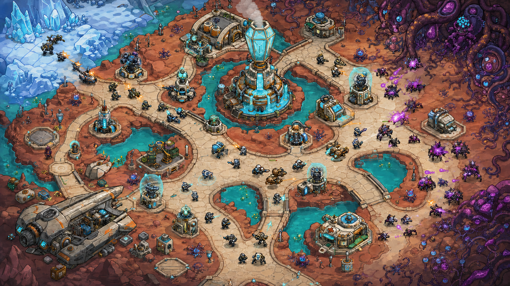

# 确认《群星熄灭之前》的美术方向

《群星熄灭之前》是三套美术的主基准。它使用明亮科幻色块、粗深描边、夸张设施比例和清晰路径，让冰原、赤砂、水系与异星生长区同时可读。

## 使用这张基准图

后续地图、设施和单位以这张定稿样张为唯一视觉基准。定稿收敛青紫霓虹与塑料高光：

样张只定义风格与信息层级，不是最终关卡地图。不要从样张裁切运行时素材，也不要复制其中未登记的临时构图。

## 保持统一的视觉规则

所有新素材遵循以下规则：

- **轮廓**：单位、设施、道路和地形边界使用稳定的深色描边
- **主色**：赤砂使用珊瑚红，水和星脉使用青蓝，冰原使用钴蓝，寂潮使用紫红
- **比例**：设施短粗、底座宽，单位头盔、武器和背包适度夸张
- **材质**：陶瓷、合金、透明晶体和生化组织使用大块高光与阴影
- **玩法层级**：浅色道路、青色水道、建筑底座和战斗单位保持清晰分离
- **阵营色**：同一单位先通过轮廓识别，再使用灯光与护甲色区分阵营
- **特效**：青色代表护盾与水系，橙色代表弹道与热能，紫色代表寂潮和生化污染

## 保留剧本辨识度

这套风格不复制任何既有游戏的塔楼、英雄、机器人或界面。原创辨识度来自弥光、雨塔、星脉、倒悬城、五个世界的生态差异和归零协议。

## 各类素材怎么画

| 类别 | 视觉要求 |
| --- | --- |
| 地图 | 两到三条浅色路线形成明确分岔，水道与真空区构成阻隔 |
| 单位 | 头盔、武器、载具和生态部件决定第一层轮廓 |
| 设施 | 晶体、管线、操作台和状态灯说明功能，底座明确占地 |
| 物件 | 水罐、货箱、护盾、根系、燃料罐和冰裂保持单格识别度 |
| 图标 | 使用高对比符号，不把完整写实装备缩进 `32×32` |
| 场景 | 保留粗描边和高饱和色，可以增加行星尺度与人物细节 |
