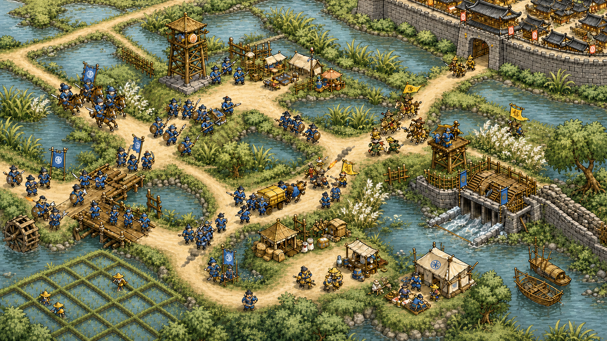

# 确认《布衣定鼎》的美术方向

《布衣定鼎》采用明亮、粗轮廓、夸张比例的俯视历史战场风格。青绿水田、浅金道路、木石城防和靛蓝军阵保持高辨识度，视觉奇观来自河决、舟师、粮道和大规模军阵，不来自法术。

## 使用这张基准图

后续地图、设施和单位以这张定稿样张为唯一视觉基准。定稿重点收敛荧光绿、青水与金黄路面，改用更自然的田野色阶：

样张只定义风格与信息层级，不是最终关卡地图。不要从样张裁切运行时素材，也不要复制其中未登记的临时构图。

## 保持统一的视觉规则

所有新素材遵循以下规则：

- **轮廓**：单位、舟船、城防、道路和田埂使用稳定的深色描边
- **主色**：水体使用青绿，稻田使用翠绿与黄绿，道路使用浅土金，军阵使用湿靛与旧甲色
- **比例**：单位头盔、旗鼓和兵器适度夸张，城门、粮站和舟船压缩为易读轮廓
- **材质**：湿土、粗木、旧甲、麻布、砖石和稻草使用大块明暗面
- **玩法层级**：道路、河渠、田埂、城墙、设施底座和单位脚线清晰分离
- **阵营色**：先靠兵器、阵形和旗号识别，再使用靛蓝、赭黄、朱砂与黑甲区分阵营
- **特效**：火铳、爆破、暴雨、风雪和火油保持短促，不把战场画成奇幻法术场

## 保留剧本辨识度

这套风格不复制任何既有游戏的塔楼、英雄、怪物或界面。原创辨识度来自淮水河堤、开仓放粮、白炬义军、江东舟师、漕运系统、北伐雪原和新朝军法。

## 各类素材怎么画

| 类别 | 视觉要求 |
| --- | --- |
| 地图 | 河渠、田埂、泥路、石街和城墙形成明确战术节点 |
| 单位 | 先区分刀枪弓弩、骑军、舟师和工程职责，再补旗色与甲色 |
| 设施 | 城门、粮站、旗点、闸桥和信号台明确入口、状态与占地 |
| 物件 | 粮箱、盾墙、盐袋、粮车、火药桶和堤土保持单格识别度 |
| 图标 | 使用兵器、旗鼓、粮秣和状态符号，避免现代图标与仙侠纹样 |
| 场景 | 沿用粗描边和明亮块面，可以提高人物、河工与民生细节 |
