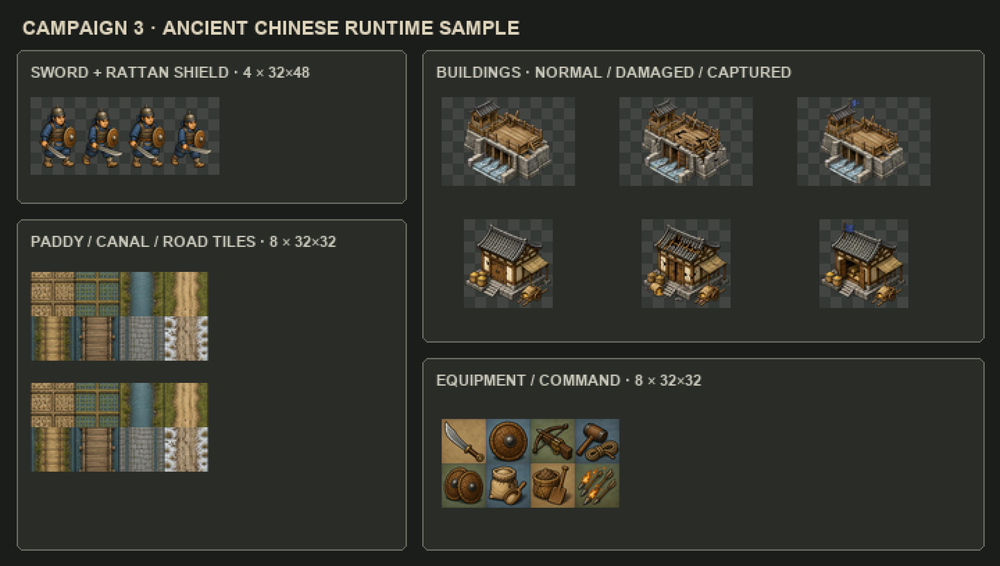

# 《布衣定鼎》中国古代风资源样例 V1

本目录验证已经定调的 `art-assets/reference/art-direction-map.png` 能否落到真实游戏规格。样例严格采用中国古代历史战争、河工与漕运语言，不加入仙侠、法术、现代物件或日欧式建筑武具。

本包是独立试产，不覆盖既有 `assets/runtime-v2/`，真实关卡验收前也不计入正式库存。

## 本轮内容

| 类型 | 运行时文件 | 规格 | 内容 |
| --- | --- | --- | --- |
| 战斗单位 | `runtime/sword-shield-infantry-walk.png` | 4 帧横排，每帧 32×48 | 刀盾卒待机 / 行走循环 |
| 大型交互建筑 | `runtime/river-sluice-bridge-states.png` | 3 行，每态 96×64 | 河堤闸桥正常 / 受损 / 占领 |
| 交互建筑 | `runtime/public-grain-depot-states.png` | 3 行，每态 64×64 | 开仓粮站正常 / 受损 / 占领开放 |
| 地形 | `runtime/terrain-swatches.png` | 4×2，每格 32×32 | 灾田、水田、河渠、车辙路、堤顶、浮桥、石街、雪原驿路 |
| 装备与军务 | `runtime/equipment-command.png` | 4×2，每格 32×32 | 单刀、藤盾、弩、河工锤绳、盾阵、分粮、筑堤、火箭齐射 |

## 风格判断

- 兵卒使用实用札甲、靛蓝麻衣、草缚靴、圆藤盾与中国式单刀，不做华丽武将化。
- 闸桥使用灰砖、湿木、绞盘、闸板与瓦顶信号棚，强调古代水利工程。
- 粮站使用县仓式木构、灰瓦、麻袋、竹筐和粮车，体现赈粮与漕运玩法。
- 受损态改变建筑主体结构；占领态才增加短杆靛蓝军旗。
- 地形与图标目前验证风格及小尺寸可读性，不代表四向 / 十六向自动拼接已经完成。
- 1× 文件用于判断真实可读性；4× 总览仅做最近邻放大，没有补画细节。

## 目录

- `masters/`：Codex 内置 ImageGen 生成的原始母图。
- `intermediate/`：去色键后的透明中间图。
- `runtime/`：按游戏规格导出的 PNG。
- `previews/`：1× 与 4× 总览。
- `PROMPTS.md`：生成提示词摘要和历史风格约束。
- `manifest-sample.json`：试产包机器可读说明，全部保持 `runtimeReady: false`。
- `process_samples.py`：确定性切片、缩放和预览脚本。

